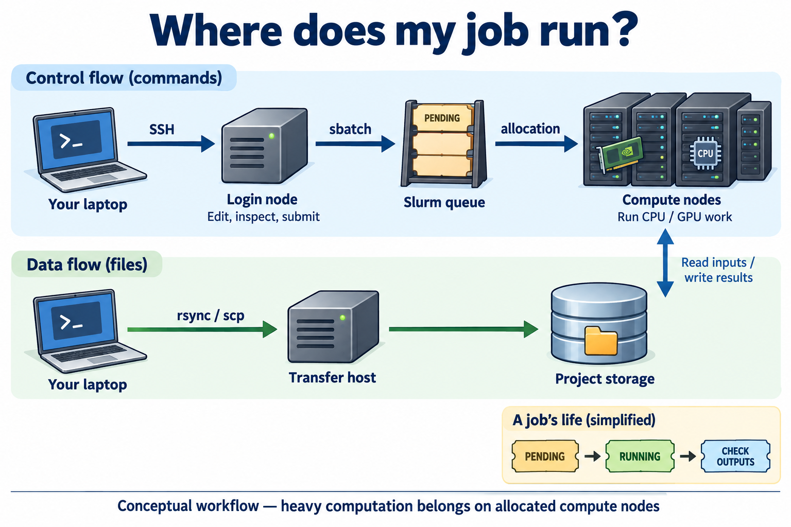

# เตรียมพร้อมใช้งาน LANTA



ภาพแนวคิด: เครื่องเข้าสู่ระบบ ใช้แก้ไข/ตรวจไฟล์และส่งงาน ส่วน เครื่องคำนวณ ที่ Slurm จัดสรรใช้คำนวณหนัก. การย้ายไฟล์กับการส่งงานเป็นคนละขั้น อ่าน [คำอธิบายสำหรับผู้เริ่มต้น](docs/BEGINNER_VISUAL_GUIDE_TH.md#2-คำสั่งกับข้อมูลเดินทางคนละเส้น) ก่อนทำตามคำสั่ง

คู่มือเริ่มต้นสำหรับใช้ repo นี้บน LANTA ตาม booklet ของงาน LANTA HPC Experience Day: On the Move.

คำสั่งและ รูปแบบคำสั่ง ในหน้านี้อธิบายรวมไว้ที่ [docs/BASH_COMMAND_REFERENCE_TH.md](docs/BASH_COMMAND_REFERENCE_TH.md) เช่น `ssh`, `scp`, `rsync`, `module`, `sbatch`, `squeue`, `sacct`, heredoc และ `#SBATCH`

<a id="1-ssh-to-lanta"></a>

## 1. เชื่อมต่อ LANTA ด้วย SSH

สำหรับการตั้งค่า SSH private key และ alias `ssh lanta` ให้ดู [docs/SSH_PRIVATE_KEY_LANTA_TH.md](docs/SSH_PRIVATE_KEY_LANTA_TH.md)

```bash
ssh <username>@lanta.nstda.or.th
```

ใช้ เครื่องรับส่งข้อมูล สำหรับย้ายไฟล์ขนาดใหญ่:

```bash
scp local-file <username>@transfer.lanta.nstda.or.th:/project/<project-id>/
rsync -rvz ./local-folder/ <username>@transfer.lanta.nstda.or.th:/project/<project-id>/local-folder/
```

หลัง login แล้ว prompt ที่เห็นคือ shell บน LANTA. ใช้ เครื่องเข้าสู่ระบบ สำหรับแก้ไฟล์ ตรวจระบบ และส่งงานเท่านั้น.

## 2. สร้างโฟลเดอร์ฝึกปฏิบัติ

```bash
mkdir -p "$HOME/hpc-ignite-standalone"
cd "$HOME/hpc-ignite-standalone"
pwd
```

ผู้ใช้เปิด หน้าบทเรียน จากเอกสารหรือหน้า GitHub แล้วแปะ ชุดคำสั่ง ของบทนั้นบน LANTA ได้ทันที แต่ละบทจะสร้าง โฟลเดอร์ และไฟล์งานของตัวเองใต้ `$HOME/hpc-ignite-standalone/<lab-id>`

Clone repo เป็นทางเลือกสำหรับผู้สอนที่ต้องการอ่านเอกสาร offline หรือปรับไฟล์ reference:

```bash
cd "$HOME"
git clone https://github.com/hpc-ignite-ile/hpc-ignite-hands-on.git
```

## 3. เตรียมพื้นที่ของกิจกรรม

```bash
mkdir -p "$HOME/hpc-ignite-standalone/lanta-experience"
cd "$HOME/hpc-ignite-standalone/lanta-experience"
mkdir -p configs input jobs logs notes results src

if [ -z "${LANTA_ACCOUNT:-}" ]; then
    read -rp "Slurm project account, leave blank for site default: " LANTA_ACCOUNT
    export LANTA_ACCOUNT
fi

export LANTA_CPU_PARTITION="${LANTA_CPU_PARTITION:-compute-devel}"
export LANTA_GPU_PARTITION="${LANTA_GPU_PARTITION:-gpu-devel}"
```

จากนั้นเลือก หน้าบทเรียน ใน [lanta-experience/](lanta-experience/) และแปะ ชุดคำสั่ง ของบทนั้นใน terminal

## 4. สร้างและส่งงานแรก

Teaching pattern นี้ให้ผู้ใช้เห็นไฟล์ที่สร้างจริงด้วย heredoc และเห็น `.sbatch` ที่ส่งด้วย `sbatch` โดยตรง:

```bash
cd "$HOME/hpc-ignite-standalone/lanta-experience"
mkdir -p jobs logs results src

cat > src/main.py <<'PY'
from pathlib import Path
Path("results").mkdir(exist_ok=True)
Path("results/main.txt").write_text("hello from LANTA\n", encoding="utf-8")
print("results/main.txt")
PY

cat > jobs/main.sbatch <<'SLURM'
#!/bin/bash
#SBATCH --job-name=hpcig-main
#SBATCH --nodes=1
#SBATCH --ntasks=1
#SBATCH --cpus-per-task=1
#SBATCH --mem=512M
#SBATCH --time=00:05:00
#SBATCH --output=logs/%x_%j.out
#SBATCH --error=logs/%x_%j.err

set -euo pipefail
module purge
module load cray-python/3.10.10 2>/dev/null || module load python 2>/dev/null || true
cd "$SLURM_SUBMIT_DIR"
python src/main.py
SLURM

SBATCH_ACCOUNT=()
if [ -n "${LANTA_ACCOUNT:-}" ]; then
    SBATCH_ACCOUNT=(-A "$LANTA_ACCOUNT")
fi
job_id=$(sbatch "${SBATCH_ACCOUNT[@]}" -p "${LANTA_CPU_PARTITION:-compute-devel}" --parsable jobs/main.sbatch)
echo "Submitted: $job_id"
squeue -j "$job_id"
```

## เก็บไฟล์ที่ไหน

พื้นที่เก็บไฟล์หลักมีหน้าที่ต่างกันดังนี้:

| พื้นที่ | ใช้เก็บอะไร |
|---|---|
| `/home/<username>` | ไฟล์ส่วนตัว โค้ดเล็ก ๆ และการตั้งค่า |
| `/project/<project-id>` | ข้อมูลและผลลัพธ์ที่ใช้ร่วมกันในโครงการ |
| `/scratch/<project-id>` | ไฟล์ชั่วคราวระหว่างคำนวณ ไม่ใช้เป็นที่สำรองถาวร |

ตรวจพื้นที่และสิทธิ์ที่เหลือก่อนเริ่มงานใหญ่:

```bash
myquota
sbalance
df -h "$HOME" "$PWD"
```

## เลือกกลุ่มเครื่อง

ใช้ `sinfo` ดูกลุ่มเครื่องและเวลาสูงสุดที่เปิดให้ใช้ขณะนั้น:

```bash
sinfo -o "%P %a %l %D %t %N"
```

เริ่มจากงานเล็กและเลือกกลุ่มเครื่องที่เหมาะสม:

| งาน | กลุ่มเครื่องเริ่มต้น | ข้อควรคิด |
|---|---|---|
| ทดสอบ CPU | `compute-devel` | งานสั้น ใช้หน่วยความจำไม่มาก |
| คำนวณด้วย CPU | `compute` | เพิ่มขนาดเมื่อผลถูกต้องแล้ว |
| ทดสอบ GPU | `gpu-devel` | เริ่มด้วยการ์ดเดียว |
| คำนวณด้วย GPU | `gpu` | ขอเท่าที่โปรแกรมใช้จริง |
| งานใช้หน่วยความจำมาก | `memory` | ใช้เมื่อกลุ่ม CPU ปกติมีหน่วยความจำไม่พอ |

## เลือกโปรแกรม

```bash
module avail
module spider python
module spider Mamba
module spider Apptainer
module spider QuantumESPRESSO
module spider GROMACS
module spider GDAL
module spider BLAST+
module list
```

เลือกโมดูลในไฟล์งาน Slurm เพื่อให้ใช้โปรแกรมรุ่นเดิมเมื่อรันซ้ำ ใน standalone lab ให้เขียน `module load ...` ไว้ใน `jobs/*.sbatch` ของบทนั้นโดยตรง ส่วน wrapper ใน `slurm/module-loads/` เช่น `base.sh`, `netcdf-python.sh`, `pytorch-shared.sh`, `cpe-mpi.sh`, `qe.sh`, `gromacs.sh`, `geodata.sh`, `bio.sh`, และ `apptainer.sh` เป็น reference สำหรับผู้สอนที่ต้องการรวม pattern ซ้ำ

## ติดตามงาน

```bash
squeue -u "$USER"
squeue -j <job-id> -o "%.18i %.9P %.20j %.8T %.20R"
sacct -j <job-id> --format=JobID,JobName,State,Elapsed,AllocCPUS,MaxRSS,ExitCode
tail -50 logs/<name>_<job-id>.out
tail -50 logs/<name>_<job-id>.err
scancel <job-id>
```

## เรียนต่อ

ทำกิจกรรมตามลำดับในคู่มือ เมื่อผู้สอน clone repo ไว้บน LANTA แล้ว สามารถเปิดสารบัญด้วย:

```bash
# จาก root ของ repo ที่ clone ไว้
sed -n '1,160p' lanta-experience/README.md
```

อ่านคำอธิบาย `sed -n '1,160p' ...` ได้ที่ [docs/BASH_COMMAND_REFERENCE_TH.md#sed](docs/BASH_COMMAND_REFERENCE_TH.md#sed)
