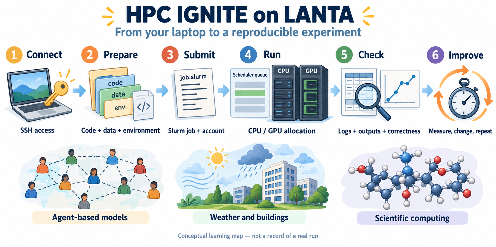

# HPC Ignite: เรียนรู้ซูเปอร์คอมพิวเตอร์ด้วยการลงมือทำ

อยากลองใช้ซูเปอร์คอมพิวเตอร์ แต่ไม่รู้จะเริ่มตรงไหน? บทเรียนนี้พาคุณตั้งแต่เชื่อมต่อ LANTA ส่งงานแรก อ่านผล ไปจนถึงทดลองงานวิทยาศาสตร์และ AI

ไม่จำเป็นต้องรู้ศัพท์ทั้งหมดก่อน เริ่มจากงานเล็กหนึ่งงานให้สำเร็จ แล้วค่อยเพิ่มขนาด คำสั่งและชื่อโปรแกรมยังใช้ภาษาอังกฤษตามที่เครื่องต้องการ ส่วนคำอธิบายใช้ภาษาไทย

ภาพใช้สรุปแนวคิด ไม่ใช่ภาพผลการรัน อ่านคำอธิบายภาษาไทยได้ใน [คู่มือเริ่มต้นด้วยภาพ](docs/BEGINNER_VISUAL_GUIDE_TH.md)

## เริ่มตรงนี้

1. [เตรียมบัญชีและเชื่อมต่อ LANTA](LANTA_SETUP.md)
2. [รู้จักไฟล์ โฟลเดอร์ และคำสั่งพื้นฐาน](lanta-experience/00-readiness.md)
3. [ส่งงานแรกและเปิดผลลัพธ์](lanta-experience/01-first-slurm-job.md)
4. [ประมาณเวลาและหน่วยความจำที่ต้องใช้](docs/RESOURCE_ESTIMATION_WORKBOOK.md)
5. [เปรียบเทียบความเร็วและปรับปรุงงาน](docs/PERFORMANCE_EVALUATION_OPTIMIZATION_TH.md)

หากยังไม่คุ้นกับหน้าต่างคำสั่ง ให้เปิด [คำศัพท์แบบง่าย](docs/GLOSSARY_TH.md) และ [คำอธิบาย Bash และ Slurm](docs/BASH_COMMAND_REFERENCE_TH.md) ไว้ข้างกัน

## เลือกบทเรียนตามความสนใจ

| อยากทำอะไร | เริ่มจากบทนี้ |
|---|---|
| ส่งงานหลายชิ้นพร้อมกัน | [CPU และชุดงานย่อย](lanta-experience/02-cpu-array.md) |
| ให้หลายคอร์ช่วยกันคำนวณ | [OpenMP และ MPI](lanta-experience/03-openmp-mpi.md) |
| จำลองการกระจายและอ่านข้อมูล | [งานวิทยาศาสตร์เบื้องต้น](lanta-experience/04-science-data.md) |
| ลองใช้ GPU | [เริ่มต้น AI และ GPU](lanta-experience/05-ai-gpu.md) |
| ทำกราฟและเปิดสมุดงาน | [ภาพผลลัพธ์และ Jupyter](mini-innovation/05-output-display-jupyter-gnuplot.md) |
| จำลองพฤติกรรมคนด้วย Mesa | [กิจกรรมจำลองโรคและนวัตกรรม](mini-innovation/README.md) |
| จำลองคนกับพลังงานอาคาร | [Twin-B และ EnergyPlus](mini-innovation/06-twinb-heatlab-repository.md) |
| เลือกปัญหาวิทยาศาสตร์จริง | [โมเลกุล วัสดุ ชีวภาพ และเกษตร](docs/REAL_APPLICATION_EXPERIMENTS.md) |
| ศึกษาของไหล อากาศ และทะเล | [การไหล ภูมิอากาศ และมหาสมุทร](docs/CFD_CLIMATE_OCEAN_EXPERIMENTS.md) |
| ศึกษาดาวและอวกาศ | [อวกาศและดาราศาสตร์](docs/SPACE_ASTRONOMY_EXPERIMENTS.md) |

บทพื้นฐานมีคำสั่งให้ทำตาม ส่วนหน้ารวมงานวิทยาศาสตร์ช่วยเลือกโจทย์ ข้อมูล และวิธีตรวจผล งานต่อยอดบางชนิดต้องเตรียมโปรแกรมหรือข้อมูลเพิ่มก่อนเริ่ม

## อ่านบทเรียนอย่างไร

แต่ละบทบอกเป้าหมาย สิ่งที่ต้องเตรียม ขั้นตอน และวิธีตรวจผล แปะคำสั่งทีละชุดและดูผลก่อนทำขั้นต่อไป อย่าแปะทั้งหน้าโดยไม่อ่าน

- ใช้บัญชีและพื้นที่โครงการของคุณเอง
- เครื่องที่ใช้เข้าสู่ระบบมีไว้เตรียมไฟล์และส่งงาน งานหนักต้องส่งผ่าน `sbatch`
- `COMPLETED` แปลว่าโปรแกรมจบ แต่ยังต้องตรวจว่าคำตอบถูกต้อง
- ลองข้อมูลเล็กก่อน เพิ่มขนาดทีละอย่าง และหยุดเมื่อพบข้อผิดพลาด
- ไม่ใส่รหัสผ่าน กุญแจ หรือ token ในไฟล์ผลลัพธ์และภาพที่เผยแพร่

## เอกสารประกอบ

- [คู่มือกิจกรรม LANTA Experience](docs/lanta-hpc-experience-handbook.pdf)
- [ลำดับกิจกรรมตามคู่มือ](lanta-experience/README.md)
- [ตั้งค่ากุญแจ SSH](docs/SSH_PRIVATE_KEY_LANTA_TH.md)
- [บันทึกการใช้ทรัพยากรของงานตนเอง](lanta-experience/06-run-logs.md)
- [ThaiSC](https://www.thaisc.io) และ [คู่มือผู้ใช้](https://thaisc.atlassian.net/wiki/)

โค้ดของคลังนี้ใช้ [สัญญาอนุญาต MIT](LICENSE) ส่วนข้อมูล โปรแกรม และภาพจากแหล่งอื่นใช้เงื่อนไขของเจ้าของแต่ละรายการ
