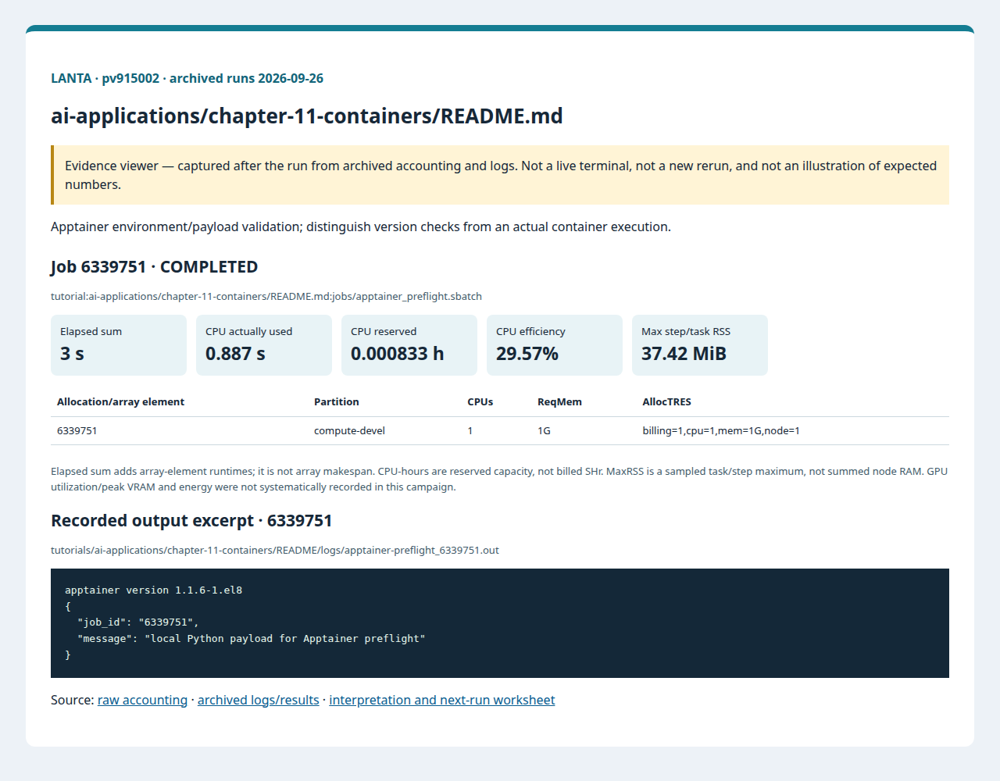
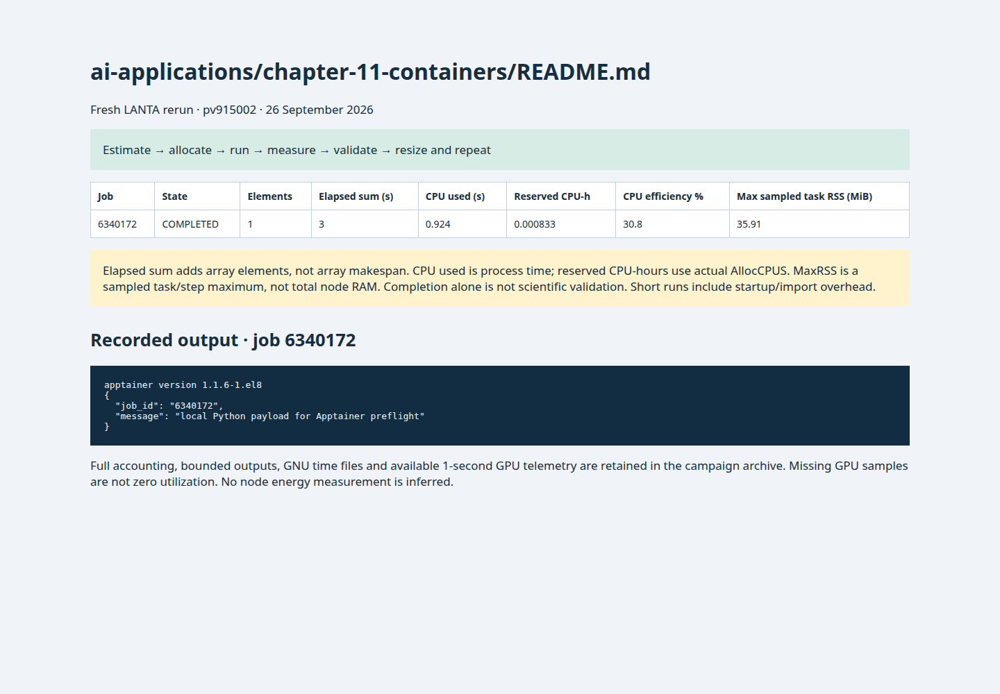

# บทที่ 11: Containers สำหรับ HPC

<!-- resource-learning:start -->
## จากงานเล็กสู่การทดลองที่วัดผลได้ / Resource lab

Booklet flow: pages **19–23** of the [LANTA handbook](../../docs/lanta-hpc-experience-handbook.pdf). [Full learning sequence and worksheet](../../docs/RESOURCE_ESTIMATION_WORKBOOK.md).

<details><summary>ภาพแนวคิดจาก booklet / workflow illustration</summary>


Original booklet illustration, not a run screenshot. [Source and limitations](../../docs/images/booklet/README.md).

</details>

### 1. ขอบเขตและการประมาณก่อนรัน

Apptainer environment/payload validation; distinguish version checks from an actual container execution.

Budget image storage + unpack/cache space separately from job RAM. Use the same CPU, memory and input for native and container pilots; image pull/build time is setup, not kernel time. Download on the transfer host.

### 2. ทรัพยากรที่ใช้จริงและตัวอย่าง output

Archived LANTA evidence, **2026-09-26**, account `pv915002`; these are historical measurements, not a new run or a future performance promise.

| Job | State | Elements | Sum elapsed (s) | CPU used (s) | Reserved CPU-h | Max step/task RSS (MiB) |
|---|---|---:|---:|---:|---:|---:|
| 6339751 | COMPLETED | 1 | 3 | 0.887 | 0.000833 | 37.42 |

Elapsed is summed across array elements, not array makespan. CPU used is `TotalCPU`; reserved CPU-hours include idle allocation time. MaxRSS is the largest sampled task/step value, **not total node RAM**. Missing GPU/energy telemetry must not be interpreted as zero.



Browser screenshot of the [archived evidence viewer](../../docs/tutorial-evidence/ai-applications-chapter-11-containers-readme.html); not a live terminal capture. Open the viewer for exact requested/allocated resources and job-specific log excerpts.

**Read the numbers:** job `6339751` used 0.887 CPU-seconds over 3 summed elapsed seconds: about **0.30 busy CPU cores per running element on average**. This describes CPU work across the whole allocation, including setup; it does not measure GPU utilization. For a seconds-long run, startup and coarse memory sampling can dominate. Do not reduce RAM to the displayed RSS or claim scaling without a longer pilot.

<details><summary>ตัวอย่าง output ที่บันทึกจริง / archived stdout excerpt</summary>

Job `6339751` · archive member `tutorials/ai-applications/chapter-11-containers/README/logs/apptainer-preflight_6339751.out`

```text
apptainer version 1.1.6-1.el8
{
  "job_id": "6339751",
  "message": "local Python payload for Apptainer preflight"
}
```

</details>

### 3. ขยายงานทีละแกนและตรวจความถูกต้อง

Pin the image digest, run the same bounded payload natively and in the container three times, and separate first-read/cold-cache from warm execution. No GPU request is needed for a CPU-only payload.

**Correctness gate:** Compare payload outputs and image digest; a version string alone does not prove the payload ran inside the container.

[Public applications and research-backed experiments](../../docs/REAL_APPLICATION_EXPERIMENTS.md#miniweather) provide the next workload. Proposed resource budgets there are not measured requirements.

Before the next run, write down input size, expected time/RAM, requested CPUs/GPUs, and a stop condition. Afterwards record job ID, actual allocation, elapsed, CPU time, memory, result check and one change for the next run. Use three repeats and report spread; do not claim speedup from one short smoke run.

<!-- resource-learning:end -->

ผลรันซ้ำ LANTA บัญชี `pv915002` วันที่ 2026-09-26: [สถานะ ขอบเขต ผลลัพธ์ และ resource usage](../../docs/lanta-runs/2026-09-26-pv915002/README.md) · [วิธีประเมินและปรับปรุง performance](../../docs/PERFORMANCE_EVALUATION_OPTIMIZATION_TH.md)

คำสั่งในหน้านี้อธิบายรวมไว้ที่ [../../docs/BASH_COMMAND_REFERENCE_TH.md](../../docs/BASH_COMMAND_REFERENCE_TH.md).

เริ่มจาก SSH ตาม [../../LANTA_SETUP.md#1-ssh-to-lanta](../../LANTA_SETUP.md#1-ssh-to-lanta) แล้วแปะ block ในหัวข้อ Copy-Paste บน LANTA

หน้านี้เป็น standalone hand-on ผู้ใช้แปะคำสั่งบน LANTA แล้วได้ workspace, source file, Slurm script, log และ result ครบใน `$HOME/hpc-ignite-standalone/ai-containers` โดยตรง

## เป้าหมาย

1. ตรวจ Apptainer module
2. รัน payload Python สั้นใน batch job
3. บันทึก version และ payload result

## Copy-Paste บน LANTA

แปะทีละ block ตามลำดับ แต่ละ block ทำหนึ่งงานหลักและมีหลักฐานให้ตรวจทันทีหลังรัน

### ขั้นที่ 1: เตรียม workspace และตัวแปร

ขั้นนี้กำหนดพื้นที่ทำงานของบท สร้าง folder มาตรฐาน และตั้งค่า account/partition ที่ใช้ซ้ำในขั้นถัดไป

```bash
mkdir -p "$HOME/hpc-ignite-standalone/ai-containers"
cd "$HOME/hpc-ignite-standalone/ai-containers"
mkdir -p jobs logs notes results src

if [ -z "${LANTA_CPU_PARTITION:-}" ]; then export LANTA_CPU_PARTITION="compute-devel"; fi
if [ -z "${LANTA_ACCOUNT:-}" ]; then read -rp "Slurm project account, blank for site default: " LANTA_ACCOUNT; export LANTA_ACCOUNT; fi
SBATCH_ACCOUNT=(); if [ -n "${LANTA_ACCOUNT:-}" ]; then SBATCH_ACCOUNT=(-A "$LANTA_ACCOUNT"); fi
```

### ขั้นที่ 2: สร้าง source code `src/container_demo.py`

ขั้นนี้สร้างไฟล์โปรแกรมหลัก ให้ผู้ใช้อ่านส่วน import, parameter, output path และ sanity check ก่อนส่งงาน

```bash
cat > src/container_demo.py <<'PYCODE'
from pathlib import Path
import json, os
Path("results").mkdir(exist_ok=True)
summary = {"job_id": os.environ.get("SLURM_JOB_ID", "manual"), "message": "local Python payload for Apptainer preflight"}
Path("results/container_payload.json").write_text(json.dumps(summary, indent=2), encoding="utf-8")
print(json.dumps(summary, indent=2))
PYCODE
```


### ขั้นที่ 3: สร้าง Slurm script `jobs/apptainer_preflight.sbatch`

ขั้นนี้สร้างไฟล์ Slurm ที่ระบุ resource, module, working directory และคำสั่งที่รันบน compute node

```bash
cat > jobs/apptainer_preflight.sbatch <<'SLURM'
#!/bin/bash
#SBATCH --job-name=apptainer-preflight
#SBATCH --nodes=1
#SBATCH --ntasks=1
#SBATCH --cpus-per-task=1
#SBATCH --mem=1G
#SBATCH --time=00:05:00
#SBATCH --output=logs/%x_%j.out
#SBATCH --error=logs/%x_%j.err
set -euo pipefail
module purge
module load Apptainer/1.1.6
module load cray-python/3.10.10
cd "$SLURM_SUBMIT_DIR"
mkdir -p "results/${SLURM_JOB_ID}"
apptainer --version | tee "results/${SLURM_JOB_ID}/apptainer_version.txt"
python src/container_demo.py | tee "results/${SLURM_JOB_ID}/payload.txt"
cp results/container_payload.json "results/${SLURM_JOB_ID}/container_payload.json"
SLURM
```

### ขั้นที่ 4: ส่งงานเข้า Slurm

ขั้นนี้ส่ง job script ที่เพิ่งสร้างไว้ด้วย `sbatch` แล้วบันทึก job id เพื่อใช้ตามคิวและอ่าน log ภายหลัง

```bash
job_id=$(sbatch "${SBATCH_ACCOUNT[@]}" -p "$LANTA_CPU_PARTITION" --parsable jobs/apptainer_preflight.sbatch)
echo "$job_id	apptainer_preflight	$(date -Is)" >> notes/job-history.tsv
echo "Submitted job: $job_id"
echo "Read: tail -80 logs/apptainer-preflight_${job_id}.out"
```

## Check

```bash
cd "$HOME/hpc-ignite-standalone/ai-containers"
find results -maxdepth 2 -type f | sort
tail -80 logs/apptainer-preflight_*.out
```

## การตรวจผล

หลัง job จบ ให้ผู้ใช้ตรวจสามชั้นหลักฐาน:

1. `sacct` แสดง `COMPLETED` และ `ExitCode` เป็น `0:0`
2. `logs/` มี stdout/stderr ของ job id นั้น
3. `results/` มีไฟล์ output ที่ระบุในหัวข้อ Check

## ใช้ Repo เป็น Reference

ถ้าผู้ใช้ clone repo แล้ว สามารถเทียบแนวคิดกับไฟล์ใน repo ได้ เช่น `slurm/`, `requirements/`, `environments/` และ `jobs/` ของแต่ละบท แต่ block ด้านบนออกแบบให้รันได้จากหน้า hand-on นี้โดยตรง

<!-- performance-rerun:start -->
## Fresh measured rerun — 26 September 2026

| Job | State | Elements | Sum elapsed (s) | CPU used (s) | Reserved CPU-h | Max step/task RSS (MiB) |
|---|---|---:|---:|---:|---:|---:|
| 6340172 | COMPLETED | 1 | 3 | 0.924 | 0.000833 | 35.91 |

These are new measured jobs, not estimates. One campaign pass does not establish scaling or runtime variance. Allocated CPU-hours are not billed SHr; sampled RSS is not total node memory.

[Accounting, output archive and measurement limitations](../../docs/lanta-runs/2026-09-26-performance/README.md)


<!-- performance-rerun:end -->
