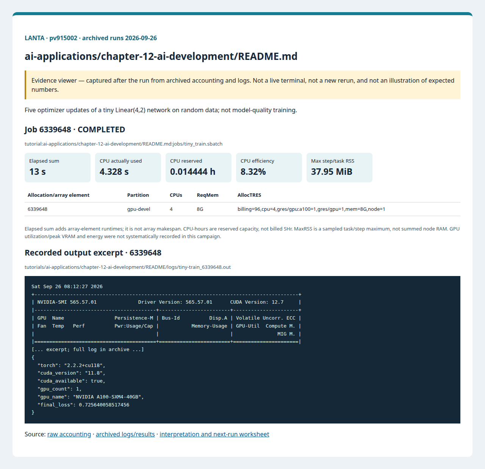

# บทที่ 12: AI Development บน HPC

<!-- resource-learning:start -->
## จากงานเล็กสู่การทดลองที่วัดผลได้ / Resource lab

Booklet flow: pages **37–38** of the [LANTA handbook](../../docs/lanta-hpc-experience-handbook.pdf). [Full learning sequence and worksheet](../../docs/RESOURCE_ESTIMATION_WORKBOOK.md).

<details><summary>ภาพแนวคิดจาก booklet / workflow illustration</summary>


Original booklet illustration, not a run screenshot. [Source and limitations](../../docs/images/booklet/README.md).

</details>

### 1. ขอบเขตและการประมาณก่อนรัน

Five optimizer updates of a tiny Linear(4,2) network on random data; not model-quality training.

Runtime approximately follows epochs × ceil(samples/batch) × seconds/step after warmup. Host data, parameters, gradients, optimizer state and activations all need separate budgets. Activation memory often grows with batch size; pilot it rather than sizing from parameter count alone.

### 2. ทรัพยากรที่ใช้จริงและตัวอย่าง output

Archived LANTA evidence, **2026-09-26**, account `pv915002`; these are historical measurements, not a new run or a future performance promise.

| Job | State | Elements | Sum elapsed (s) | CPU used (s) | Reserved CPU-h | Max step/task RSS (MiB) |
|---|---|---:|---:|---:|---:|---:|
| 6339648 | COMPLETED | 1 | 13 | 4.328 | 0.014444 | 37.95 |

Elapsed is summed across array elements, not array makespan. CPU used is `TotalCPU`; reserved CPU-hours include idle allocation time. MaxRSS is the largest sampled task/step value, **not total node RAM**. Missing GPU/energy telemetry must not be interpreted as zero.



Browser screenshot of the [archived evidence viewer](../../docs/tutorial-evidence/ai-applications-chapter-12-ai-development-readme.html); not a live terminal capture. Open the viewer for exact requested/allocated resources and job-specific log excerpts.

**Read the numbers:** job `6339648` used 4.328 CPU-seconds over 13 summed elapsed seconds: about **0.33 busy CPU cores per running element on average**. This describes CPU work across the whole allocation, including setup; it does not measure GPU utilization. For a seconds-long run, startup and coarse memory sampling can dominate. Do not reduce RAM to the displayed RSS or claim scaling without a longer pilot.

<details><summary>ตัวอย่าง output ที่บันทึกจริง / archived stdout excerpt</summary>

Job `6339648` · archive member `tutorials/ai-applications/chapter-12-ai-development/README/logs/tiny-train_6339648.out`

```text
Sat Sep 26 08:12:27 2026
+-----------------------------------------------------------------------------------------+
| NVIDIA-SMI 565.57.01              Driver Version: 565.57.01      CUDA Version: 12.7     |
|-----------------------------------------+------------------------+----------------------+
| GPU  Name                 Persistence-M | Bus-Id          Disp.A | Volatile Uncorr. ECC |
| Fan  Temp   Perf          Pwr:Usage/Cap |           Memory-Usage | GPU-Util  Compute M. |
|                                         |                        |               MIG M. |
|=========================================+========================+======================|
[... excerpt; full log in archive ...]
{
  "torch": "2.2.2+cu118",
  "cuda_version": "11.8",
  "cuda_available": true,
  "gpu_count": 1,
  "gpu_name": "NVIDIA A100-SXM4-40GB",
  "final_loss": 0.725640058517456
}
```

</details>

### 3. ขยายงานทีละแกนและตรวจความถูกต้อง

Fix train/validation data and seeds, increase updates to 100 then 1000, and compare batch sizes 64/128/256 on one GPU. Report examples/second, VRAM, validation metric and time to the same quality target. This extension requires replacing the random-data demonstration.

**Correctness gate:** Check finite losses, actual parameter updates and held-out quality. The archived unseeded final loss is an example, not an exact expected value.

[Public applications and research-backed experiments](../../docs/REAL_APPLICATION_EXPERIMENTS.md#nvidia-and-ai) provide the next workload. Proposed resource budgets there are not measured requirements.

Before the next run, write down input size, expected time/RAM, requested CPUs/GPUs, and a stop condition. Afterwards record job ID, actual allocation, elapsed, CPU time, memory, result check and one change for the next run. Use three repeats and report spread; do not claim speedup from one short smoke run.

<!-- resource-learning:end -->

ผลรันซ้ำ LANTA บัญชี `pv915002` วันที่ 2026-09-26: [สถานะ ขอบเขต ผลลัพธ์ และ resource usage](../../docs/lanta-runs/2026-09-26-pv915002/README.md) · [วิธีประเมินและปรับปรุง performance](../../docs/PERFORMANCE_EVALUATION_OPTIMIZATION_TH.md)

คำสั่งในหน้านี้อธิบายรวมไว้ที่ [../../docs/BASH_COMMAND_REFERENCE_TH.md](../../docs/BASH_COMMAND_REFERENCE_TH.md).

เริ่มจาก SSH ตาม [../../LANTA_SETUP.md#1-ssh-to-lanta](../../LANTA_SETUP.md#1-ssh-to-lanta) แล้วแปะ block ในหัวข้อ Copy-Paste บน LANTA

หน้านี้เป็น standalone hand-on ผู้ใช้แปะคำสั่งบน LANTA แล้วได้ workspace, source file, Slurm script, log และ result ครบใน `$HOME/hpc-ignite-standalone/ai-pytorch-train` โดยตรง

## เป้าหมาย

1. ขอ GPU หนึ่งใบ
2. รัน tiny training loop ด้วย PyTorch
3. ตรวจ loss, CUDA และ GPU name

## Copy-Paste บน LANTA

แปะทีละ block ตามลำดับ แต่ละ block ทำหนึ่งงานหลักและมีหลักฐานให้ตรวจทันทีหลังรัน

### ขั้นที่ 1: เตรียม workspace และตัวแปร

ขั้นนี้กำหนดพื้นที่ทำงานของบท สร้าง folder มาตรฐาน และตั้งค่า account/partition ที่ใช้ซ้ำในขั้นถัดไป

```bash
mkdir -p "$HOME/hpc-ignite-standalone/ai-pytorch-train"
cd "$HOME/hpc-ignite-standalone/ai-pytorch-train"
mkdir -p jobs logs notes results src

if [ -z "${LANTA_GPU_PARTITION:-}" ]; then export LANTA_GPU_PARTITION="gpu-devel"; fi
if [ -z "${LANTA_ACCOUNT:-}" ]; then read -rp "Slurm project account, blank for site default: " LANTA_ACCOUNT; export LANTA_ACCOUNT; fi
SBATCH_ACCOUNT=(); if [ -n "${LANTA_ACCOUNT:-}" ]; then SBATCH_ACCOUNT=(-A "$LANTA_ACCOUNT"); fi
```

### ขั้นที่ 2: สร้าง source code `src/tiny_train.py`

ขั้นนี้สร้างไฟล์โปรแกรมหลัก ให้ผู้ใช้อ่านส่วน import, parameter, output path และ sanity check ก่อนส่งงาน

```bash
cat > src/tiny_train.py <<'PYCODE'
from pathlib import Path
import json
import torch
Path("results").mkdir(exist_ok=True)
summary = {"torch": torch.__version__, "cuda_version": torch.version.cuda, "cuda_available": torch.cuda.is_available(), "gpu_count": torch.cuda.device_count()}
if torch.cuda.is_available():
    model = torch.nn.Linear(4, 2).to("cuda"); opt = torch.optim.SGD(model.parameters(), lr=0.1)
    x = torch.randn(64, 4, device="cuda"); target = torch.randint(0, 2, (64,), device="cuda"); loss_fn = torch.nn.CrossEntropyLoss()
    for _ in range(5):
        opt.zero_grad(); loss = loss_fn(model(x), target); loss.backward(); opt.step()
    torch.cuda.synchronize(); summary["gpu_name"] = torch.cuda.get_device_name(0); summary["final_loss"] = float(loss.detach().cpu())
Path("results/tiny_train_summary.json").write_text(json.dumps(summary, indent=2), encoding="utf-8")
print(json.dumps(summary, indent=2))
PYCODE
```


### ขั้นที่ 3: สร้าง Slurm script `jobs/tiny_train.sbatch`

ขั้นนี้สร้างไฟล์ Slurm ที่ระบุ resource, module, working directory และคำสั่งที่รันบน compute node

```bash
cat > jobs/tiny_train.sbatch <<'SLURM'
#!/bin/bash
#SBATCH --job-name=tiny-train
#SBATCH --nodes=1
#SBATCH --ntasks=1
#SBATCH --cpus-per-task=4
#SBATCH --gpus-per-node=1
#SBATCH --mem=8G
#SBATCH --time=00:10:00
#SBATCH --output=logs/%x_%j.out
#SBATCH --error=logs/%x_%j.err
set -euo pipefail
module purge
module load Mamba/23.11.0-0 2>/dev/null || module load Mamba 2>/dev/null || true
conda activate pytorch-2.2.2 2>/dev/null || true
export PATH="/lustrefs/disk/modules/easybuild/software/Mamba/23.11.0-0/envs/pytorch-2.2.2/bin:${PATH}"
cd "$SLURM_SUBMIT_DIR"
mkdir -p "results/${SLURM_JOB_ID}"
nvidia-smi | tee "results/${SLURM_JOB_ID}/nvidia-smi.txt"
python src/tiny_train.py | tee "results/${SLURM_JOB_ID}/torch.txt"
cp results/tiny_train_summary.json "results/${SLURM_JOB_ID}/tiny_train_summary.json"
SLURM
```

### ขั้นที่ 4: ส่งงานเข้า Slurm

ขั้นนี้ส่ง job script ที่เพิ่งสร้างไว้ด้วย `sbatch` แล้วบันทึก job id เพื่อใช้ตามคิวและอ่าน log ภายหลัง

```bash
job_id=$(sbatch "${SBATCH_ACCOUNT[@]}" -p "$LANTA_GPU_PARTITION" --parsable jobs/tiny_train.sbatch)
echo "$job_id	tiny_train	$(date -Is)" >> notes/job-history.tsv
echo "Submitted job: $job_id"
echo "Read: tail -80 logs/tiny-train_${job_id}.out"
```

## Check

```bash
cd "$HOME/hpc-ignite-standalone/ai-pytorch-train"
cat results/tiny_train_summary.json
tail -80 logs/tiny-train_*.out
```

## การตรวจผล

หลัง job จบ ให้ผู้ใช้ตรวจสามชั้นหลักฐาน:

1. `sacct` แสดง `COMPLETED` และ `ExitCode` เป็น `0:0`
2. `logs/` มี stdout/stderr ของ job id นั้น
3. `results/` มีไฟล์ output ที่ระบุในหัวข้อ Check

## ใช้ Repo เป็น Reference

ถ้าผู้ใช้ clone repo แล้ว สามารถเทียบแนวคิดกับไฟล์ใน repo ได้ เช่น `slurm/`, `requirements/`, `environments/` และ `jobs/` ของแต่ละบท แต่ block ด้านบนออกแบบให้รันได้จากหน้า hand-on นี้โดยตรง
