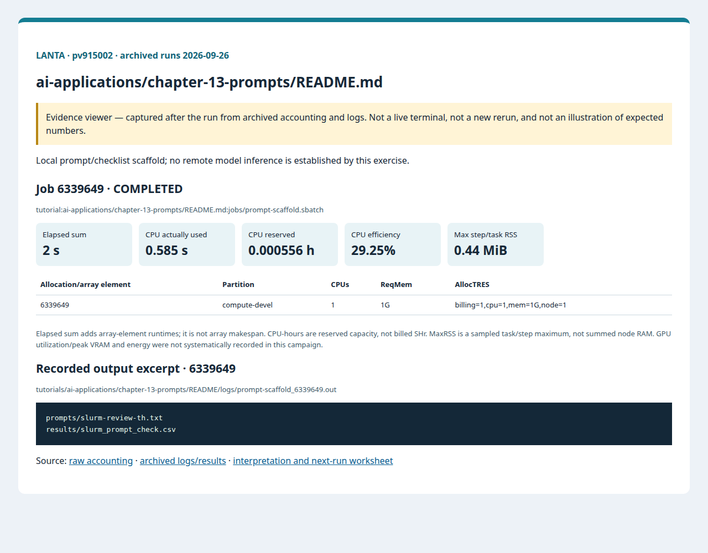
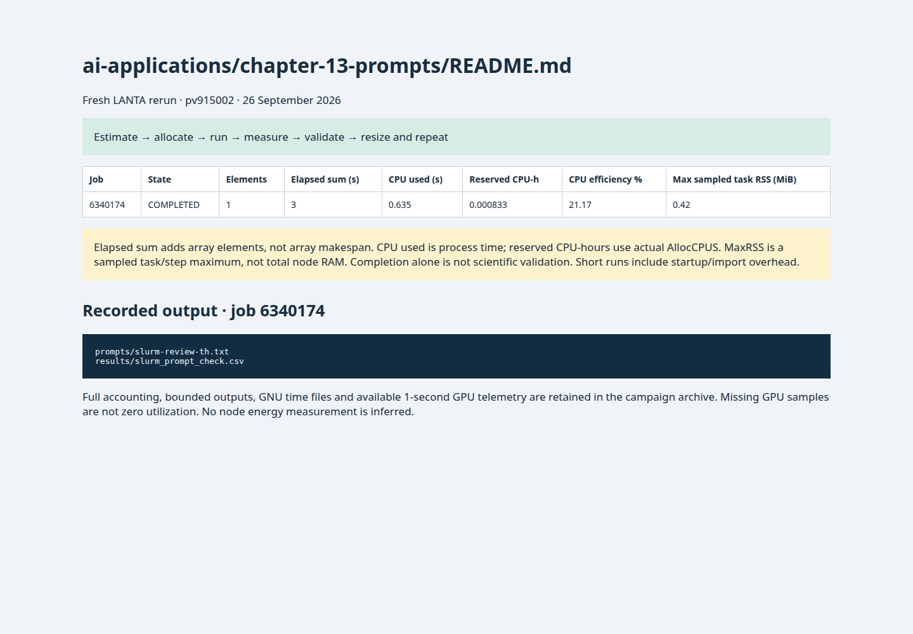

# บทที่ 13: Prompt Engineering

<!-- resource-learning:start -->
## จากงานเล็กสู่การทดลองที่วัดผลได้ / Resource lab

Booklet flow: pages **37–38** of the [LANTA handbook](../../docs/lanta-hpc-experience-handbook.pdf). [Full learning sequence and worksheet](../../docs/RESOURCE_ESTIMATION_WORKBOOK.md).

<details><summary>ภาพแนวคิดจาก booklet / workflow illustration</summary>


Original booklet illustration, not a run screenshot. [Source and limitations](../../docs/images/booklet/README.md).

</details>

### 1. ขอบเขตและการประมาณก่อนรัน

Local prompt/checklist scaffold; no remote model inference is established by this exercise.

Current text generation/checking is a one-CPU task. For a future model, budget prompt + generated tokens, batching and KV cache separately; this scaffold supplies no tokens/second or inference-memory measurement.

### 2. ทรัพยากรที่ใช้จริงและตัวอย่าง output

Archived LANTA evidence, **2026-09-26**, account `pv915002`; these are historical measurements, not a new run or a future performance promise.

| Job | State | Elements | Sum elapsed (s) | CPU used (s) | Reserved CPU-h | Max step/task RSS (MiB) |
|---|---|---:|---:|---:|---:|---:|
| 6339649 | COMPLETED | 1 | 2 | 0.585 | 0.000556 | 0.44 |

Elapsed is summed across array elements, not array makespan. CPU used is `TotalCPU`; reserved CPU-hours include idle allocation time. MaxRSS is the largest sampled task/step value, **not total node RAM**. Missing GPU/energy telemetry must not be interpreted as zero.



Browser screenshot of the [archived evidence viewer](../../docs/tutorial-evidence/ai-applications-chapter-13-prompts-readme.html); not a live terminal capture. Open the viewer for exact requested/allocated resources and job-specific log excerpts.

**Read the numbers:** job `6339649` used 0.585 CPU-seconds over 2 summed elapsed seconds: about **0.29 busy CPU cores per running element on average**. This describes CPU work across the whole allocation, including setup; it does not measure GPU utilization. For a seconds-long run, startup and coarse memory sampling can dominate. Do not reduce RAM to the displayed RSS or claim scaling without a longer pilot.

<details><summary>ตัวอย่าง output ที่บันทึกจริง / archived stdout excerpt</summary>

Job `6339649` · archive member `tutorials/ai-applications/chapter-13-prompts/README/logs/prompt-scaffold_6339649.out`

```text
prompts/slurm-review-th.txt
results/slurm_prompt_check.csv
```

</details>

### 3. ขยายงานทีละแกนและตรวจความถูกต้อง

Create a fixed set of valid and invalid Slurm examples, score detected errors and false positives, and only then compare inference implementations on the same set. Do not send credentials or private research data to an external model.

**Correctness gate:** Check that account, partition, resources and output paths are represented; report quality alongside any future latency improvement.

[Public applications and research-backed experiments](../../docs/REAL_APPLICATION_EXPERIMENTS.md#nvidia-and-ai) provide the next workload. Proposed resource budgets there are not measured requirements.

Before the next run, write down input size, expected time/RAM, requested CPUs/GPUs, and a stop condition. Afterwards record job ID, actual allocation, elapsed, CPU time, memory, result check and one change for the next run. Use three repeats and report spread; do not claim speedup from one short smoke run.

<!-- resource-learning:end -->

ผลรันซ้ำ LANTA บัญชี `pv915002` วันที่ 2026-09-26: [สถานะ ขอบเขต ผลลัพธ์ และ resource usage](../../docs/lanta-runs/2026-09-26-pv915002/README.md) · [วิธีประเมินและปรับปรุง performance](../../docs/PERFORMANCE_EVALUATION_OPTIMIZATION_TH.md)

คำสั่งในหน้านี้อธิบายรวมไว้ที่ [../../docs/BASH_COMMAND_REFERENCE_TH.md](../../docs/BASH_COMMAND_REFERENCE_TH.md).

เริ่มจาก SSH ตาม [../../LANTA_SETUP.md#1-ssh-to-lanta](../../LANTA_SETUP.md#1-ssh-to-lanta) แล้วแปะ block ในหัวข้อ Copy-Paste บน LANTA

หน้านี้เป็น standalone hand-on ผู้ใช้แปะคำสั่งบน LANTA แล้วได้ workspace, source file, Slurm script, log และ result ครบใน `$HOME/hpc-ignite-standalone/ai-prompts` โดยตรง

## เป้าหมาย

1. สร้าง prompt scaffold เป็นไฟล์
2. สร้าง checklist CSV จาก prompt review
3. ฝึกแยก prompt, input และ result

## Copy-Paste บน LANTA

แปะทีละ block ตามลำดับ แต่ละ block ทำหนึ่งงานหลักและมีหลักฐานให้ตรวจทันทีหลังรัน

### ขั้นที่ 1: เตรียม workspace และตัวแปร

ขั้นนี้กำหนดพื้นที่ทำงานของบท สร้าง folder มาตรฐาน และตั้งค่า account/partition ที่ใช้ซ้ำในขั้นถัดไป

```bash
mkdir -p "$HOME/hpc-ignite-standalone/ai-prompts"
cd "$HOME/hpc-ignite-standalone/ai-prompts"
mkdir -p configs input jobs logs notes results src prompts

if [ -z "${LANTA_CPU_PARTITION:-}" ]; then
    export LANTA_CPU_PARTITION="compute-devel"
fi
if [ -z "${LANTA_ACCOUNT:-}" ]; then
    read -rp "Slurm project account, blank for site default: " LANTA_ACCOUNT
    export LANTA_ACCOUNT
fi
SBATCH_ACCOUNT=()
if [ -n "${LANTA_ACCOUNT:-}" ]; then
    SBATCH_ACCOUNT=(-A "$LANTA_ACCOUNT")
fi
```

### ขั้นที่ 2: สร้าง source code `src/prompt_scaffold.py`

ขั้นนี้สร้างไฟล์โปรแกรมหลัก ให้ผู้ใช้อ่านส่วน import, parameter, output path และ sanity check ก่อนส่งงาน

```bash
cat > src/prompt_scaffold.py <<'PYCODE'
from pathlib import Path
Path("prompts").mkdir(exist_ok=True); Path("results").mkdir(exist_ok=True)
prompt = """[System]
คุณเป็นผู้ช่วยตรวจ Slurm script สำหรับ training บน LANTA

[Task]
ประเมิน resource request ของ job สั้น ๆ โดยดู account, partition, walltime, output log และ reproducibility
"""
Path("prompts/slurm-review-th.txt").write_text(prompt, encoding="utf-8")
report = """checklist,status
account,needs user value
partition,compute-devel for smoke
walltime,short
logs,stdout and stderr separated
reproducibility,record module list and command versions
"""
Path("results/slurm_prompt_check.csv").write_text(report, encoding="utf-8")
print("prompts/slurm-review-th.txt"); print("results/slurm_prompt_check.csv")
PYCODE
```


### ขั้นที่ 3: สร้าง Slurm script `jobs/prompt-scaffold.sbatch`

ขั้นนี้สร้างไฟล์ Slurm ที่ระบุ resource, module, working directory และคำสั่งที่รันบน compute node

```bash
cat > jobs/prompt-scaffold.sbatch <<'SLURM'
#!/bin/bash
#SBATCH --job-name=prompt-scaffold
#SBATCH --nodes=1
#SBATCH --ntasks=1
#SBATCH --cpus-per-task=1
#SBATCH --mem=1G
#SBATCH --time=00:05:00
#SBATCH --output=logs/%x_%j.out
#SBATCH --error=logs/%x_%j.err

set -euo pipefail
module purge
module load cray-python/3.10.10 2>/dev/null || module load python 2>/dev/null || true
cd "$SLURM_SUBMIT_DIR"
mkdir -p "results/${SLURM_JOB_ID}"
python src/prompt_scaffold.py | tee "results/${SLURM_JOB_ID}/output.txt"
SLURM
```

### ขั้นที่ 4: ส่งงานเข้า Slurm

ขั้นนี้ส่ง job script ที่เพิ่งสร้างไว้ด้วย `sbatch` แล้วบันทึก job id เพื่อใช้ตามคิวและอ่าน log ภายหลัง

```bash
job_id=$(sbatch "${SBATCH_ACCOUNT[@]}" -p "$LANTA_CPU_PARTITION" --parsable jobs/prompt-scaffold.sbatch)
echo "$job_id	prompt-scaffold	$(date -Is)" >> notes/job-history.tsv
echo "Submitted job: $job_id"
echo "Monitor: squeue -j $job_id"
echo "Read: tail -80 logs/prompt-scaffold_${job_id}.out"
```

## Check

```bash
cd "$HOME/hpc-ignite-standalone/ai-prompts"
cat prompts/slurm-review-th.txt
cat results/slurm_prompt_check.csv
```

## การตรวจผล

หลัง job จบ ให้ผู้ใช้ตรวจสามชั้นหลักฐาน:

1. `sacct` แสดง `COMPLETED` และ `ExitCode` เป็น `0:0`
2. `logs/` มี stdout/stderr ของ job id นั้น
3. `results/` มีไฟล์ output ที่ระบุในหัวข้อ Check

## ใช้ Repo เป็น Reference

ถ้าผู้ใช้ clone repo แล้ว สามารถเทียบแนวคิดกับไฟล์ใน repo ได้ เช่น `slurm/`, `requirements/`, `environments/` และ `jobs/` ของแต่ละบท แต่ block ด้านบนออกแบบให้รันได้จากหน้า hand-on นี้โดยตรง

<!-- performance-rerun:start -->
## Fresh measured rerun — 26 September 2026

| Job | State | Elements | Sum elapsed (s) | CPU used (s) | Reserved CPU-h | Max step/task RSS (MiB) |
|---|---|---:|---:|---:|---:|---:|
| 6340174 | COMPLETED | 1 | 3 | 0.635 | 0.000833 | 0.42 |

These are new measured jobs, not estimates. One campaign pass does not establish scaling or runtime variance. Allocated CPU-hours are not billed SHr; sampled RSS is not total node memory.

[Accounting, output archive and measurement limitations](../../docs/lanta-runs/2026-09-26-performance/README.md)


<!-- performance-rerun:end -->
