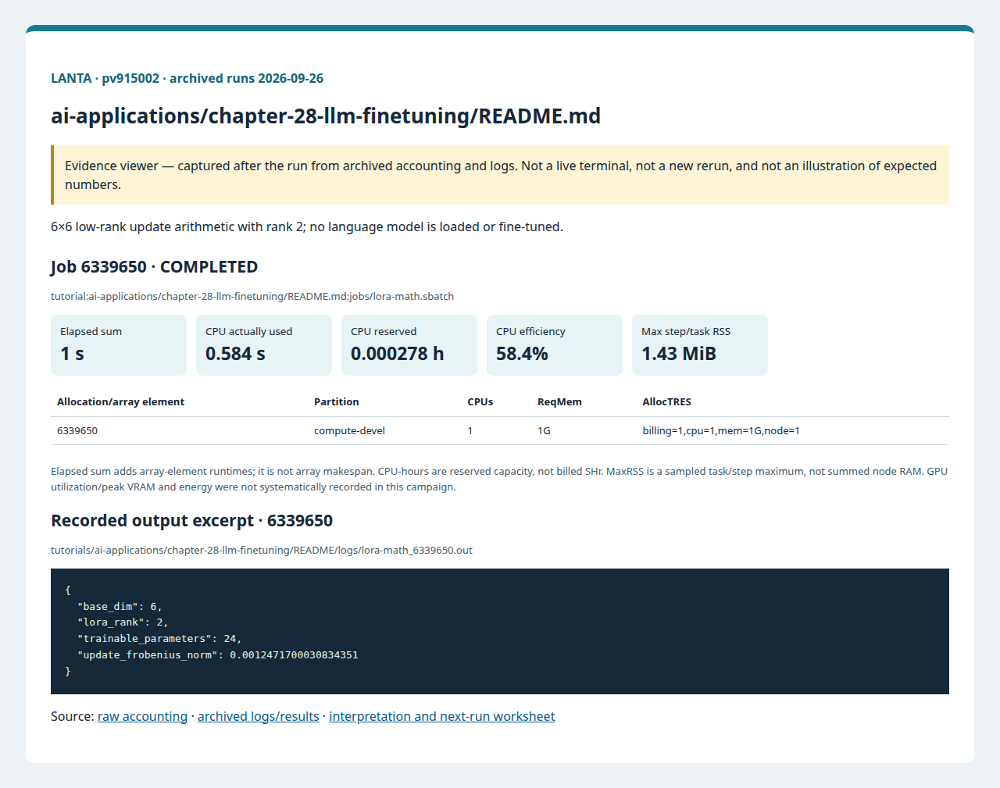
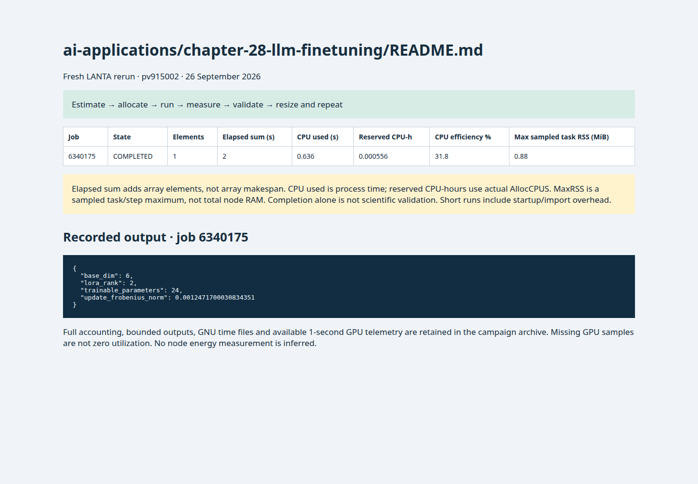

# บทที่ 28: การ Finetune LLM

<!-- resource-learning:start -->
## จากงานเล็กสู่การทดลองที่วัดผลได้ / Resource lab

Booklet flow: pages **37–38** of the [LANTA handbook](../../docs/lanta-hpc-experience-handbook.pdf). [Full learning sequence and worksheet](../../docs/RESOURCE_ESTIMATION_WORKBOOK.md).

<details><summary>ภาพแนวคิดจาก booklet / workflow illustration</summary>


Original booklet illustration, not a run screenshot. [Source and limitations](../../docs/images/booklet/README.md).

</details>

### 1. ขอบเขตและการประมาณก่อนรัน

6×6 low-rank update arithmetic with rank 2; no language model is loaded or fine-tuned.

Adapter parameters = r(d_in+d_out), versus d_in×d_out dense weights. Here 2(6+6)=24. This saving does not remove base-model, activation, gradient or optimizer memory in real training.

### 2. ทรัพยากรที่ใช้จริงและตัวอย่าง output

Archived LANTA evidence, **2026-09-26**, account `pv915002`; these are historical measurements, not a new run or a future performance promise.

| Job | State | Elements | Sum elapsed (s) | CPU used (s) | Reserved CPU-h | Max step/task RSS (MiB) |
|---|---|---:|---:|---:|---:|---:|
| 6339650 | COMPLETED | 1 | 1 | 0.584 | 0.000278 | 1.43 |

Elapsed is summed across array elements, not array makespan. CPU used is `TotalCPU`; reserved CPU-hours include idle allocation time. MaxRSS is the largest sampled task/step value, **not total node RAM**. Missing GPU/energy telemetry must not be interpreted as zero.



Browser screenshot of the [archived evidence viewer](../../docs/tutorial-evidence/ai-applications-chapter-28-llm-finetuning-readme.html); not a live terminal capture. Open the viewer for exact requested/allocated resources and job-specific log excerpts.

**Read the numbers:** job `6339650` used 0.584 CPU-seconds over 1 summed elapsed seconds: about **0.58 busy CPU cores per running element on average**. This describes CPU work across the whole allocation, including setup; it does not measure GPU utilization. For a seconds-long run, startup and coarse memory sampling can dominate. Do not reduce RAM to the displayed RSS or claim scaling without a longer pilot.

<details><summary>ตัวอย่าง output ที่บันทึกจริง / archived stdout excerpt</summary>

Job `6339650` · archive member `tutorials/ai-applications/chapter-28-llm-finetuning/README/logs/lora-math_6339650.out`

```text
{
  "base_dim": 6,
  "lora_rank": 2,
  "trainable_parameters": 24,
  "update_frobenius_norm": 0.0012471700030834351
}
```

</details>

### 3. ขยายงานทีละแกนและตรวจความถูกต้อง

For the arithmetic exercise vary dimension 6/60/600 and rank 2/4/8, recording update norm and time. A real fine-tuning extension must specify model, dataset, sequence length, precision and quality target before requesting GPUs.

**Correctness gate:** Check parameter counts and finite matrix values. Do not describe this result as LLM fine-tuning throughput or accuracy.

[Public applications and research-backed experiments](../../docs/REAL_APPLICATION_EXPERIMENTS.md#nvidia-and-ai) provide the next workload. Proposed resource budgets there are not measured requirements.

Before the next run, write down input size, expected time/RAM, requested CPUs/GPUs, and a stop condition. Afterwards record job ID, actual allocation, elapsed, CPU time, memory, result check and one change for the next run. Use three repeats and report spread; do not claim speedup from one short smoke run.

<!-- resource-learning:end -->

ผลรันซ้ำ LANTA บัญชี `pv915002` วันที่ 2026-09-26: [สถานะ ขอบเขต ผลลัพธ์ และ resource usage](../../docs/lanta-runs/2026-09-26-pv915002/README.md) · [วิธีประเมินและปรับปรุง performance](../../docs/PERFORMANCE_EVALUATION_OPTIMIZATION_TH.md)

คำสั่งในหน้านี้อธิบายรวมไว้ที่ [../../docs/BASH_COMMAND_REFERENCE_TH.md](../../docs/BASH_COMMAND_REFERENCE_TH.md).

เริ่มจาก SSH ตาม [../../LANTA_SETUP.md#1-ssh-to-lanta](../../LANTA_SETUP.md#1-ssh-to-lanta) แล้วแปะ block ในหัวข้อ Copy-Paste บน LANTA

หน้านี้เป็น standalone hand-on ผู้ใช้แปะคำสั่งบน LANTA แล้วได้ workspace, source file, Slurm script, log และ result ครบใน `$HOME/hpc-ignite-standalone/ai-lora-math` โดยตรง

## เป้าหมาย

1. สาธิต LoRA parameter update ด้วยคณิตศาสตร์ขนาดเล็ก
2. บันทึกจำนวน trainable parameters
3. เตรียมหลักฐานก่อนใช้ model cache จริง

## Copy-Paste บน LANTA

แปะทีละ block ตามลำดับ แต่ละ block ทำหนึ่งงานหลักและมีหลักฐานให้ตรวจทันทีหลังรัน

### ขั้นที่ 1: เตรียม workspace และตัวแปร

ขั้นนี้กำหนดพื้นที่ทำงานของบท สร้าง folder มาตรฐาน และตั้งค่า account/partition ที่ใช้ซ้ำในขั้นถัดไป

```bash
mkdir -p "$HOME/hpc-ignite-standalone/ai-lora-math"
cd "$HOME/hpc-ignite-standalone/ai-lora-math"
mkdir -p configs input jobs logs notes results src

if [ -z "${LANTA_CPU_PARTITION:-}" ]; then
    export LANTA_CPU_PARTITION="compute-devel"
fi
if [ -z "${LANTA_ACCOUNT:-}" ]; then
    read -rp "Slurm project account, blank for site default: " LANTA_ACCOUNT
    export LANTA_ACCOUNT
fi
SBATCH_ACCOUNT=()
if [ -n "${LANTA_ACCOUNT:-}" ]; then
    SBATCH_ACCOUNT=(-A "$LANTA_ACCOUNT")
fi
```

### ขั้นที่ 2: สร้าง source code `src/lora_math.py`

ขั้นนี้สร้างไฟล์โปรแกรมหลัก ให้ผู้ใช้อ่านส่วน import, parameter, output path และ sanity check ก่อนส่งงาน

```bash
cat > src/lora_math.py <<'PYCODE'
from pathlib import Path
import json, math, random
Path("results").mkdir(exist_ok=True); random.seed(7)
base_dim, rank = 6, 2
A = [[random.uniform(-0.02, 0.02) for _ in range(rank)] for _ in range(base_dim)]
B = [[random.uniform(-0.02, 0.02) for _ in range(base_dim)] for _ in range(rank)]
updates = [[sum(A[i][k] * B[k][j] for k in range(rank)) for j in range(base_dim)] for i in range(base_dim)]
summary = {"base_dim": base_dim, "lora_rank": rank, "trainable_parameters": base_dim * rank + rank * base_dim, "update_frobenius_norm": math.sqrt(sum(x*x for row in updates for x in row))}
out = Path("results/lora_math_summary.json"); out.write_text(json.dumps(summary, indent=2), encoding="utf-8"); print(json.dumps(summary, indent=2))
PYCODE
```


### ขั้นที่ 3: สร้าง Slurm script `jobs/lora-math.sbatch`

ขั้นนี้สร้างไฟล์ Slurm ที่ระบุ resource, module, working directory และคำสั่งที่รันบน compute node

```bash
cat > jobs/lora-math.sbatch <<'SLURM'
#!/bin/bash
#SBATCH --job-name=lora-math
#SBATCH --nodes=1
#SBATCH --ntasks=1
#SBATCH --cpus-per-task=1
#SBATCH --mem=1G
#SBATCH --time=00:05:00
#SBATCH --output=logs/%x_%j.out
#SBATCH --error=logs/%x_%j.err

set -euo pipefail
module purge
module load cray-python/3.10.10 2>/dev/null || module load python 2>/dev/null || true
cd "$SLURM_SUBMIT_DIR"
mkdir -p "results/${SLURM_JOB_ID}"
python src/lora_math.py | tee "results/${SLURM_JOB_ID}/output.txt"
SLURM
```

### ขั้นที่ 4: ส่งงานเข้า Slurm

ขั้นนี้ส่ง job script ที่เพิ่งสร้างไว้ด้วย `sbatch` แล้วบันทึก job id เพื่อใช้ตามคิวและอ่าน log ภายหลัง

```bash
job_id=$(sbatch "${SBATCH_ACCOUNT[@]}" -p "$LANTA_CPU_PARTITION" --parsable jobs/lora-math.sbatch)
echo "$job_id	lora-math	$(date -Is)" >> notes/job-history.tsv
echo "Submitted job: $job_id"
echo "Monitor: squeue -j $job_id"
echo "Read: tail -80 logs/lora-math_${job_id}.out"
```

## Check

```bash
cd "$HOME/hpc-ignite-standalone/ai-lora-math"
cat results/lora_math_summary.json
tail -50 logs/lora-math_*.out
```

## การตรวจผล

หลัง job จบ ให้ผู้ใช้ตรวจสามชั้นหลักฐาน:

1. `sacct` แสดง `COMPLETED` และ `ExitCode` เป็น `0:0`
2. `logs/` มี stdout/stderr ของ job id นั้น
3. `results/` มีไฟล์ output ที่ระบุในหัวข้อ Check

## ใช้ Repo เป็น Reference

ถ้าผู้ใช้ clone repo แล้ว สามารถเทียบแนวคิดกับไฟล์ใน repo ได้ เช่น `slurm/`, `requirements/`, `environments/` และ `jobs/` ของแต่ละบท แต่ block ด้านบนออกแบบให้รันได้จากหน้า hand-on นี้โดยตรง

<!-- performance-rerun:start -->
## Fresh measured rerun — 26 September 2026

| Job | State | Elements | Sum elapsed (s) | CPU used (s) | Reserved CPU-h | Max step/task RSS (MiB) |
|---|---|---:|---:|---:|---:|---:|
| 6340175 | COMPLETED | 1 | 2 | 0.636 | 0.000556 | 0.88 |

These are new measured jobs, not estimates. One campaign pass does not establish scaling or runtime variance. Allocated CPU-hours are not billed SHr; sampled RSS is not total node memory.

[Accounting, output archive and measurement limitations](../../docs/lanta-runs/2026-09-26-performance/README.md)


<!-- performance-rerun:end -->
