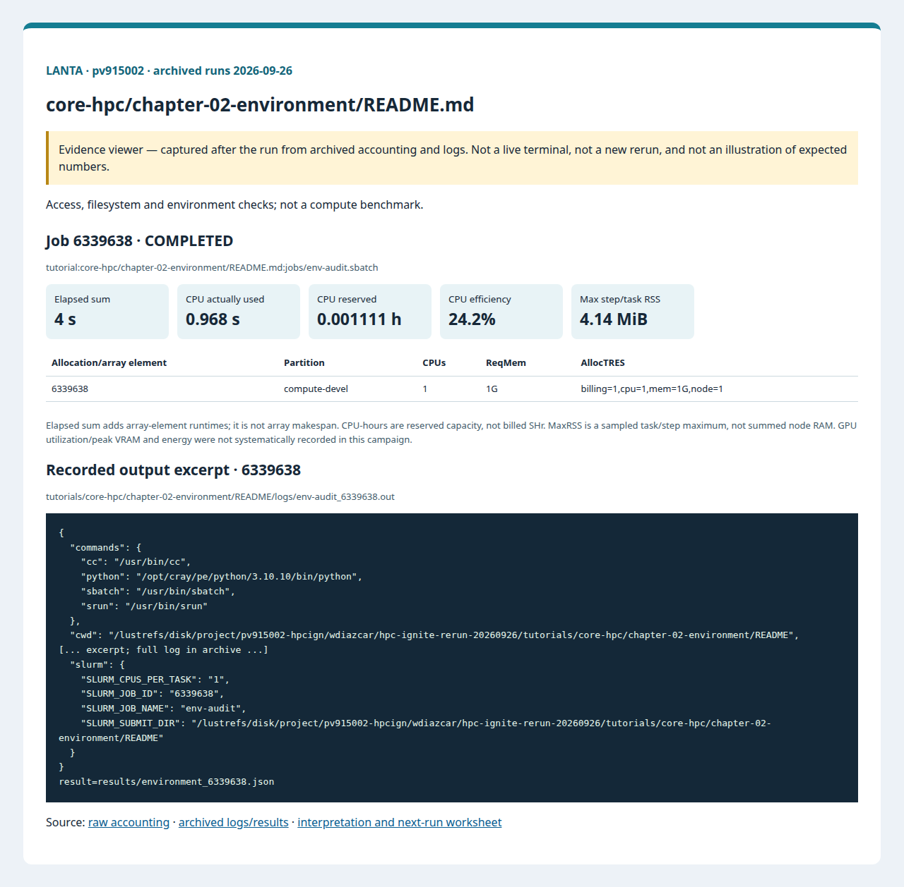

# บทที่ 2: สภาพแวดล้อม HPC และระบบ LANTA

<!-- resource-learning:start -->
## จากงานเล็กสู่การทดลองที่วัดผลได้ / Resource lab

Booklet flow: pages **5–18** of the [LANTA handbook](../../docs/lanta-hpc-experience-handbook.pdf). [Full learning sequence and worksheet](../../docs/RESOURCE_ESTIMATION_WORKBOOK.md).

<details><summary>ภาพแนวคิดจาก booklet / workflow illustration</summary>


Original booklet illustration, not a run screenshot. [Source and limitations](../../docs/images/booklet/README.md).

</details>

### 1. ขอบเขตและการประมาณก่อนรัน

Access, filesystem and environment checks; not a compute benchmark.

No GPU is needed. File/module checks need no compute allocation; use the existing one-CPU Slurm smoke job to prove compute-node access. Budget storage from input + output + checkpoints, not input alone.

### 2. ทรัพยากรที่ใช้จริงและตัวอย่าง output

Archived LANTA evidence, **2026-09-26**, account `pv915002`; these are historical measurements, not a new run or a future performance promise.

| Job | State | Elements | Sum elapsed (s) | CPU used (s) | Reserved CPU-h | Max step/task RSS (MiB) |
|---|---|---:|---:|---:|---:|---:|
| 6339638 | COMPLETED | 1 | 4 | 0.968 | 0.001111 | 4.14 |

Elapsed is summed across array elements, not array makespan. CPU used is `TotalCPU`; reserved CPU-hours include idle allocation time. MaxRSS is the largest sampled task/step value, **not total node RAM**. Missing GPU/energy telemetry must not be interpreted as zero.



Browser screenshot of the [archived evidence viewer](../../docs/tutorial-evidence/core-hpc-chapter-02-environment-readme.html); not a live terminal capture. Open the viewer for exact requested/allocated resources and job-specific log excerpts.

**Read the numbers:** job `6339638` used 0.968 CPU-seconds over 4 summed elapsed seconds: about **0.24 busy CPU cores per running element on average**. This describes CPU work across the whole allocation, including setup; it does not measure GPU utilization. For a seconds-long run, startup and coarse memory sampling can dominate. Do not reduce RAM to the displayed RSS or claim scaling without a longer pilot.

<details><summary>ตัวอย่าง output ที่บันทึกจริง / archived stdout excerpt</summary>

Job `6339638` · archive member `tutorials/core-hpc/chapter-02-environment/README/logs/env-audit_6339638.out`

```text
{
  "commands": {
    "cc": "/usr/bin/cc",
    "python": "/opt/cray/pe/python/3.10.10/bin/python",
    "sbatch": "/usr/bin/sbatch",
    "srun": "/usr/bin/srun"
  },
  "cwd": "/lustrefs/disk/project/pv915002-hpcign/wdiazcar/hpc-ignite-rerun-20260926/tutorials/core-hpc/chapter-02-environment/README",
[... excerpt; full log in archive ...]
  "slurm": {
    "SLURM_CPUS_PER_TASK": "1",
    "SLURM_JOB_ID": "6339638",
    "SLURM_JOB_NAME": "env-audit",
    "SLURM_SUBMIT_DIR": "/lustrefs/disk/project/pv915002-hpcign/wdiazcar/hpc-ignite-rerun-20260926/tutorials/core-hpc/chapter-02-environment/README"
  }
}
result=results/environment_6339638.json
```

</details>

### 3. ขยายงานทีละแกนและตรวจความถูกต้อง

Record account, quota, module versions and a small job ID before moving to CPU scaling. Do not run a CPU stress test on a login node.

**Correctness gate:** Confirm the compute hostname, intended account, output file and exit status. Redact tokens and private keys from evidence.

[Public applications and research-backed experiments](../../docs/REAL_APPLICATION_EXPERIMENTS.md#miniweather) provide the next workload. Proposed resource budgets there are not measured requirements.

Before the next run, write down input size, expected time/RAM, requested CPUs/GPUs, and a stop condition. Afterwards record job ID, actual allocation, elapsed, CPU time, memory, result check and one change for the next run. Use three repeats and report spread; do not claim speedup from one short smoke run.

<!-- resource-learning:end -->

ผลรันซ้ำ LANTA บัญชี `pv915002` วันที่ 2026-09-26: [สถานะ ขอบเขต ผลลัพธ์ และ resource usage](../../docs/lanta-runs/2026-09-26-pv915002/README.md) · [วิธีประเมินและปรับปรุง performance](../../docs/PERFORMANCE_EVALUATION_OPTIMIZATION_TH.md)

คำสั่งในหน้านี้อธิบายรวมไว้ที่ [../../docs/BASH_COMMAND_REFERENCE_TH.md](../../docs/BASH_COMMAND_REFERENCE_TH.md).

เริ่มจาก SSH ตาม [../../LANTA_SETUP.md#1-ssh-to-lanta](../../LANTA_SETUP.md#1-ssh-to-lanta) แล้วแปะ block ในหัวข้อ Copy-Paste บน LANTA

หน้านี้เป็น standalone hand-on ผู้ใช้แปะคำสั่งบน LANTA แล้วได้ workspace, source file, Slurm script, log และ result ครบใน `$HOME/hpc-ignite-standalone/core-environment` โดยตรง

## เป้าหมาย

1. ตรวจ Python, command path และตัวแปร Slurm
2. บันทึก environment evidence เป็น JSON
3. ฝึกส่งงานสั้นบน compute-devel

## Copy-Paste บน LANTA

แปะทีละ block ตามลำดับ แต่ละ block ทำหนึ่งงานหลักและมีหลักฐานให้ตรวจทันทีหลังรัน

### ขั้นที่ 1: เตรียม workspace และตัวแปร

ขั้นนี้กำหนดพื้นที่ทำงานของบท สร้าง folder มาตรฐาน และตั้งค่า account/partition ที่ใช้ซ้ำในขั้นถัดไป

```bash
mkdir -p "$HOME/hpc-ignite-standalone/core-environment"
cd "$HOME/hpc-ignite-standalone/core-environment"
mkdir -p configs input jobs logs notes results src

if [ -z "${LANTA_CPU_PARTITION:-}" ]; then
    export LANTA_CPU_PARTITION="compute-devel"
fi
if [ -z "${LANTA_ACCOUNT:-}" ]; then
    read -rp "Slurm project account, blank for site default: " LANTA_ACCOUNT
    export LANTA_ACCOUNT
fi
SBATCH_ACCOUNT=()
if [ -n "${LANTA_ACCOUNT:-}" ]; then
    SBATCH_ACCOUNT=(-A "$LANTA_ACCOUNT")
fi
```

### ขั้นที่ 2: สร้าง source code `src/environment_audit.py`

ขั้นนี้สร้างไฟล์โปรแกรมหลัก ให้ผู้ใช้อ่านส่วน import, parameter, output path และ sanity check ก่อนส่งงาน

```bash
cat > src/environment_audit.py <<'PYCODE'
from pathlib import Path
import json
import os
import platform
import shutil
import socket
import sys
Path("results").mkdir(exist_ok=True)
info = {
    "python": sys.version.split()[0],
    "executable": sys.executable,
    "host": socket.gethostname(),
    "platform": platform.platform(),
    "cwd": str(Path.cwd()),
    "slurm": {key: os.environ.get(key, "") for key in ["SLURM_JOB_ID", "SLURM_JOB_NAME", "SLURM_CPUS_PER_TASK", "SLURM_SUBMIT_DIR"]},
    "commands": {cmd: shutil.which(cmd) for cmd in ["python", "srun", "sbatch", "cc"]},
}
out = Path("results") / f"environment_{os.environ.get('SLURM_JOB_ID', 'manual')}.json"
out.write_text(json.dumps(info, indent=2, sort_keys=True), encoding="utf-8")
print(json.dumps(info, indent=2, sort_keys=True))
print(f"result={out}")
PYCODE
```


### ขั้นที่ 3: สร้าง Slurm script `jobs/env-audit.sbatch`

ขั้นนี้สร้างไฟล์ Slurm ที่ระบุ resource, module, working directory และคำสั่งที่รันบน compute node

```bash
cat > jobs/env-audit.sbatch <<'SLURM'
#!/bin/bash
#SBATCH --job-name=env-audit
#SBATCH --nodes=1
#SBATCH --ntasks=1
#SBATCH --cpus-per-task=1
#SBATCH --mem=1G
#SBATCH --time=00:05:00
#SBATCH --output=logs/%x_%j.out
#SBATCH --error=logs/%x_%j.err

set -euo pipefail
module purge
module load cray-python/3.10.10 2>/dev/null || module load python 2>/dev/null || true
cd "$SLURM_SUBMIT_DIR"
mkdir -p "results/${SLURM_JOB_ID}"
python src/environment_audit.py | tee "results/${SLURM_JOB_ID}/output.txt"
SLURM
```

### ขั้นที่ 4: ส่งงานเข้า Slurm

ขั้นนี้ส่ง job script ที่เพิ่งสร้างไว้ด้วย `sbatch` แล้วบันทึก job id เพื่อใช้ตามคิวและอ่าน log ภายหลัง

```bash
job_id=$(sbatch "${SBATCH_ACCOUNT[@]}" -p "$LANTA_CPU_PARTITION" --parsable jobs/env-audit.sbatch)
echo "$job_id	env-audit	$(date -Is)" >> notes/job-history.tsv
echo "Submitted job: $job_id"
echo "Monitor: squeue -j $job_id"
echo "Read: tail -80 logs/env-audit_${job_id}.out"
```

## Check

```bash
cd "$HOME/hpc-ignite-standalone/core-environment"
find results -maxdepth 2 -type f | sort
tail -80 logs/env-audit_*.out
```

## การตรวจผล

หลัง job จบ ให้ผู้ใช้ตรวจสามชั้นหลักฐาน:

1. `sacct` แสดง `COMPLETED` และ `ExitCode` เป็น `0:0`
2. `logs/` มี stdout/stderr ของ job id นั้น
3. `results/` มีไฟล์ output ที่ระบุในหัวข้อ Check

## ใช้ Repo เป็น Reference

ถ้าผู้ใช้ clone repo แล้ว สามารถเทียบแนวคิดกับไฟล์ใน repo ได้ เช่น `slurm/`, `requirements/`, `environments/` และ `jobs/` ของแต่ละบท แต่ block ด้านบนออกแบบให้รันได้จากหน้า hand-on นี้โดยตรง
