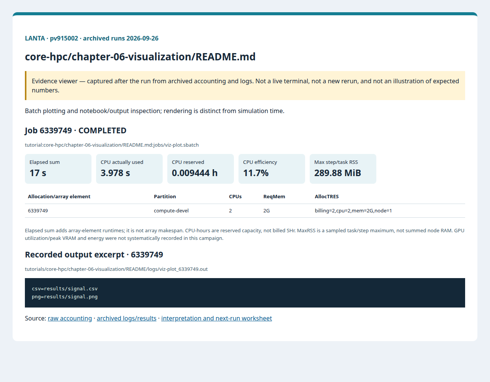
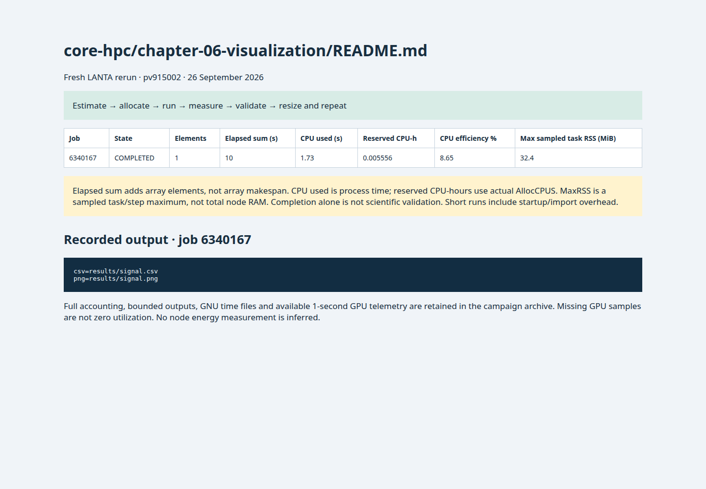

# บทที่ 6: การสร้างภาพข้อมูล

<!-- resource-learning:start -->
## จากงานเล็กสู่การทดลองที่วัดผลได้ / Resource lab

Booklet flow: pages **33–36** of the [LANTA handbook](../../docs/lanta-hpc-experience-handbook.pdf). [Full learning sequence and worksheet](../../docs/RESOURCE_ESTIMATION_WORKBOOK.md).

<details><summary>ภาพแนวคิดจาก booklet / workflow illustration</summary>


Original booklet illustration, not a run screenshot. [Source and limitations](../../docs/images/booklet/README.md).

</details>

### 1. ขอบเขตและการประมาณก่อนรัน

Batch plotting and notebook/output inspection; rendering is distinct from simulation time.

Budget arrays separately from figure buffers. A W × H pixel RGBA canvas needs at least 4WH bytes, before renderer overhead; two float64 coordinate arrays need 16N bytes, while Python lists use more. A single plot normally starts with one CPU and no GPU.

### 2. ทรัพยากรที่ใช้จริงและตัวอย่าง output

Archived LANTA evidence, **2026-09-26**, account `pv915002`; these are historical measurements, not a new run or a future performance promise.

| Job | State | Elements | Sum elapsed (s) | CPU used (s) | Reserved CPU-h | Max step/task RSS (MiB) |
|---|---|---:|---:|---:|---:|---:|
| 6339749 | COMPLETED | 1 | 17 | 3.978 | 0.009444 | 289.88 |

Elapsed is summed across array elements, not array makespan. CPU used is `TotalCPU`; reserved CPU-hours include idle allocation time. MaxRSS is the largest sampled task/step value, **not total node RAM**. Missing GPU/energy telemetry must not be interpreted as zero.



Browser screenshot of the [archived evidence viewer](../../docs/tutorial-evidence/core-hpc-chapter-06-visualization-readme.html); not a live terminal capture. Open the viewer for exact requested/allocated resources and job-specific log excerpts.

**Read the numbers:** job `6339749` used 3.978 CPU-seconds over 17 summed elapsed seconds: about **0.23 busy CPU cores per running element on average**. This describes CPU work across the whole allocation, including setup; it does not measure GPU utilization. For a seconds-long run, startup and coarse memory sampling can dominate. Do not reduce RAM to the displayed RSS or claim scaling without a longer pilot.

<details><summary>ตัวอย่าง output ที่บันทึกจริง / archived stdout excerpt</summary>

Job `6339749` · archive member `tutorials/core-hpc/chapter-06-visualization/README/logs/viz-plot_6339749.out`

```text
csv=results/signal.csv
png=results/signal.png
```

</details>

### 3. ขยายงานทีละแกนและตรวจความถูกต้อง

Compare 120, 12k and 120k points while holding figure size fixed; then vary DPI alone. Record render seconds, peak RSS and PNG size. Downsample only the display, retaining the raw scientific output.

**Correctness gate:** Open the generated image, verify axis units and that plotted values correspond to the source CSV. An existing PNG alone is not a successful scientific run.

[Public applications and research-backed experiments](../../docs/REAL_APPLICATION_EXPERIMENTS.md#miniweather) provide the next workload. Proposed resource budgets there are not measured requirements.

Before the next run, write down input size, expected time/RAM, requested CPUs/GPUs, and a stop condition. Afterwards record job ID, actual allocation, elapsed, CPU time, memory, result check and one change for the next run. Use three repeats and report spread; do not claim speedup from one short smoke run.

<!-- resource-learning:end -->

ผลรันซ้ำ LANTA บัญชี `pv915002` วันที่ 2026-09-26: [สถานะ ขอบเขต ผลลัพธ์ และ resource usage](../../docs/lanta-runs/2026-09-26-pv915002/README.md) · [วิธีประเมินและปรับปรุง performance](../../docs/PERFORMANCE_EVALUATION_OPTIMIZATION_TH.md)

คำสั่งในหน้านี้อธิบายรวมไว้ที่ [../../docs/BASH_COMMAND_REFERENCE_TH.md](../../docs/BASH_COMMAND_REFERENCE_TH.md).

เริ่มจาก SSH ตาม [../../LANTA_SETUP.md#1-ssh-to-lanta](../../LANTA_SETUP.md#1-ssh-to-lanta) แล้วแปะ block ในหัวข้อ Copy-Paste บน LANTA

หน้านี้เป็น standalone hand-on ผู้ใช้แปะคำสั่งบน LANTA แล้วได้ workspace, source file, Slurm script, log และ result ครบใน `$HOME/hpc-ignite-standalone/core-visualization` โดยตรง

## เป้าหมาย

1. สร้าง CSV สัญญาณจำลอง
2. สร้าง plot ด้วย Matplotlib ใน batch job
3. ตรวจไฟล์ PNG และ CSV

## Copy-Paste บน LANTA

แปะทีละ block ตามลำดับ แต่ละ block ทำหนึ่งงานหลักและมีหลักฐานให้ตรวจทันทีหลังรัน

### ขั้นที่ 1: เตรียม workspace และตัวแปร

ขั้นนี้กำหนดพื้นที่ทำงานของบท สร้าง folder มาตรฐาน และตั้งค่า account/partition ที่ใช้ซ้ำในขั้นถัดไป

```bash
mkdir -p "$HOME/hpc-ignite-standalone/core-visualization"
cd "$HOME/hpc-ignite-standalone/core-visualization"
mkdir -p configs input jobs logs notes results src

if [ -z "${LANTA_CPU_PARTITION:-}" ]; then
    export LANTA_CPU_PARTITION="compute-devel"
fi
if [ -z "${LANTA_ACCOUNT:-}" ]; then
    read -rp "Slurm project account, blank for site default: " LANTA_ACCOUNT
    export LANTA_ACCOUNT
fi
SBATCH_ACCOUNT=()
if [ -n "${LANTA_ACCOUNT:-}" ]; then
    SBATCH_ACCOUNT=(-A "$LANTA_ACCOUNT")
fi
```

### ขั้นที่ 2: สร้าง source code `src/make_plot.py`

ขั้นนี้สร้างไฟล์โปรแกรมหลัก ให้ผู้ใช้อ่านส่วน import, parameter, output path และ sanity check ก่อนส่งงาน

```bash
cat > src/make_plot.py <<'PYCODE'
from pathlib import Path
import csv
import math
import matplotlib
matplotlib.use("Agg")
import matplotlib.pyplot as plt
Path("results").mkdir(exist_ok=True)
csv_path = Path("results/signal.csv")
with csv_path.open("w", newline="", encoding="utf-8") as handle:
    writer = csv.writer(handle); writer.writerow(["x", "value"])
    for i in range(120): writer.writerow([i, math.sin(i / 12) + 0.2 * math.cos(i / 5)])
xs, ys = [], []
with csv_path.open(encoding="utf-8") as handle:
    next(handle)
    for line in handle:
        x, y = line.strip().split(","); xs.append(float(x)); ys.append(float(y))
plt.figure(figsize=(7, 3)); plt.plot(xs, ys); plt.xlabel("sample"); plt.ylabel("value"); plt.title("Standalone signal plot"); plt.tight_layout()
png = Path("results/signal.png"); plt.savefig(png, dpi=140)
print(f"csv={csv_path}"); print(f"png={png}")
PYCODE
```


### ขั้นที่ 3: สร้าง Slurm script `jobs/viz-plot.sbatch`

ขั้นนี้สร้างไฟล์ Slurm ที่ระบุ resource, module, working directory และคำสั่งที่รันบน compute node

```bash
cat > jobs/viz-plot.sbatch <<'SLURM'
#!/bin/bash
#SBATCH --job-name=viz-plot
#SBATCH --nodes=1
#SBATCH --ntasks=1
#SBATCH --cpus-per-task=1
#SBATCH --mem=2G
#SBATCH --time=00:05:00
#SBATCH --output=logs/%x_%j.out
#SBATCH --error=logs/%x_%j.err

set -euo pipefail
module purge
module load Mamba/23.11.0-0 2>/dev/null || true
set +u  # GDAL activation reads optional unset variables
conda activate netcdf-py39
set -u
cd "$SLURM_SUBMIT_DIR"
mkdir -p "results/${SLURM_JOB_ID}"
python src/make_plot.py | tee "results/${SLURM_JOB_ID}/output.txt"
SLURM
```

### ขั้นที่ 4: ส่งงานเข้า Slurm

ขั้นนี้ส่ง job script ที่เพิ่งสร้างไว้ด้วย `sbatch` แล้วบันทึก job id เพื่อใช้ตามคิวและอ่าน log ภายหลัง

```bash
job_id=$(sbatch "${SBATCH_ACCOUNT[@]}" -p "$LANTA_CPU_PARTITION" --parsable jobs/viz-plot.sbatch)
echo "$job_id	viz-plot	$(date -Is)" >> notes/job-history.tsv
echo "Submitted job: $job_id"
echo "Monitor: squeue -j $job_id"
echo "Read: tail -80 logs/viz-plot_${job_id}.out"
```

## Check

```bash
cd "$HOME/hpc-ignite-standalone/core-visualization"
find results -maxdepth 2 -type f | sort
ls -lh results/signal.png
```

## การตรวจผล

หลัง job จบ ให้ผู้ใช้ตรวจสามชั้นหลักฐาน:

1. `sacct` แสดง `COMPLETED` และ `ExitCode` เป็น `0:0`
2. `logs/` มี stdout/stderr ของ job id นั้น
3. `results/` มีไฟล์ output ที่ระบุในหัวข้อ Check

## ใช้ Repo เป็น Reference

ถ้าผู้ใช้ clone repo แล้ว สามารถเทียบแนวคิดกับไฟล์ใน repo ได้ เช่น `slurm/`, `requirements/`, `environments/` และ `jobs/` ของแต่ละบท แต่ block ด้านบนออกแบบให้รันได้จากหน้า hand-on นี้โดยตรง

<!-- performance-rerun:start -->
## Fresh measured rerun — 26 September 2026

| Job | State | Elements | Sum elapsed (s) | CPU used (s) | Reserved CPU-h | Max step/task RSS (MiB) |
|---|---|---:|---:|---:|---:|---:|
| 6340167 | COMPLETED | 1 | 10 | 1.730 | 0.005556 | 32.40 |

These are new measured jobs, not estimates. One campaign pass does not establish scaling or runtime variance. Allocated CPU-hours are not billed SHr; sampled RSS is not total node memory.

[Accounting, output archive and measurement limitations](../../docs/lanta-runs/2026-09-26-performance/README.md)


<!-- performance-rerun:end -->
