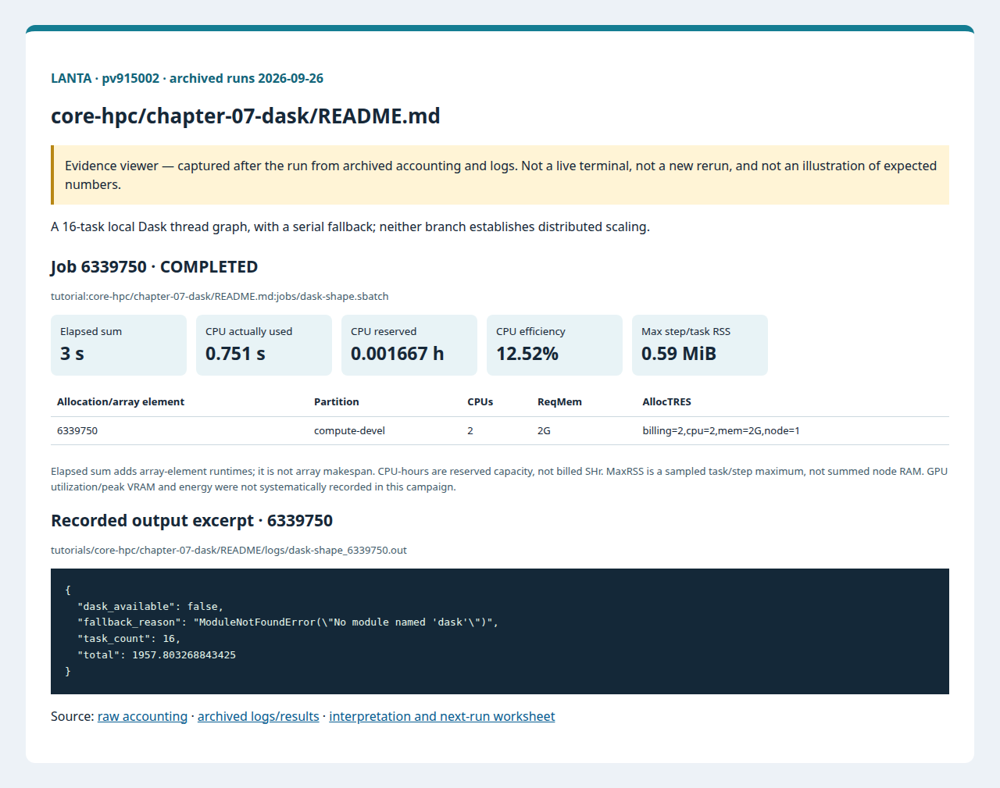

# บทที่ 7: Distributed Python ด้วย Dask

<!-- resource-learning:start -->
## จากงานเล็กสู่การทดลองที่วัดผลได้ / Resource lab

Booklet flow: pages **24–27** of the [LANTA handbook](../../docs/lanta-hpc-experience-handbook.pdf). [Full learning sequence and worksheet](../../docs/RESOURCE_ESTIMATION_WORKBOOK.md).

<details><summary>ภาพแนวคิดจาก booklet / workflow illustration</summary>


Original booklet illustration, not a run screenshot. [Source and limitations](../../docs/images/booklet/README.md).

</details>

### 1. ขอบเขตและการประมาณก่อนรัน

A 16-task local Dask thread graph, with a serial fallback; neither branch establishes distributed scaling.

Peak RAM includes concurrently live chunks, temporary arrays, scheduler and workers. For float64 chunks estimate chunk_elements × 8 × live_chunks × temporary_factor. Current Python math loops can be limited by the GIL; more threads are not guaranteed to help.

### 2. ทรัพยากรที่ใช้จริงและตัวอย่าง output

Archived LANTA evidence, **2026-09-26**, account `pv915002`; these are historical measurements, not a new run or a future performance promise.

| Job | State | Elements | Sum elapsed (s) | CPU used (s) | Reserved CPU-h | Max step/task RSS (MiB) |
|---|---|---:|---:|---:|---:|---:|
| 6339750 | COMPLETED | 1 | 3 | 0.751 | 0.001667 | 0.59 |

Elapsed is summed across array elements, not array makespan. CPU used is `TotalCPU`; reserved CPU-hours include idle allocation time. MaxRSS is the largest sampled task/step value, **not total node RAM**. Missing GPU/energy telemetry must not be interpreted as zero.



Browser screenshot of the [archived evidence viewer](../../docs/tutorial-evidence/core-hpc-chapter-07-dask-readme.html); not a live terminal capture. Open the viewer for exact requested/allocated resources and job-specific log excerpts.

**Read the numbers:** job `6339750` used 0.751 CPU-seconds over 3 summed elapsed seconds: about **0.25 busy CPU cores per running element on average**. This describes CPU work across the whole allocation, including setup; it does not measure GPU utilization. For a seconds-long run, startup and coarse memory sampling can dominate. Do not reduce RAM to the displayed RSS or claim scaling without a longer pilot.

<details><summary>ตัวอย่าง output ที่บันทึกจริง / archived stdout excerpt</summary>

Job `6339750` · archive member `tutorials/core-hpc/chapter-07-dask/README/logs/dask-shape_6339750.out`

```text
{
  "dask_available": false,
  "fallback_reason": "ModuleNotFoundError(\"No module named 'dask'\")",
  "task_count": 16,
  "total": 1957.803268843425
}
```

</details>

### 3. ขยายงานทีละแกนและตรวจความถูกต้อง

First require dask_available=true in the output. Enlarge work per task, compare serial and 1/2/4 workers at fixed total work, and record scheduler overhead. A process-based version needs a main guard and its own memory budget. Distributed execution is a separate implementation step.

**Correctness gate:** Compare totals with serial output to a declared tolerance. A fallback result is environment evidence, not a successful Dask benchmark.

[Public applications and research-backed experiments](../../docs/REAL_APPLICATION_EXPERIMENTS.md#data-analytics) provide the next workload. Proposed resource budgets there are not measured requirements.

Before the next run, write down input size, expected time/RAM, requested CPUs/GPUs, and a stop condition. Afterwards record job ID, actual allocation, elapsed, CPU time, memory, result check and one change for the next run. Use three repeats and report spread; do not claim speedup from one short smoke run.

<!-- resource-learning:end -->

ผลรันซ้ำ LANTA บัญชี `pv915002` วันที่ 2026-09-26: [สถานะ ขอบเขต ผลลัพธ์ และ resource usage](../../docs/lanta-runs/2026-09-26-pv915002/README.md) · [วิธีประเมินและปรับปรุง performance](../../docs/PERFORMANCE_EVALUATION_OPTIMIZATION_TH.md)

คำสั่งในหน้านี้อธิบายรวมไว้ที่ [../../docs/BASH_COMMAND_REFERENCE_TH.md](../../docs/BASH_COMMAND_REFERENCE_TH.md).

เริ่มจาก SSH ตาม [../../LANTA_SETUP.md#1-ssh-to-lanta](../../LANTA_SETUP.md#1-ssh-to-lanta) แล้วแปะ block ในหัวข้อ Copy-Paste บน LANTA

หน้านี้เป็น standalone hand-on ผู้ใช้แปะคำสั่งบน LANTA แล้วได้ workspace, source file, Slurm script, log และ result ครบใน `$HOME/hpc-ignite-standalone/core-dask` โดยตรง

## เป้าหมาย

1. สร้าง task graph ขนาดเล็ก
2. รันด้วย Dask threads เมื่อ package พร้อม
3. บันทึก fallback summary สำหรับตรวจ environment

## Copy-Paste บน LANTA

แปะทีละ block ตามลำดับ แต่ละ block ทำหนึ่งงานหลักและมีหลักฐานให้ตรวจทันทีหลังรัน

### ขั้นที่ 1: เตรียม workspace และตัวแปร

ขั้นนี้กำหนดพื้นที่ทำงานของบท สร้าง folder มาตรฐาน และตั้งค่า account/partition ที่ใช้ซ้ำในขั้นถัดไป

```bash
mkdir -p "$HOME/hpc-ignite-standalone/core-dask"
cd "$HOME/hpc-ignite-standalone/core-dask"
mkdir -p configs input jobs logs notes results src

if [ -z "${LANTA_CPU_PARTITION:-}" ]; then
    export LANTA_CPU_PARTITION="compute-devel"
fi
if [ -z "${LANTA_ACCOUNT:-}" ]; then
    read -rp "Slurm project account, blank for site default: " LANTA_ACCOUNT
    export LANTA_ACCOUNT
fi
SBATCH_ACCOUNT=()
if [ -n "${LANTA_ACCOUNT:-}" ]; then
    SBATCH_ACCOUNT=(-A "$LANTA_ACCOUNT")
fi
```

### ขั้นที่ 2: สร้าง source code `src/dask_shape.py`

ขั้นนี้สร้างไฟล์โปรแกรมหลัก ให้ผู้ใช้อ่านส่วน import, parameter, output path และ sanity check ก่อนส่งงาน

```bash
cat > src/dask_shape.py <<'PYCODE'
from pathlib import Path
import json
import math
Path("results").mkdir(exist_ok=True)
try:
    import dask
    from dask import delayed, compute
    tasks = [delayed(lambda i: sum(math.sin(j / 1000) for j in range(i * 1000, (i + 1) * 1000)))(i) for i in range(16)]
    values = compute(*tasks, scheduler="threads")
    summary = {"dask_available": True, "dask_version": dask.__version__, "task_count": len(values), "total": sum(values)}
except Exception as exc:
    values = [sum(math.sin(j / 1000) for j in range(i * 1000, (i + 1) * 1000)) for i in range(16)]
    summary = {"dask_available": False, "fallback_reason": repr(exc), "task_count": len(values), "total": sum(values)}
out = Path("results/dask_shape_summary.json"); out.write_text(json.dumps(summary, indent=2), encoding="utf-8"); print(json.dumps(summary, indent=2))
PYCODE
```


### ขั้นที่ 3: สร้าง Slurm script `jobs/dask-shape.sbatch`

ขั้นนี้สร้างไฟล์ Slurm ที่ระบุ resource, module, working directory และคำสั่งที่รันบน compute node

```bash
cat > jobs/dask-shape.sbatch <<'SLURM'
#!/bin/bash
#SBATCH --job-name=dask-shape
#SBATCH --nodes=1
#SBATCH --ntasks=1
#SBATCH --cpus-per-task=1
#SBATCH --mem=2G
#SBATCH --time=00:05:00
#SBATCH --output=logs/%x_%j.out
#SBATCH --error=logs/%x_%j.err

set -euo pipefail
module purge
module load Mamba/23.11.0-0 2>/dev/null || module load cray-python/3.10.10 2>/dev/null || true
set +u  # GDAL activation reads optional unset variables
conda activate netcdf-py39
set -u
cd "$SLURM_SUBMIT_DIR"
mkdir -p "results/${SLURM_JOB_ID}"
python src/dask_shape.py | tee "results/${SLURM_JOB_ID}/output.txt"
SLURM
```

### ขั้นที่ 4: ส่งงานเข้า Slurm

ขั้นนี้ส่ง job script ที่เพิ่งสร้างไว้ด้วย `sbatch` แล้วบันทึก job id เพื่อใช้ตามคิวและอ่าน log ภายหลัง

```bash
job_id=$(sbatch "${SBATCH_ACCOUNT[@]}" -p "$LANTA_CPU_PARTITION" --parsable jobs/dask-shape.sbatch)
echo "$job_id	dask-shape	$(date -Is)" >> notes/job-history.tsv
echo "Submitted job: $job_id"
echo "Monitor: squeue -j $job_id"
echo "Read: tail -80 logs/dask-shape_${job_id}.out"
```

## Check

```bash
cd "$HOME/hpc-ignite-standalone/core-dask"
cat results/dask_shape_summary.json
tail -60 logs/dask-shape_*.out
```

## การตรวจผล

หลัง job จบ ให้ผู้ใช้ตรวจสามชั้นหลักฐาน:

1. `sacct` แสดง `COMPLETED` และ `ExitCode` เป็น `0:0`
2. `logs/` มี stdout/stderr ของ job id นั้น
3. `results/` มีไฟล์ output ที่ระบุในหัวข้อ Check

## ใช้ Repo เป็น Reference

ถ้าผู้ใช้ clone repo แล้ว สามารถเทียบแนวคิดกับไฟล์ใน repo ได้ เช่น `slurm/`, `requirements/`, `environments/` และ `jobs/` ของแต่ละบท แต่ block ด้านบนออกแบบให้รันได้จากหน้า hand-on นี้โดยตรง
