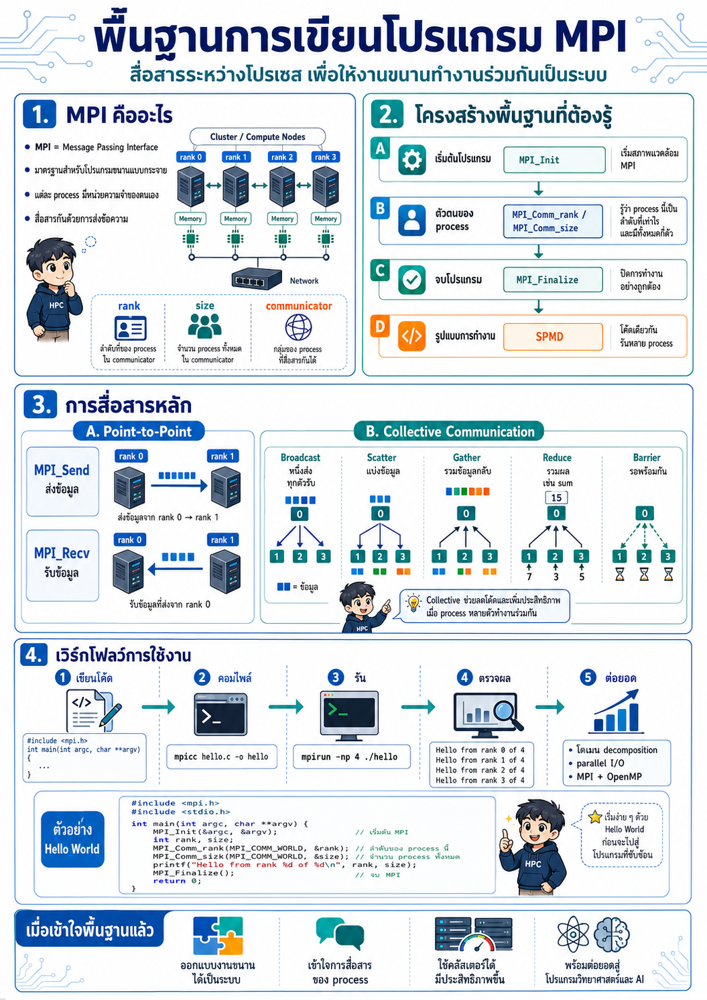
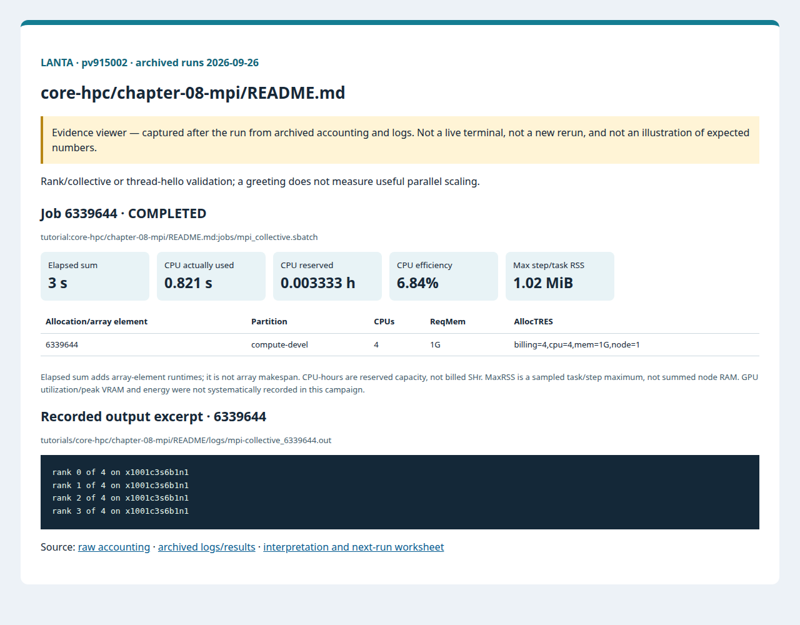

# บทที่ 8: MPI บน LANTA

<!-- resource-learning:start -->
## จากงานเล็กสู่การทดลองที่วัดผลได้ / Resource lab

Booklet flow: pages **27–31** of the [LANTA handbook](../../docs/lanta-hpc-experience-handbook.pdf). [Full learning sequence and worksheet](../../docs/RESOURCE_ESTIMATION_WORKBOOK.md).

<details><summary>ภาพแนวคิดจาก booklet / workflow illustration</summary>



Original booklet illustration, not a run screenshot. [Source and limitations](../../docs/images/booklet/README.md).

</details>

### 1. ขอบเขตและการประมาณก่อนรัน

Rank/collective or thread-hello validation; a greeting does not measure useful parallel scaling.

MPI: requested CPUs = ranks × threads/rank; OpenMP: one rank with cpus-per-task equal to OMP_NUM_THREADS. For replicated arrays, node RAM grows with ranks; for decomposed arrays estimate local cells × bytes/field × fields plus halos and runtime overhead.

### 2. ทรัพยากรที่ใช้จริงและตัวอย่าง output

Archived LANTA evidence, **2026-09-26**, account `pv915002`; these are historical measurements, not a new run or a future performance promise.

| Job | State | Elements | Sum elapsed (s) | CPU used (s) | Reserved CPU-h | Max step/task RSS (MiB) |
|---|---|---:|---:|---:|---:|---:|
| 6339644 | COMPLETED | 1 | 3 | 0.821 | 0.003333 | 1.02 |

Elapsed is summed across array elements, not array makespan. CPU used is `TotalCPU`; reserved CPU-hours include idle allocation time. MaxRSS is the largest sampled task/step value, **not total node RAM**. Missing GPU/energy telemetry must not be interpreted as zero.



Browser screenshot of the [archived evidence viewer](../../docs/tutorial-evidence/core-hpc-chapter-08-mpi-readme.html); not a live terminal capture. Open the viewer for exact requested/allocated resources and job-specific log excerpts.

**Read the numbers:** job `6339644` used 0.821 CPU-seconds over 3 summed elapsed seconds: about **0.27 busy CPU cores per running element on average**. This describes CPU work across the whole allocation, including setup; it does not measure GPU utilization. For a seconds-long run, startup and coarse memory sampling can dominate. Do not reduce RAM to the displayed RSS or claim scaling without a longer pilot.

<details><summary>ตัวอย่าง output ที่บันทึกจริง / archived stdout excerpt</summary>

Job `6339644` · archive member `tutorials/core-hpc/chapter-08-mpi/README/logs/mpi-collective_6339644.out`

```text
rank 0 of 4 on x1001c3s6b1n1
rank 1 of 4 on x1001c3s6b1n1
rank 2 of 4 on x1001c3s6b1n1
rank 3 of 4 on x1001c3s6b1n1
```

</details>

### 3. ขยายงานทีละแกนและตรวจความถูกต้อง

After hello/collective checks, implement a fixed-size reduction or stencil lasting at least about 60 seconds. Compare 1, 2, 4 ranks or threads with three repeats, then a two-node run at the same total rank count to expose communication cost. Do not change input size in a strong-scaling comparison.

**Correctness gate:** Require all ranks/threads to appear and collective sums to match a serial reference. Preserve reduction tolerances because floating-point summation order can change.

[Public applications and research-backed experiments](../../docs/REAL_APPLICATION_EXPERIMENTS.md#miniweather) provide the next workload. Proposed resource budgets there are not measured requirements.

Before the next run, write down input size, expected time/RAM, requested CPUs/GPUs, and a stop condition. Afterwards record job ID, actual allocation, elapsed, CPU time, memory, result check and one change for the next run. Use three repeats and report spread; do not claim speedup from one short smoke run.

<!-- resource-learning:end -->

ผลรันซ้ำ LANTA บัญชี `pv915002` วันที่ 2026-09-26: [สถานะ ขอบเขต ผลลัพธ์ และ resource usage](../../docs/lanta-runs/2026-09-26-pv915002/README.md) · [วิธีประเมินและปรับปรุง performance](../../docs/PERFORMANCE_EVALUATION_OPTIMIZATION_TH.md)

คำสั่งในหน้านี้อธิบายรวมไว้ที่ [../../docs/BASH_COMMAND_REFERENCE_TH.md](../../docs/BASH_COMMAND_REFERENCE_TH.md).

เริ่มจาก SSH ตาม [../../LANTA_SETUP.md#1-ssh-to-lanta](../../LANTA_SETUP.md#1-ssh-to-lanta) แล้วแปะ block ในหัวข้อ Copy-Paste บน LANTA

หน้านี้เป็น standalone hand-on ผู้ใช้แปะคำสั่งบน LANTA แล้วได้ workspace, source file, Slurm script, log และ result ครบใน `$HOME/hpc-ignite-standalone/core-mpi-collective` โดยตรง

## เป้าหมาย

1. compile โปรแกรม MPI
2. รันหลาย rank ด้วย Slurm
3. ตรวจ output ตามจำนวน rank

## Copy-Paste บน LANTA

แปะทีละ block ตามลำดับ แต่ละ block ทำหนึ่งงานหลักและมีหลักฐานให้ตรวจทันทีหลังรัน

### ขั้นที่ 1: เตรียม workspace และตัวแปร

ขั้นนี้กำหนดพื้นที่ทำงานของบท สร้าง folder มาตรฐาน และตั้งค่า account/partition ที่ใช้ซ้ำในขั้นถัดไป

```bash
mkdir -p "$HOME/hpc-ignite-standalone/core-mpi-collective"
cd "$HOME/hpc-ignite-standalone/core-mpi-collective"
mkdir -p jobs logs notes results src

if [ -z "${LANTA_CPU_PARTITION:-}" ]; then export LANTA_CPU_PARTITION="compute-devel"; fi
if [ -z "${LANTA_ACCOUNT:-}" ]; then read -rp "Slurm project account, blank for site default: " LANTA_ACCOUNT; export LANTA_ACCOUNT; fi
SBATCH_ACCOUNT=(); if [ -n "${LANTA_ACCOUNT:-}" ]; then SBATCH_ACCOUNT=(-A "$LANTA_ACCOUNT"); fi
```

### ขั้นที่ 2: สร้างไฟล์ `src/mpi_hello.c`

ขั้นนี้ทำงานหนึ่งส่วนของ workflow ให้แปะและตรวจผลก่อนขยับไปขั้นถัดไป

```bash
cat > src/mpi_hello.c <<'C_CODE'
#include <mpi.h>
#include <stdio.h>
int main(int argc, char **argv) {
    MPI_Init(&argc, &argv);
    int rank, size; char name[MPI_MAX_PROCESSOR_NAME]; int len = 0;
    MPI_Comm_rank(MPI_COMM_WORLD, &rank); MPI_Comm_size(MPI_COMM_WORLD, &size); MPI_Get_processor_name(name, &len);
    printf("rank %d of %d on %s\n", rank, size, name);
    MPI_Finalize(); return 0;
}
C_CODE
```


### ขั้นที่ 3: สร้าง Slurm script `jobs/mpi_collective.sbatch`

ขั้นนี้สร้างไฟล์ Slurm ที่ระบุ resource, module, working directory และคำสั่งที่รันบน compute node

```bash
cat > jobs/mpi_collective.sbatch <<'SLURM'
#!/bin/bash
#SBATCH --job-name=mpi-collective
#SBATCH --nodes=1
#SBATCH --ntasks=4
#SBATCH --cpus-per-task=1
#SBATCH --mem=1G
#SBATCH --time=00:05:00
#SBATCH --output=logs/%x_%j.out
#SBATCH --error=logs/%x_%j.err
set -euo pipefail
module purge
module load cpeCray/25.03 2>/dev/null || module load cray-mpich 2>/dev/null || true
cd "$SLURM_SUBMIT_DIR"
mkdir -p "results/${SLURM_JOB_ID}"
cc src/mpi_hello.c -o "results/${SLURM_JOB_ID}/mpi_hello"
srun -n "$SLURM_NTASKS" "results/${SLURM_JOB_ID}/mpi_hello" | sort | tee "results/${SLURM_JOB_ID}/ranks.txt"
SLURM
```

### ขั้นที่ 4: ส่งงานเข้า Slurm

ขั้นนี้ส่ง job script ที่เพิ่งสร้างไว้ด้วย `sbatch` แล้วบันทึก job id เพื่อใช้ตามคิวและอ่าน log ภายหลัง

```bash
job_id=$(sbatch "${SBATCH_ACCOUNT[@]}" -p "$LANTA_CPU_PARTITION" --parsable jobs/mpi_collective.sbatch)
echo "$job_id	mpi_collective	$(date -Is)" >> notes/job-history.tsv
echo "Submitted job: $job_id"
echo "Read: tail -50 logs/mpi-collective_${job_id}.out"
```

## Check

```bash
cd "$HOME/hpc-ignite-standalone/core-mpi-collective"
find results -maxdepth 2 -type f | sort
tail -50 logs/mpi-collective_*.out
```

## การตรวจผล

หลัง job จบ ให้ผู้ใช้ตรวจสามชั้นหลักฐาน:

1. `sacct` แสดง `COMPLETED` และ `ExitCode` เป็น `0:0`
2. `logs/` มี stdout/stderr ของ job id นั้น
3. `results/` มีไฟล์ output ที่ระบุในหัวข้อ Check

## ใช้ Repo เป็น Reference

ถ้าผู้ใช้ clone repo แล้ว สามารถเทียบแนวคิดกับไฟล์ใน repo ได้ เช่น `slurm/`, `requirements/`, `environments/` และ `jobs/` ของแต่ละบท แต่ block ด้านบนออกแบบให้รันได้จากหน้า hand-on นี้โดยตรง
