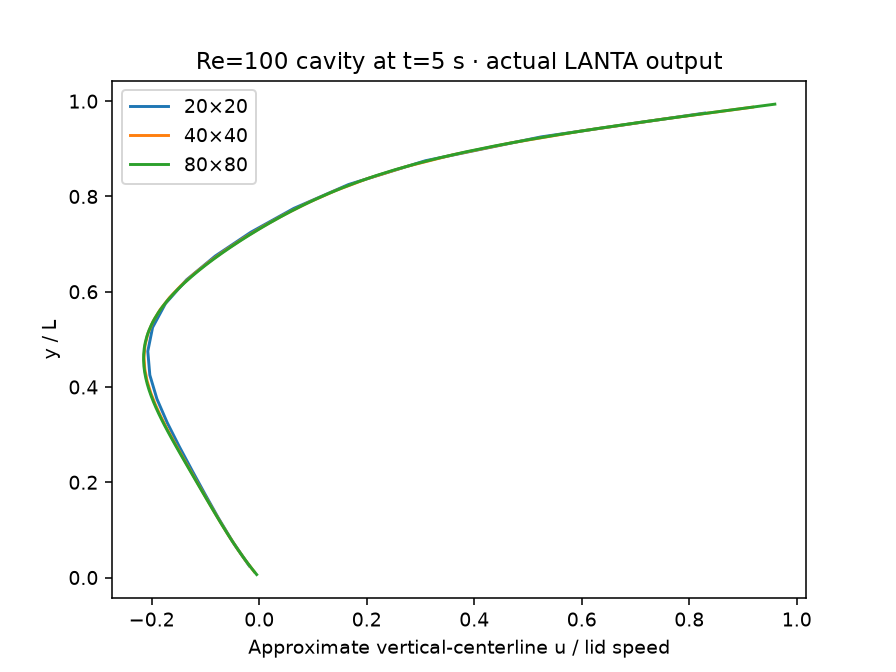
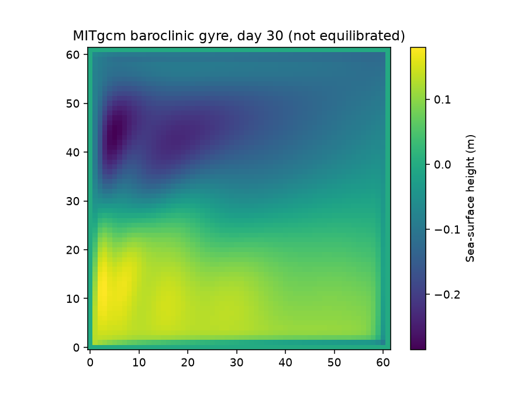

# ลองจำลองการไหล อากาศ และทะเล

สิ่งเหล่านี้ดูต่างกัน แต่มีแนวคิดร่วมคือแบ่งพื้นที่เป็นช่อง แล้วคำนวณว่าค่าในแต่ละช่องเปลี่ยนตามเวลาอย่างไร ช่องเล็กขึ้นให้รายละเอียดมากขึ้น แต่ใช้เวลาและหน่วยความจำเพิ่ม

เริ่มจาก [การแบ่งงานด้วย MPI](../lanta-experience/03-openmp-mpi.md) และ [ใบงานทรัพยากร](RESOURCE_ESTIMATION_WORKBOOK.md) หน้านี้เป็นแนวทางเลือกการทดลอง ต้องเตรียมโปรแกรมและข้อมูลให้พร้อมก่อนส่งงานจริง

## 1. ของไหลในกล่อง: OpenFOAM

CFD คือการใช้คอมพิวเตอร์คำนวณการไหล ลองกล่องที่ผนังด้านบนเคลื่อนที่แล้วพาของไหลหมุนวน เป็นโจทย์ที่เห็นผลได้ง่าย

**ลำดับ:** เลือกโจทย์กล่องของ [OpenFOAM](https://www.openfoam.com/documentation/tutorial-guide) → ตรวจตารางช่อง → รันหนึ่งกระบวนการ → ดูความเร็ว → เปรียบเทียบหลายกระบวนการ

ใช้โจทย์และรุ่นโปรแกรมที่เข้าชุดกัน OpenFOAM มีหลายสายพัฒนา จึงไม่ควรนำไฟล์ต่างรุ่นมาปะปนโดยไม่ตรวจ

ภาพเป็นผลจำลองกล่องที่ค่า Reynolds เท่ากับ 100 ณ เวลา 5 วินาที สีแทนตาราง 20×20, 40×40 และ 80×80 แกนนอนเป็นความเร็วเทียบกับผนังที่เคลื่อน แกนตั้งเป็นความสูงเทียบกับขนาดกล่อง เส้นที่ใกล้กันช่วยตรวจความละเอียด แต่ยังต้องเทียบคำตอบอ้างอิงก่อนสรุปว่าถูกต้อง

**ลองเปลี่ยน:** ตาราง 20×20, 40×40, 80×80 แล้วเปรียบเทียบ 1 กับ 2 กระบวนการด้วยข้อมูลเดิม

**วัดอะไร:** เวลา หน่วยความจำ และความเร็วของของไหล ตรวจความเสถียรของขั้นเวลา หากขั้นเวลาเล็กลง จำนวนครั้งที่ต้องคำนวณจะเพิ่ม

## 2. อากาศอุ่นลอยตัว: miniWeather

[miniWeather](https://github.com/mrnorman/miniWeather) เป็นแบบจำลองการไหลขนาดเล็ก เหมาะกับการเรียนแบ่งงาน ไม่ใช่ระบบพยากรณ์อากาศประจำวัน

ภาพเป็นผลตัวอย่างที่เวลา 1,000 วินาทีจำลอง สีแสดงการเปลี่ยนแปลงของอุณหภูมิศักย์ ซึ่งใช้เปรียบเทียบสภาพอากาศเมื่ออ้างอิงความดันเดียวกัน ตำแหน่งในภาพอยู่ในโดเมนสมมติ ไม่ใช่แผนที่ประเทศไทย

**ลองเปลี่ยน:** ใช้ตาราง 200×100 ก่อน 400×200 คงระยะเวลาจำลอง แล้วเปรียบเทียบ 1, 2 และ 4 กระบวนการ

**ตรวจคำตอบ:** มวลรวมไม่ควรเปลี่ยนอย่างผิดปกติ และผลจากจำนวนกระบวนการต่างกันควรใกล้กัน กำหนดค่าคลาดเคลื่อนที่ยอมรับก่อนดูผล

## 3. สมดุลภูมิอากาศ: climlab

[climlab](https://climlab.readthedocs.io/) ช่วยเรียนว่าพลังงานที่รับเข้าและปล่อยออกมีผลต่ออุณหภูมิอย่างไร แบบจำลองสมดุลพลังงานเริ่มได้โดยไม่ต้องใช้ GPU

**ลองทำ:** รันกรณีตั้งต้น แล้วเพิ่มพลังงานเข้าระบบ 4 วัตต์ต่อตารางเมตร เปรียบเทียบตารางละติจูด 90 กับ 180 ช่อง

**หยุดเมื่อไร:** ตั้งเกณฑ์ว่าอุณหภูมิเปลี่ยนต่อปีน้อยพอและพลังงานสุทธิใกล้ศูนย์ พร้อมกำหนดจำนวนปีสูงสุด ไม่ปล่อยให้คำนวณไม่สิ้นสุด

ผลนี้ใช้เรียนรู้กลไก ไม่ใช่คำพยากรณ์สภาพอากาศของจังหวัดใด

## 4. กระแสน้ำวน: MITgcm

[MITgcm](https://mitgcm.readthedocs.io/) ใช้จำลองบรรยากาศและมหาสมุทร ลองกรณีทะเลในอ่างสี่เหลี่ยมก่อนข้อมูลทะเลจริง

ภาพเป็นผลกรณี baroclinic gyre ตาราง 62×62 ช่อง ลึก 15 ชั้น หลังจำลอง 30 วัน สีคือระดับผิวน้ำหน่วยเมตร แกนแสดงตำแหน่งช่องตาราง แบบจำลองยังไม่เข้าสู่สมดุลระยะยาว และไม่ใช่แผนที่น้ำทะเลไทย

**ลองเปลี่ยน:** แบ่งตารางเดิมให้ 1 และ 4 กระบวนการ ทำซ้ำสามครั้ง

**ตรวจคำตอบ:** อุณหภูมิ ความเร็ว และระดับน้ำต้องเป็นค่าปกติ ไม่ใช่ NaN เปรียบเทียบทั้งสนามข้อมูล ไม่ดูเพียงภาพสวยหรือสถานะงานจบ

**ประมาณทรัพยากร:** จำนวนช่องแนวนอน × ชั้นความลึก × ตัวแปร × ขนาดตัวเลข รวมข้อมูลชั่วคราวด้วย จำนวนวันที่จำลองเพิ่มทำให้เวลาและไฟล์ผลเพิ่ม

## 5. เมื่อต้องการต่อยอด

| เครื่องมือหรือข้อมูล | เหมาะกับเรื่องใด | สิ่งที่ต้องเตรียมเพิ่ม |
|---|---|---|
| [WRF](https://www.mmm.ucar.edu/models/wrf) | พยากรณ์อากาศรายพื้นที่ | ข้อมูลตั้งต้น ขอบเขต และ WPS ที่เข้ากับรุ่น WRF |
| [CMIP6](https://wcrp-cmip.org/cmip6/) | เปรียบเทียบผลแบบจำลองภูมิอากาศ | เลือกแบบจำลอง ตัวแปร ช่วงเวลา ปฏิทิน และหน่วยให้ตรงกัน |
| [Oceananigans](https://clima.github.io/OceananigansDocumentation/stable/) | ทดลองการไหลในทะเลด้วย Julia | สภาพแวดล้อม Julia และตัวอย่างที่เหมาะกับ CPU หรือ GPU |

รายการนี้เป็นทางเลือกต่อยอด ไม่ได้หมายความว่าทุกโปรแกรมติดตั้งพร้อมในบัญชีของคุณ ตรวจสิทธิ์ข้อมูลและพื้นที่เก็บก่อนดาวน์โหลด

## สรุปผลหนึ่งหน้า

ให้มีคำถาม ภาพตาราง ขนาดข้อมูล เวลาที่ใช้ หน่วยความจำ และผลตรวจความถูกต้อง แล้วจึงสรุปว่าการเพิ่มคอร์ช่วยหรือไม่ อ่าน [วิธีเปรียบเทียบอย่างยุติธรรม](PERFORMANCE_EVALUATION_OPTIMIZATION_TH.md) ก่อนรายงานว่าเร็วขึ้น
