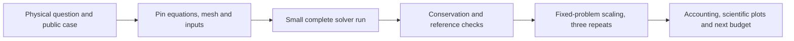

# CFD, climate and ocean: scientific experiment tracks

Research and read-only LANTA module check: **2026-09-26**. These are proposed
experiments, **not completed runs**. Budgets are initial allocation ceilings,
not measured requirements or promises of completion. Follow the
[resource worksheet](RESOURCE_ESTIMATION_WORKBOOK.md), then publish accounting,
scientific checks and actual output screenshots before marking a pilot qualified.

## Where these fit in the booklet

Booklet pages 27–32 supply MPI/OpenMP foundations; pages 33–36 supply scientific
workflow and reproducibility. Choose one physical question below, establish a
serial reference, then compare resources at fixed accuracy. GPU/AI extensions
come afterwards. A flow-field picture alone does not validate a solver.

## CFD

### C1. OpenFOAM lid-driven cavity: first solver-validation lab

Use the [Foundation v10 cavity tutorial](https://doc.cfd.direct/openfoam/user-guide-v10/cavity)
with the matching [OpenFOAM-10 source](https://github.com/OpenFOAM/OpenFOAM-10).
This is a real incompressible Navier–Stokes solve with an analytically specified
geometry, not a package-import demonstration.

- **Pilot:** supplied case first; then 20×20, 40×40 and 80×80 in-plane cells,
  preserving its thin-domain boundary treatment and Reynolds number. Start with
  one CPU, 2 GiB, 10 minutes; qualify parallel execution before trying four ranks.
- **Resource model:** memory scales with cells, fields and sparse pressure-solver
  storage. With a CFL-limited timestep, 2× refinement in both planar directions
  can require roughly 4× cells and 2× steps for the same physical duration.
  This is a planning model, not a guaranteed 8× timing ratio.
- **Validation:** inspect mesh quality, continuity error, residual histories,
  wall boundary conditions and velocity profiles through the cavity center.
  Compare profiles across meshes and timesteps at the same physical time. Do not
  mistake a decaying residual for a mesh-independent solution.
- **Optimization:** fixed mesh, viscosity, end time and solver tolerances;
  compare 1/2/4 ranks and output frequency separately. Tiny meshes may be faster
  in serial. Report cell-updates/s, solver iterations and reserved CPU-hours.
- **Post-run images:** mesh, velocity/streamlines, centerline profiles, residual
  plot and the job accounting panel, all labelled with job ID and case hash.

### C2. Backward-facing step: turbulence and validation data

Follow either the [Foundation v13 backward-step tutorial](https://doc.cfd.direct/openfoam/user-guide-v13/backwardstep)
or the [OpenCFD verification case](https://doc.openfoam.com/2606/examples/verification-validation/turbulent/backward-facing-step/)
with its cited experimental reference. These are different distributions/case
configurations; do not mix their solver commands, dictionaries or reference data.

**Proposed pilot:** a copied, version-matched case, four CPUs, 8 GiB, 20 minutes.
Budget pressure/turbulence fields, matrix workspaces and output separately.
Save inlet conditions, Reynolds number, turbulence closure, wall treatment and
mesh. Compare reattachment length and available velocity/skin-friction profiles,
not just residuals. A mesh study changes accuracy; a rank study holds mesh fixed.
Capture a recirculation contour plus the quantitative reference comparison.
Do not call the basic pitzDaily teaching case an exact reproduction of another
experiment without matching its geometry and boundary conditions.

### C3. NVIDIA PhysicsNeMo: surrogate after the reference solver

The [Darcy FNO plan](REAL_APPLICATION_EXPERIMENTS.md#nvidia-and-ai) is an AI/PDE
track, not a replacement for Navier–Stokes CFD. Use its held-out PDE solution
error alongside training time. A later flow surrogate must include reference
solver cost and training cost when claiming end-to-end acceleration.

## Weather and climate

### A1. miniWeather: thermal and density-current experiments

Use [miniWeather](https://github.com/mrnorman/miniWeather) for two distinct
generated-input cases: rising thermal and density current. Start with the
[existing 200×100 pilot plan](REAL_APPLICATION_EXPERIMENTS.md#miniweather), then
400×200, with a four-rank, 8-GiB, 15-minute ceiling per pilot. Record the same
physical duration, timestep/CFL rule and output cadence. Measure mass/energy
diagnostics and field convergence; save potential-temperature and velocity plots.
This teaches atmospheric dynamics, **not regional forecasting or climate change**.

### A2. WRF idealized baroclinic wave

The official [idealized initialization guide](https://www2.mmm.ucar.edu/wrf/site/users_guide/idealized.html)
and [ideal-case exercise](https://www2.mmm.ucar.edu/wrf/site/online_tutorial/ideal_exercise.html)
identify `em_b_wave`. Use the matched [WRF source](https://github.com/wrf-model/WRF)
case, including its supplied initialization inputs. An ideal-case build is
case-specific: a visible real-data WRF module does not prove `ideal.exe` is built
for this experiment.

**Pilot:** retain the upstream spatial configuration and shorten only the run
duration for qualification; four MPI ranks, 16 GiB, 20 minutes. Record all changed
namelist fields. Check successful initialization/integration, CFL diagnostics,
finite state, pressure/temperature ranges and serial/parallel agreement. A short
run proves execution, not a developed baroclinic wave. Extend physical duration
only after measuring wall seconds/model hour. Capture temperature, pressure and
wind evolution at matched model times, plus restart-versus-continuous agreement.

### A3. climlab energy-balance model: an actual climate question

Use [climlab](https://github.com/climlab/climlab) and its
[preconfigured energy-balance models](https://climlab.readthedocs.io/en/latest/courseware/Preconfigured_EBM.html).
Ask how equilibrium temperature changes with a documented forcing perturbation.
Start with the upstream latitude configuration, then 90/180 latitude bands as
a resolution experiment; one CPU, 2 GiB, 10 minutes per bounded integration.

Convergence requires a small top-of-atmosphere imbalance and stable temperature,
not an arbitrary number of timesteps. State the stopping tolerances before running.
Save area-weighted temperature, absorbed solar/outgoing longwave radiation and
imbalance versus model time. Parameter ensembles suit arrays; requesting more
threads will not automatically parallelize one model. This simplified climate
model is not a comprehensive Earth-system projection.

### A4. CMIP6 with xarray/Dask: analyze real model archives

Use the [Project Pythia CMIP6 cookbook](https://projectpythia.org/cmip6-cookbook/README.html)
and [source notebooks](https://github.com/ProjectPythia/cmip6-cookbook).
Select one monthly variable, one model/member and one decade before any ensemble.
Cache the bounded subset and record dataset version, calendar, units, grid,
experiment and source terms; data access/download time is separate from compute.

**Pilot ceiling:** four CPUs, 8 GiB, 15 minutes on locally staged data. Budget
decoded chunks and intermediate arrays, not compressed Zarr/NetCDF size. Compare
chunk layouts on an identical subset. Validate area-weighted means using cell
areas (cosine latitude is only an appropriate approximation on suitable grids),
calendar-aware temporal weights, missing-data masks and a small eager reference.
Save a climatology map, anomaly series and task/memory diagnostics. One model and
decade are a workflow pilot, not an uncertainty assessment or new climate finding.

## Ocean science

### O1. MITgcm wind-driven baroclinic gyre

Use the [official baroclinic-gyre tutorial](https://mitgcm.readthedocs.io/en/latest/examples/baroclinic_gyre/baroclinic_gyre.html)
and [MITgcm source](https://github.com/MITgcm/MITgcm), case
`verification/tutorial_baroclinic_gyre`. Preserve the supplied forcing, grid and
vertical layers initially. Build serial and MPI versions with consistent global
dimensions; tile sizes and process layout are compile-time configuration.

**Pilot:** four ranks, 8 GiB, 20 minutes, with bounded step count. Measure
wall seconds/model day, tracer/velocity memory, checkpoint and diagnostic I/O.
Verify tracer budgets against imposed fluxes/relaxation and boundary conditions,
finite sea-surface height and serial/MPI agreement at the same early model time.
A short integration is **not an equilibrated ocean gyre**. Save circulation/SSH,
temperature sections and time-dependent budgets; estimate the longer spin-up
from the pilot rather than launching it by default.

### O2. Oceananigans baroclinic adjustment: CPU/GPU ocean dynamics

Use [Oceananigans.jl](https://github.com/CliMA/Oceananigans.jl) and its
[baroclinic-adjustment example](https://clima.github.io/OceananigansDocumentation/stable/literated/baroclinic_adjustment).
Pin Julia, the package manifest and example together. Start from a recorded
reduced 32×32×16 configuration, preserving domain extent, boundary conditions and
physical parameters; then compare 64×64×32. These reduced grids are our proposed
pilot, not a published resolved-turbulence setup.

**Ceiling:** one GPU, four host CPUs, 8 GiB host RAM and 15 minutes; first verify
the same bounded case on CPU. Separate Julia compilation/GPU warmup from stepping.
For eight live float64 fields, 64×64×32 cells require 8 MiB of raw field storage,
before halos, pressure solver, temporaries and runtime. Measure actual VRAM/RSS.
Check tracer budgets, CFL, kinetic/potential energy evolution and refinement
sensitivity. Save buoyancy slices, vorticity and energy curves; compare tolerances
or statistical diagnostics rather than bitwise CPU/GPU identity.

### O3. MITgcm reentrant channel: a larger ocean experiment

The [reentrant-channel tutorial and analysis notebook](https://github.com/MITgcm/MITgcm/blob/master/doc/examples/reentrant_channel/reentrant_channel.rst)
provide a path from gyre dynamics to an idealized Southern-Ocean-like channel.
Begin with the supplied coarse setup under four ranks, 8 GiB, 20 minutes, using
a deliberately short qualification segment. Record eddy parameterization,
forcing and grid. Validate heat/volume budgets, zonal transport and restart
continuity; save temperature sections and transport time series. Equilibrium,
eddy statistics and parameterization comparisons need separately budgeted longer
integrations. This is not a calibrated Gulf of Thailand simulation.

## LANTA readiness and publication gates

Read-only module search found `OpenFOAM/10-cpeCray-23.03`,
`OpenFOAM/v2212-cpeCray-23.03`, `WRF/4.7.1-DMSM-cpeCray-25.03`,
`WRFchem/4.7.1-DM-cpeCray-25.03` and `WPS/4.6-DM-cpeCray-25.03`.
Use a version-matched case; availability is not runtime/MPI qualification.
No Julia or MITgcm entry appeared in that search; isolated installation/build
qualification is still required. Do not claim they are absent from every possible
module hierarchy. Match WPS/WRF according to application guidance before any
real-data extension, rather than treating listed modules as a validated pair.

For every case: retain code/data licenses and attribution, record commit and
input hashes, stage downloads via the transfer host, then run a single bounded
pilot using `pv915002`. Stop on OOM, unstable CFL, non-finite fields or failed
validation. Compare three repeats only after correctness. Store requested and
actual resources, elapsed, TotalCPU, RSS, GPU telemetry when applicable, output
bytes and scientific plots. Do not generate purported result screenshots before
execution. See also [space and astronomy](SPACE_ASTRONOMY_EXPERIMENTS.md).
