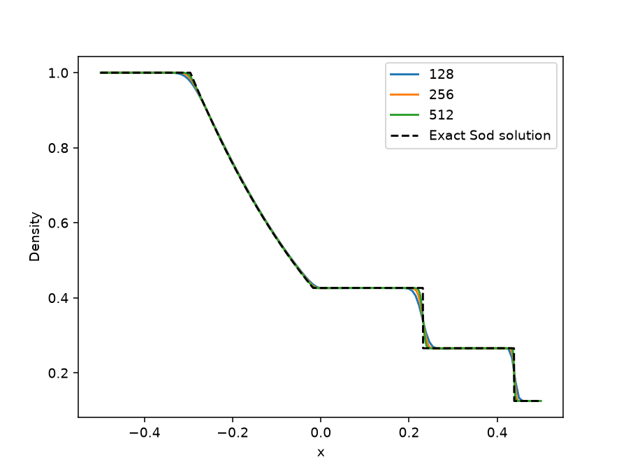
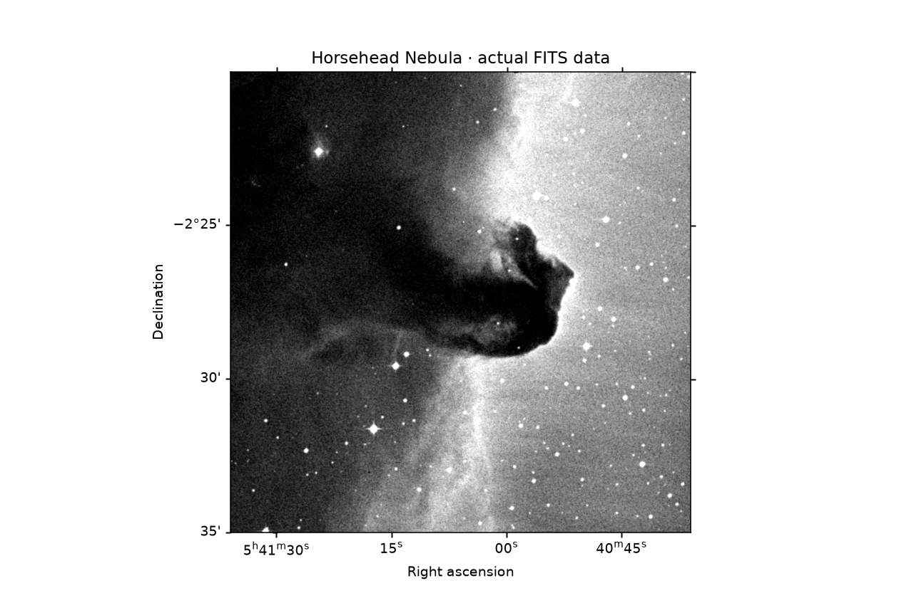

# ใช้ซูเปอร์คอมพิวเตอร์เรียนรู้ดาวและอวกาศ

งานดาราศาสตร์มีทั้งการจำลองการเคลื่อนที่และการอ่านข้อมูลกล้อง ไม่ใช่ทุกงานต้องใช้ GPU งานภาพเล็กหรือดาวไม่กี่ดวงอาจใช้ CPU คอร์เดียวได้ดี

เลือกหนึ่งโจทย์ แล้วใช้ [ใบงานประมาณทรัพยากร](RESOURCE_ESTIMATION_WORKBOOK.md) วางแผนก่อนเริ่ม

## 1. วงโคจรดาว: REBOUND

[REBOUND](https://rebound.readthedocs.io/) คำนวณแรงโน้มถ่วงระหว่างวัตถุ ลองดาวฤกษ์หนึ่งดวงกับดาวเคราะห์สองดวง โดยกำหนดมวล ตำแหน่ง และหน่วยให้ชัดเจน

**ลองเปลี่ยน:** แบ่งหนึ่งรอบโคจรเป็น 20, 40 และ 80 ขั้นเวลา แล้วจำลองระยะเวลาเท่ากัน ขั้นเล็กลงอาจแม่นขึ้นแต่ต้องคำนวณมากขึ้น

**ตรวจคำตอบ:** ดูการเปลี่ยนของพลังงานและโมเมนตัมเชิงมุม เทียบตำแหน่งกับตัวคำนวณที่แม่นกว่า อย่าตัดสินจากรูปวงโคจรเพียงอย่างเดียว

**ประมาณทรัพยากร:** เริ่มที่ CPU 1 คอร์ หากจำลองหลายชุดเงื่อนไขที่แยกจากกัน ให้ใช้ชุดงานย่อยแทนจองหลายคอร์กับระบบเล็กเพียงชุดเดียว

## 2. คลื่นกระแทก: Athena++

[Athena++](https://github.com/PrincetonUniversity/athena) ใช้ศึกษาของไหลในดาราศาสตร์ เริ่มจากโจทย์ Sod ซึ่งแบ่งก๊าซเป็นสองด้านที่ความดันต่างกัน แล้วดูคลื่นที่เกิดขึ้น

ภาพเป็นผลที่เวลา 0.25 ในหน่วยของโจทย์ แกนนอนเป็นตำแหน่ง แกนตั้งเป็นความหนาแน่น เส้นประคือคำตอบทางคณิตศาสตร์ เส้นสีใช้ 128, 256 และ 512 ช่อง สังเกตบริเวณที่ค่าเปลี่ยนรวดเร็ว

**ลองเปลี่ยน:** จำนวนช่องก่อน แล้วแยกการทดลองจำนวนกระบวนการ 1, 2 และ 4 โดยใช้ช่องเท่าเดิม

**ตรวจคำตอบ:** รวมผลทุกส่วนให้ครบทั้งโดเมนแล้ววัดความคลาดเคลื่อน ไม่ใช้ตัวเลขจากส่วนเดียวแทนทั้งระบบ ตรวจด้วยว่าความหนาแน่นและความดันเป็นบวก

## 3. อ่านภาพเนบิวลา: Astropy

[บทเรียนภาพ FITS ของ Astropy](https://learn.astropy.org/tutorials/FITS-images.html) มีภาพเนบิวลาหัวม้าให้ทดลอง ไฟล์ FITS เก็บทั้งภาพและคำอธิบายพิกัดท้องฟ้า

ภาพนี้มาจากข้อมูลตัวอย่าง Astropy สีและระดับความสว่างใช้ช่วยมองรายละเอียด ไม่ใช่สีที่ตามนุษย์เห็นโดยตรง

**ลองทำ:** อ่านข้อมูลกำกับภาพ หาค่าความสว่าง แล้วเปรียบเทียบการอ่านทั้งภาพกับการอ่านทีละส่วน

**ตรวจคำตอบ:** ค่าสรุปต้องใกล้กัน และเมื่อแปลงพิกัดพิกเซลเป็นพิกัดฟ้าแล้วแปลงกลับ ควรได้ตำแหน่งเดิมภายในค่าคลาดเคลื่อนที่กำหนด

**ประมาณทรัพยากร:** จำนวนพิกเซล × ไบต์ต่อค่า แล้วเผื่อสำเนาข้อมูล การตัดภาพเป็นส่วนช่วยลดหน่วยความจำได้

## 4. ภาพดวงอาทิตย์: SunPy

[SunPy](https://docs.sunpy.org/) มีข้อมูลตัวอย่างจากกล้อง SDO/AIA ใช้ฝึกอ่านเวลา หน่วย การรับแสง และพิกัดบนดวงอาทิตย์

**ลองทำ:** เลือกบริเวณหนึ่งในภาพ คำนวณความสว่างต่อเวลารับแสง แล้วทำซ้ำด้วยข้อมูลเดิม

**ตรวจคำตอบ:** ไฟล์ต้องเป็นภาพจริง ไม่ใช่เพียงข้อความชี้ไปยังไฟล์ ตรวจคุณภาพภาพและพิกัดก่อนเทียบภาพต่างเวลา ความสว่างที่เปลี่ยนอาจมาจากวิธีรับภาพ ไม่ใช่การเปลี่ยนทางกายภาพอย่างเดียว

## เมื่อใดจึงควรใช้งานใหญ่?

เพิ่มขนาดเมื่อมีเหตุผล เช่น ต้องการจำลองหลายระบบดาวหรือประมวลผลภาพหลายช่วงเวลา เริ่มจากข้อมูลหนึ่งชุดที่ตรวจได้แล้วค่อยขยาย พร้อมรายงานเวลา หน่วยความจำ และความคลาดเคลื่อนร่วมกัน ดู [แนวทางปรับความเร็ว](PERFORMANCE_EVALUATION_OPTIMIZATION_TH.md)
