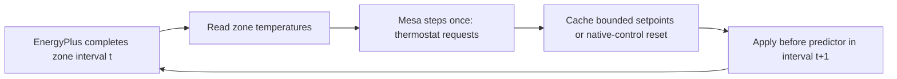

# EnergyPlus + Mesa: reproducible reference-building benchmarks

This tutorial tests real EnergyPlus/Mesa coupling using public reference models.
It does **not** repair or validate the student's Boonchoo geometry. The original
student files remain unchanged. Start with the [Twin-B overview](../mini-innovation/04-building-cosimulation-twinb.md).
For shell commands, see [Bash reference](BASH_COMMAND_REFERENCE_TH.md).

[Actual LANTA results, plots, resource statistics and downloadable evidence](lanta-runs/2026-09-26-twinb-benchmarks/README.md).

## Why two buildings?

1. **Five-zone building:** EnergyPlus `5ZoneAirCooled.idf`, five controlled zones
   plus an uncontrolled return plenum; a small case for debugging controls.
2. **Secondary school:** `ASHRAE901_SchoolSecondary_STD2019_Denver.idf`, a larger
   school example for testing multi-zone requests and computational workload.
3. **Thai-weather sensitivity:** a separately labelled experiment, never a claim
   that either reference building represents Boonchoo or is calibrated for Thailand.
   The five-zone geometry and Chicago design-day sizing are retained, and only
   weather is changed to the student's Lampang EPW. This asks how that fixed-design
   building responds to different weather; it is not a Thai climate-resized design.

Models come from the [EnergyPlus v25.1.0 test files](https://github.com/NatLabRockies/EnergyPlus/tree/v25.1.0/testfiles).
The runtime is pinned to 25.1.0; upgrading runtime and models is a separate experiment.
Weather: packaged Chicago O'Hare TMY3 for the five-zone Chicago example, and
[Buckley station 724695 TMY3](https://energyplus-weather.s3.amazonaws.com/north_and_central_america_wmo_region_4/USA/CO/USA_CO_Aurora-Buckley.Field.ANGB.724695_TMY3/USA_CO_Aurora-Buckley.Field.ANGB.724695_TMY3.epw)
for the Denver school. Chicago's file header references an older TMY2 station;
the selected packaged O'Hare TMY3 is explicitly recorded, not claimed to recreate
an old published numerical result. The DOE website's weather link returned HTTP
404 during acquisition; the EnergyPlus archive supplied the Buckley station file.

## The feedback loop



One process owns EnergyPlus and its callbacks. There is no background simulation
thread, unbounded queue, GPU, or distributed duplication of occupants. Warmup and
sizing are excluded. API variables are requested before simulation, and handles
are resolved only when data are ready. The full runtime API inventory is saved;
missing required sensors or actuators fail the run. Plenums/uncontrolled zones
are explicitly listed rather than silently treated as failed thermostats.

The first interval uses native controls. End-of-zone temperatures drive requests
for the next interval. The actuator callback runs **before the predictor**;
the first prototype's after-HVAC-manager callback was demonstrably one interval
late and failed the intervention test. The end-of-zone callback is the only place
that advances Mesa; repeated HVAC/system callbacks do not advance agents.

## What the agents mean

These are **synthetic thermostat-request agents**, not a recreation of the
student's occupant model. Existing EnergyPlus people, heat gains, schedules,
geometry, materials and equipment are preserved. Do not add those heat gains a
second time in Mesa.

- Seed: 42; deterministic round-robin assignment to controlled zones.
- Preferred temperature: uniform 22–26 °C; tolerance: uniform 0.5–1.5 °C.
- Request cooling only when temperature exceeds preference plus tolerance and
  the synthetic request window is 08:00–17:00. This is a software test policy,
  not a measured attendance schedule; the July school schedule may differ.
- Lowest requested preference wins in a zone. No requests means
  `reset_actuator`, returning control to EnergyPlus—not infinity or AC-off.
- Non-finite values and requests outside 18–30 °C are rejected.
- Cooling commands are raised, if necessary, to the maximum native heating
  schedule temperature plus 0.5 °C. This conservative deadband guard prevents
  conflicting heating/cooling requests without modifying the heating schedule.
  Compact and constant heating schedules are supported; other schedule types
  fail preparation until their bounds have been explicitly implemented.
- Five-zone workload: 50 agents. School workload: 1,875 request agents, a
  computational stress case, **not** an assertion of the school's occupancy.

Future behavioural research should replace these assumptions with documented
occupancy and comfort data, while retaining the synchronization tests.
The bang-bang request/reset policy can oscillate between setpoints and increase
electricity consumption. It is intentionally a simple integration workload,
not an optimized controller. Hysteresis/minimum dwell time would be a separately
tested policy change, not a performance-only code optimization.

The school reference emits 82 warnings in the one-day baseline, including coil
convergence, sizing, schedule, and interzone-construction warnings. These persist
in the coupled case. Passing the zero-severe-error and coupling gates does not
resolve those warnings or establish suitability for engineering design decisions.

## Correctness gates

| Check | Required result |
|---|---|
| Standalone EnergyPlus | Exit 0, success footer, no severe/fatal errors |
| Read-only API adapter | Same timestep CSV as standalone within 1e-7 tolerance |
| Native-control reset | Same timestep CSV as standalone |
| Fixed intervention | 26 °C during test window, changes output, release restores native setpoints |
| Small Mesa case | Five agents; correct step count and valid sensor/actuator handles |
| Full request workload | 50 or 1,875 agents; one Mesa step per zone interval |
| Reproducibility | Three seed-42 trace files have identical SHA-256 |

The derived input runs July 14, 2025 (Monday), for one or three days, with
holiday/DST overrides disabled for a stable test calendar. Four timesteps/hour
means 96 steps/day. Only run-period and diagnostic-output configuration changes;
building physics and native schedules are retained. All derived files and source
hashes are recorded. A passing gate is not a calibration or proof of energy savings.

## Run on LANTA

The scripts currently reference the instructor's pinned environment under
`/project/pv915002-hpcign/wdiazcar/hpc-ignite-rerun-20260926/`.
Adjust paths and the account for your allocation. Transfer the scripts and batch
files into a new working directory; do not write into a student's source tree.

On the transfer host, acquire the models, weather and upstream license:

```bash
bash scripts/fetch_twinb_benchmarks.sh
```

On the login host, submit compute work (do not execute the batch file with Bash):

```bash
sbatch slurm/qualification/twinb-benchmark-coupled.sbatch
# After the one-day qualification passes:
sbatch --cpus-per-task=4 --mem=7G --export=ALL,BENCHMARK_DAYS=3,INCLUDE_THAI=1 slurm/qualification/twinb-benchmark-coupled.sbatch
sacct -j <job-id> --units=M --parsable2 \
  --format=JobID,State,ExitCode,Elapsed,AllocCPUS,TotalCPU,MaxRSS
```

Each job gets a separate `results/<job-id>/` directory. Each simulation runs in a
fresh process with a 480-second external time limit and ten-second kill grace;
Slurm supplies an additional job limit. The scripts stop at the first failed gate.

Inspect `qualification.json`, each `summary.json`/`gate.json`, `trace.csv`,
`eplusout.csv`, `eplusout.err`, `handles.json`, `api-inventory.csv`, logs and
`*-time.txt`. The trace records interval, zone temperature, actual reported
cooling setpoint and the command applied for that interval. `heartbeat.json`
records the latest completed step for debugging; it is not a success flag.

## Performance evaluation

First require equivalent outputs for any proposed optimization. Compare three
same-seed runs using median wall time, process peak RSS, callback time, TotalCPU
and Slurm allocation. For short runs, Slurm's sampled MaxRSS can miss the peak;
retain `/usr/bin/time -v` measurements as well. Separate Python startup and
EnergyPlus sizing/warmup from measured callback work.

The initial four-CPU allocation did not imply four-way parallel simulation:
this adapter is single-process and thread counts are pinned to one. A one-CPU,
1,800 MiB repeat passed the one-day output-equivalence checks for both models,
so the batch script now defaults to that smaller allocation. It needs no GPU.
Prefer independent scenario job arrays for throughput; do not claim GPU speedup
from these runs. Tune agent aggregation or output frequency only after preserving
the correctness contract. See the [performance guide](PERFORMANCE_EVALUATION_OPTIMIZATION_TH.md).
