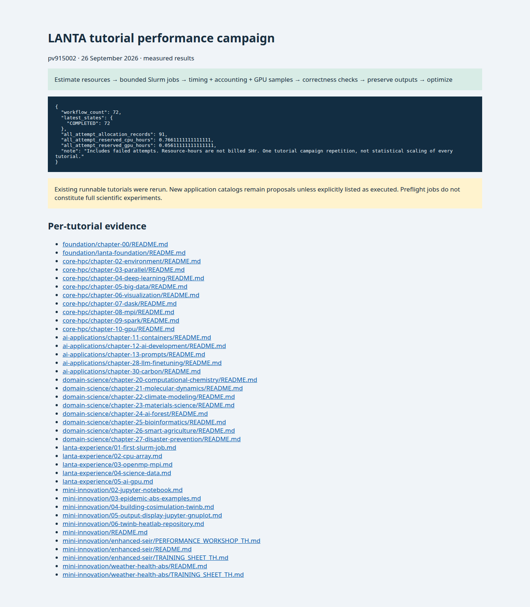
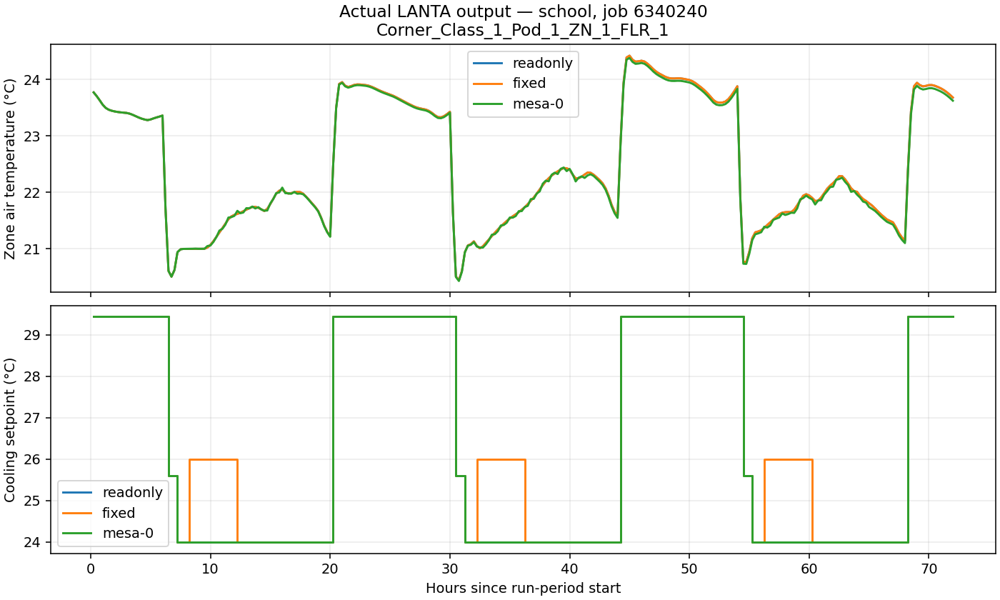
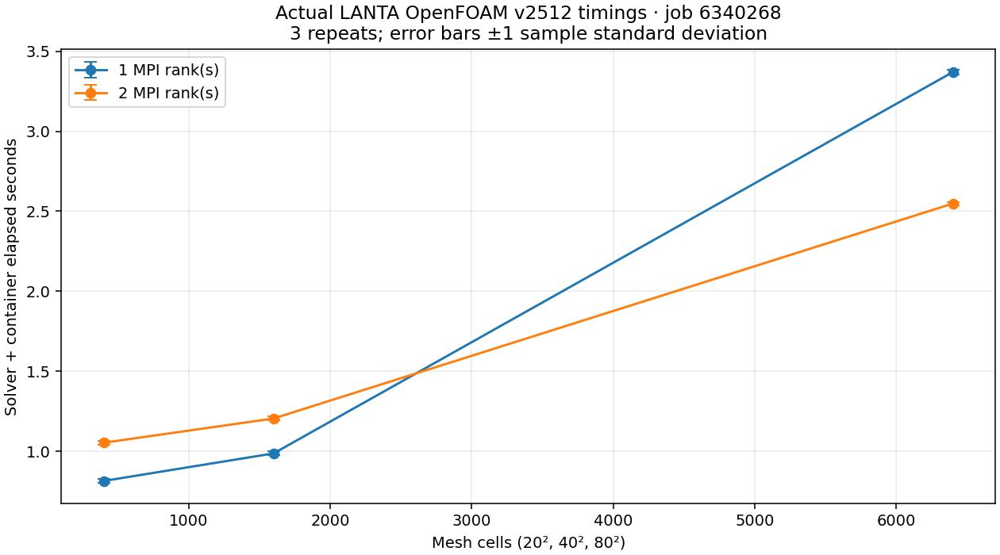

# Fresh LANTA resource and performance rerun

Executed **26 September 2026**, account **pv915002**, in a new workspace:
`/project/pv915002-hpcign/wdiazcar/hpc-ignite-performance-20260926`.
Historical campaign outputs were not overwritten.

**72/72 latest workflows completed:** all 44 extracted tutorial jobs, all 25
non-template repository jobs, notebook/security post-processing, a real
EnergyPlus/Mesa reference-building benchmark, and an OpenFOAM experiment.
There were 73 submissions and 91 allocation/array-element records, including
one failed CFD setup attempt followed by a successful corrected run.
Setup/reading pages without executable jobs do not receive invented timings.

[Browse the evidence viewer](index.html) · [Every workflow and job ID](WORKFLOWS.md)
· [Raw Slurm accounting](accounting.psv) · [Submission receipts](submissions.jsonl)
· [Bounded output archive](artifacts.tar.gz) · [Artifact hashes](artifact-inventory.json)

## What was spent

| Measure | Recorded value | Interpretation |
|---|---:|---|
| Reserved CPU time, all attempts | 0.766111 CPU-hours | Actual `AllocCPUS × ElapsedRaw`, including failed attempts |
| Reserved GPU time, all attempts | 0.056111 GPU-hours | GPU count from `AllocTRES × ElapsedRaw` |
| Process CPU time, latest successful workflows | 582.237 seconds | Sum of parent/array `TotalCPU`, without summing steps again |
| GPU jobs with telemetry | 11 | One-second utilization, VRAM and board-power samples |
| Account balance before / after | 6113.12 / 6112.95 SHr | Observed account snapshots; accounting can lag and other account jobs may contribute |

CPU/GPU resource-hours are **not billed SHr**. The observed 0.17-SHr balance
change is not a reconciled campaign bill. Memory is in each workflow record;
Slurm MaxRSS is a sampled task/step maximum, not summed node RAM. GNU time
measurements are also archived; its parent-shell memory is not a replacement
for MPI task accounting. Arrays report summed element runtime, not makespan.

[GPU sample summary](gpu-samples-summary.json) reports sampled values, not
kernel-only utilization, exact peak VRAM, or node energy. Startup/idle periods
are included; short kernels may fall between samples. Missing samples are not
zeros. Shared environments were reused without modification, so installation
cost is excluded. Package imports, compilation where specified, and launcher
startup remain in whole-job measurements.

## Correctness and scope

- All existing runnable tutorial jobs completed, but a **preflight remains a
  preflight**. For example, the materials page reports
  `pseudo_status=shared_si_pseudo_pending`; this is not a completed Quantum
  ESPRESSO SCF benchmark. Climate/grid and agriculture/risk teaching examples
  remain teaching examples, not full WRF or crop-model runs.
- Jupyter job **6340238** returned HTTP 200 from its API and shutdown request.
  Job **6340255** executed both notebooks, the security exercise, and performance
  post-processing. Display job **6340259** used newly generated array results.
- [SEIR CPU/GPU correctness](seir-correctness.json): **36/36** scientific-field
  comparisons passed at `rtol=atol=1e-4`; timing fields were not compared.
- Original TwinB job **6340239** ran with `TWINB_EP_CONTROL=0`: Mesa-only baseline,
  **not** repaired/coupled student geometry. The separate reference benchmark
  below exercises real EnergyPlus coupling.
- New [public application](../../REAL_APPLICATION_EXPERIMENTS.md),
  [climate/ocean](../../CFD_CLIMATE_OCEAN_EXPERIMENTS.md) and
  [space](../../SPACE_ASTRONOMY_EXPERIMENTS.md) catalogs are **not all executed**.
  Unimplemented proposals have not been relabeled as successful tutorials.

## Real EnergyPlus + Mesa rerun

Job **6340240**, one CPU, three simulated days, ran **24 mode/case combinations**:
five-zone Chicago, five-zone Lampang-weather sensitivity, and a Denver school.
Each case passed baseline/read-only/reset equivalence, fixed-actuator response,
control release, and three identical seeded Mesa traces. All three Mesa repeats
tracked the commanded setpoints. Inputs and scripts have retained hashes.

| Case | Agents | Steps | Median Mesa process wall (s) | Peak process RSS (MiB) | Warnings |
|---|---:|---:|---:|---:|---:|
| Five-zone Chicago | 50 | 288 | 2.103 | 293.5 | 0 |
| Five-zone Lampang weather | 50 | 288 | 1.979 | 292.3 | 1 |
| School Denver | 1875 | 288 | 6.893 | 359.6 | 84 |

[Detailed measured summary](twinb-performance-summary.json). School warnings
remain disclosed; qualification does not prove calibration. Lampang changes
weather only, not design-day sizing or Thai building-code compliance. These
short reference cases do not establish energy savings for the student building.

## Real CFD mesh/rank/repeat experiment

OpenFOAM **v2512** in the previously qualified container; successful job
**6340268**. Lid-driven cavity grids 20²/40²/80², one/two MPI ranks, three repeats:
**18/18** bounded trials passed mesh checks, reached time 0.1, had Courant number
below one, and finite bounded reported residuals. Each trial uses 100 timesteps.
The container digest, dictionaries, timing files and solver logs are archived;
larger files remain on LANTA with hashes in the inventory.

| Cells | One-rank median (s) | Two-rank median (s) | Observed runtime ratio |
|---:|---:|---:|---:|
| 400 | 0.815 | 1.054 | 0.77× |
| 1600 | 0.987 | 1.205 | 0.82× |
| 6400 | 3.370 | 2.548 | 1.32× |

These are short solver-plus-container timings, excluding meshing. Two ranks
are slower on the smallest grids: launch/communication overhead matters.
The largest grid benefits in wall time but not proportionally to rank count.
The job reserves two CPUs throughout, including one-rank trials. Numerical
field equivalence across decompositions, mesh convergence, and steady state
are **not yet established**; these ratios are not validated scientific speedups.

Failed attempt **6340254** used LANTA's physical `/lustrefs/...` path, which was
not bound in the container. The correction uses the `/project/...` alias. Its
logs and resource cost are preserved, not removed from accounting.

## How learners should optimize next

1. Find the exact job in the per-page table and inspect actual `AllocCPUS`,
   `ReqMem`, elapsed time, TotalCPU, RSS and recorded output. A large memory
   request can increase the CPU allocation beyond the requested task count.
2. Separate setup/import/compilation from steady-state work. These tutorials
   have **one fresh campaign pass**, not three repeats of every workload.
   Do not infer stable speedups from short smoke-test timing.
3. Repeat a fixed, validated problem at 1/2/4 workers; retain identical inputs,
   output cadence and seeds. Report median/spread and cost as well as speed.
4. Reduce excess memory/CPU requests only with measured headroom, then rerun
   correctness checks. Increase problem size before buying more parallelism.
5. For GPU work, inspect the actual samples and workload outputs, not just
   `nvidia-smi` availability. Low utilization in a preflight is expected.

The 40 tutorial evidence pages include actual post-run browser screenshots.
They show archived measurements and log excerpts, not fabricated terminal
screenshots. [Capture hashes](capture-manifest.json) bind each PNG to its HTML.
Historical panels remain explicitly separate from these fresh measurements.

The archive includes staged input data and cumulative workspace snapshots as
well as generated results; not every file in a snapshot was produced by that
one job. Per-page excerpts are selected by job ID. `instrumentation.json`
records hashes of the original job bodies; `source-provenance.json` records the
pre-submission source checkout. The repository commit containing this report
preserves the added measurement and CFD scripts.

Reproduction helpers: `scripts/extract_tutorial_files.py`,
`scripts/instrument_campaign.py`, `scripts/rerun_campaign.py`,
`scripts/collect_campaign_evidence.py`, `scripts/build_performance_campaign_report.py`.
Review dependencies and isolate a new campaign root before submitting; never
rerun extraction/instrumentation over historical evidence.
