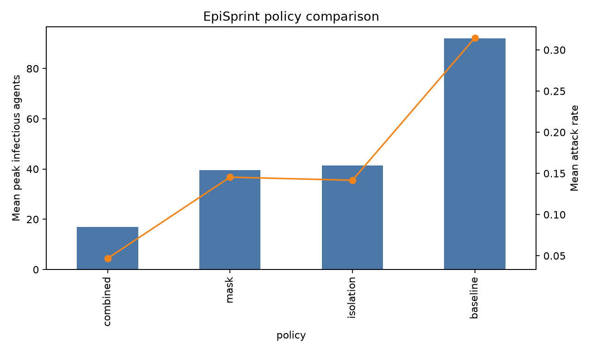
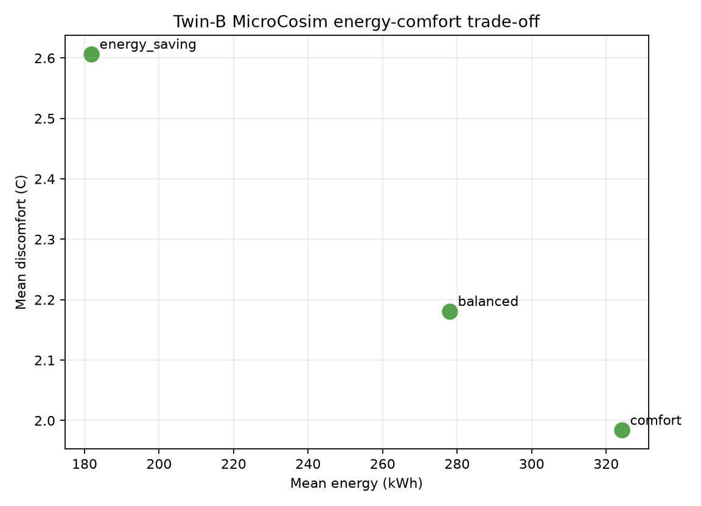

# LANTA tutorial rerun — 2026-09-26, pv915002

**Execution result: 70/70 baseline workflows completed with exit `0:0` after repairs. Three additional full EnergyPlus/Mesa integration attempts failed. This is not an all-science-validation pass.**

The baseline inventory consists of 44 job scripts extracted from learner pages, 25 checked-in jobs, and one supplementary workflow for security, notebook execution, result merging, and performance postprocessing. Arrays contain multiple tasks; 70 is a workflow count, not a Slurm task count. All 47 learner pages link to this report and the [per-hands-on performance guide](../../PERFORMANCE_EVALUATION_OPTIMIZATION_TH.md).

Initial documentation was committed and pushed as `250c8d8`; this report accompanies the follow-up rerun/fix commit. The unrelated `docs/Booklet_LANTA-Experience.pdf` was not included.

## Evidence and reproduction

- [Complete workflow/resource table](WORKFLOWS.md), [machine-readable latest status](workflow-status.json).
- [All submission attempts](submissions.jsonl), including failed attempts and retries; [raw final Slurm accounting](accounting.psv), including batch/extern/srun steps and array elements.
- [Actual output/log/plot/notebook archive](artifacts.tar.gz), [artifact sizes/checksums and omissions](artifact-inventory.json). Jupyter tokens are redacted. Files above 2 MB remain on LANTA; large text logs have head/tail excerpts in the archive.
- [Twin-B source provenance](source-provenance.json). The source working tree was not changed. The campaign used a separate snapshot, migrated to Mesa 3.5.1.
- [Deterministic training SEIR comparison](training-seir-correctness.json), [enhanced repository SEIR comparison](repository-seir-correctness.json).

Full remote campaign: `/project/pv915002-hpcign/wdiazcar/hpc-ignite-rerun-20260926`. It contains `repo/`, isolated `tutorials/`, `twinb/`, `envs/`, `apps/`, `cadc/`, receipts, accounting and `evidence-export/`. Keep or export this data before project access expires. Transfer used `transfer.lanta.nstda.or.th`; submission and monitoring used `lanta.nstda.or.th`. Only project `pv915002` was charged for campaign jobs. Slurm timestamps are LANTA local time (UTC+7); receipt timestamps explicitly use UTC.

Operator tools in `scripts/` are `extract_tutorial_files.py`, `rerun_campaign.py`, `collect_campaign_evidence.py`, `probe_jupyter.py`, `record_campaign_provenance.py`, and `compare_seir_correctness.py`. Extraction writes literal heredoc files without executing the surrounding tutorial commands. External data/environment preparation must precede submission. `--retry` is only for selected terminal workflows. Jobs in the same workspace are serialized to avoid output collisions. These tools do not replace the standalone learner instructions.

## What was actually exercised

| Area | Evidence and scope |
|---|---|
| Foundation and LANTA experience | Hello jobs, environment reports, arrays, MPI/OpenMP, pi/diffusion examples, GPU checks; SSH/module/account/transfer readiness checked live |
| Core HPC | CPU/MPI/GPU jobs, chunked data, visualization, Dask-shaped and Spark-shaped teaching examples; not a multi-node Spark deployment |
| AI | CUDA/PyTorch computation and tiny training, container tool preflight plus **host** Python demo, prompt scaffold, LoRA parameter arithmetic, carbon proxy, fake-secret permission audit; not production LLM fine-tuning or a container-image execution |
| Domain science | Chemistry arithmetic/preflight, actual GROMACS 100-step GPU benchmark, NetCDF/climate and geodata examples, BLAST mini database/search, agriculture/hazard examples |
| Materials/WRF | Module/input preflight only. No silicon pseudopotential was available under the tutorial's shared path, so QE SCF did not run. No full WRF forecast or licensed chemistry calculation is claimed |
| Mesa | Mesa 3.5.1 qualification; epidemic single/multicore/8-element array; Twin-B thermal-surrogate single/6-element array |
| Notebooks and plots | JupyterLab authenticated `/api` check and graceful `/api/shutdown`, both HTTP 200; EpiSprint and display notebooks executed; actual Matplotlib figures generated. Gnuplot executable/module was unavailable; optional gnuplot rendering was not performed |
| SEIR/performance | Both tutorial and checked-in C++/MPI and PyTorch/GPU solvers; 1/2/4-rank roofline solver; theory tables, startup/import benchmark, comparisons and plots |
| HPDS weather-health | NASA POWER 48-hour Bangkok CSV downloaded; four location transforms staged; actual Dask LocalCluster simulation and summary/graph/plot scripts ran. Location perturbations are teaching transformations, not additional weather observations |
| CADC data rescue | Direct LANTA probe timed out; external download and transfer fallback succeeded, with matching SHA256 on LANTA |
| Twin-B repository | Four HeatLab scenarios generated; Mesa-only baseline passed with 1,875 agents and 288 steps. Full coupled variants failed; see below |

Navigation, connection and setup pages have no independent simulation job. Generic Slurm templates were syntax-checked; arbitrary template workloads were not launched. A successful preflight is not evidence that its optional downstream application ran.

## Repairs demonstrated by retries

| Failure | Repair | Successful retry |
|---|---|---|
| Conda GDAL activation read unset `GDAL_DATA` under `set -u` | Temporarily disable nounset only for activation; restore it afterward | Visualization `6339749`, Dask `6339750`, climate `6339753`; checked-in data workflows `6339762`–`6339765` |
| Apptainer preflight lacked Python | Explicit `cray-python/3.10.10` alongside Apptainer | `6339751`, `6339759` |
| Chemistry base environment lacked NumPy | Use shared scientific Python environment | `6339760` |
| GROMACS exceeded 8 GiB | Request 32 GiB; checked-in job explicitly uses one thread-MPI rank | `6339752`, `6339761` |
| Slurm rejected CRLF job script | Normalize job/template line endings | Hello job `6339766` |
| Generated display notebook had escaped newlines/tabs and incorrect relative paths | Decode code-cell strings, create notebook folder, use parent results paths, register correct kernel | Notebook execution `6339795`, final postprocessing `6339820` |
| Weather-health hardcoded another project module path | Honor `EPI_MODULE_ROOT` | `6339789`, `6339790` |
| Plot glob mixed different attempts | Select exactly one final array's result files before merging/plotting | `6339820`, arrays `6339754` and `6339757` |

## Resource statistics: examples and limitations

| Run | Job | Slurm elapsed | Resource evidence |
|---|---:|---:|---|
| GROMACS GPU | 6339761 | 42 s | 8 CPUs, 1 A100, 32 GiB requested; sampled peak step RSS 9,134,088 KiB |
| HPDS weather-health | 6339790 | 9 s | 4 CPUs, 4 GiB requested; direct Python `/usr/bin/time -v` RSS 112,144 KiB, user 3.50 s, system 1.48 s |
| Enhanced SEIR GPU | 6339770 | 10 s | 8 CPUs, 1 A100, 12 GiB requested; GNU time RSS 541,148 KiB, wall 6.44 s |
| Twin-B Mesa-only | 6339794 | 22 s | 4 CPUs, 16 GiB requested; sampled peak step RSS 191,912 KiB |
| Jupyter service | 6339784 | 38 s | 2 CPUs, 4 GiB requested; authenticated service check, then shut down |

Raw accounting records `ElapsedRaw`, `TotalCPU`, `UserCPU`, `SystemCPU`, requested memory, allocated CPUs/TRES, sampled `MaxRSS`, node and timestamps. The summary's **task-seconds sum array elements**, not array makespan. CPU efficiency is `TotalCPU / (ElapsedRaw × AllocCPUS)` and is not GPU utilization. Short jobs can finish between memory samples, so tiny/zero Slurm RSS values are not true application memory requirements. GNU time around `srun` measures the launcher, not necessarily remote ranks; do not substitute its RSS for remote process memory. GPU utilization time series and repeated-run confidence intervals were not collected; no such claims are made.

## Actual example output and interpretation

GROMACS job `6339761` reported `Performance: 0.587 40.890` (ns/day, hour/ns). This 100-step smoke is too short for a production throughput conclusion.

The deterministic training SEIR CPU/GPU pair passed all 36 comparisons at `rtol=1e-4`, `atol=1e-4`. Baseline peak infectious values were `118303.490848` (C++/MPI) and `118303.492188` (GPU). The enhanced repository pair did **not** match at that tolerance (30/36 failed): C++ draws daily beta noise, while the PyTorch kernel has no matching noise series. These are not equivalent trajectories; do not present their timing ratio as an implementation speedup. Align the input noise series or use an appropriate ensemble validation first.

The tutorial roofline run measured 0.907805, 0.452350 and 0.243285 s at 1, 2 and 4 ranks, respectively, with equal reported residual `547.715890`. Four-rank observed speedup was about 3.73× (93.3% efficiency). These are single samples, not a statistically established optimization result. The postprocessing run measured interpreter startup 0.013575 s and PyTorch import 1.690499 s in its first measurement; subsequent raw measurements are retained rather than hidden.

HPDS example: BangkokCore/baseline used 48 rows and 240 agents, with mean temperature `24.8425` °C and modeled cooling `21.2408` kWh. These are model outputs, not observed health outcomes.

Actual plotted outputs from the final selected arrays:





These PNGs come from the actual runs. The earlier [AI-generated expected-result illustrations](../2026-09-25-pv915002/README.md) are separate teaching aids, not screenshots of this campaign.

## CADC recovery evidence

Dataset `G006.149.683+68.863.G.fits` was downloaded outside LANTA using the repository's resumable helper, then copied to `cadc/raw/sample.fits` through the transfer host. Size: **1,706,276,160 bytes**. SHA256 locally and on LANTA:

```text
29badef08e1249ce47165a7c4ca2a946bd1136148219ae2dbe55e9888c2bd2cf
```

The FITS first-card check passed. This verifies transfer integrity and the basic header, not a full astronomical science analysis. The 1.7 GB dataset is not committed to Git; the manifest and checksum are retained in the evidence archive. Direct LANTA connectivity remained unavailable; the fallback completed the transfer exercise.

## Remaining Twin-B integration failure

The original dirty source (`2d16b3a` plus local changes) was preserved. A project-local [official EnergyPlus 25.1.0 runtime](https://github.com/NatLabRockies/EnergyPlus/releases/tag/v25.1.0) was installed to match the IDF's 25.1 version; this is not a claim that 25.1 is the newest EnergyPlus. The Mesa-only result is not an EnergyPlus simulation.

| Attempt | Job | Outcome |
|---|---:|---|
| Original annual IDF/API path | 6339812 | Required `ExpandObjects` for `HVACTemplate:*`; EnergyPlus fatal error followed by an unbounded callback wait; bounded runner exited 124 |
| Add `-x` preprocessing in snapshot | 6339815 | EnergyPlus produced temperatures, but annual model did not finish within the 120-second qualification limit; exit 124 |
| One-day IDF, 96 Mesa steps, skip warmup callbacks, bounded queue | 6339819 | Callback did not arrive within 60 seconds; `_queue.Empty`, final exit 1 after 112 seconds |

`scripts/prepare_twinb_day_smoke.py` reproduces the bounded one-day snapshot changes. It does **not** repair or validate asynchronous coupling. Next work must explicitly handle startup/warmup readiness, propagate EnergyPlus thread failures, synchronize temperature/setpoint exchange, verify actuator handles and timestamp alignment, and archive job-specific Mesa outputs. A successful EnergyPlus subprocess alone is not sufficient. Do not run the GPU scaling plan or report energy/comfort conclusions until this correctness gate passes.

## Verification

The repository test suite passed 29 tests after the changes. It includes extracted-source syntax, shell syntax, extraction idempotence, generated notebook code compilation, accounting-unit checks, beginner-image/link checks and evidence token redaction. Full LANTA jobs and both executed notebooks provide the runtime evidence. Failures and optional/unavailable paths remain documented rather than being converted into synthetic passes.
