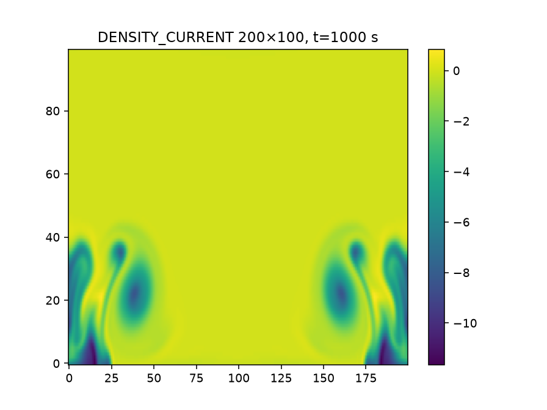
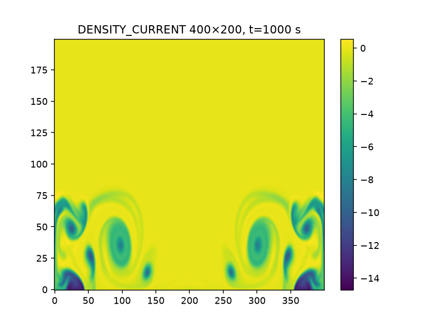
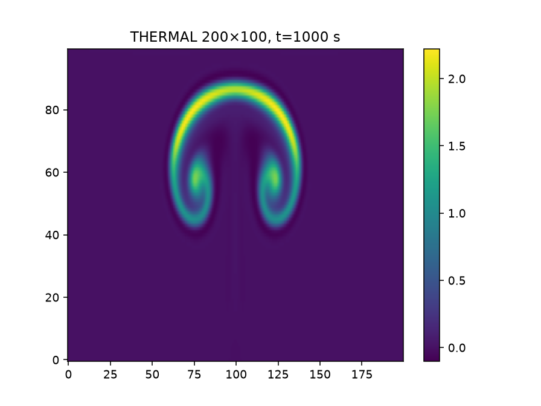
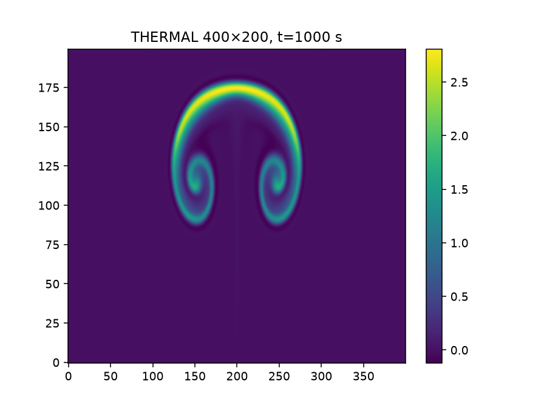
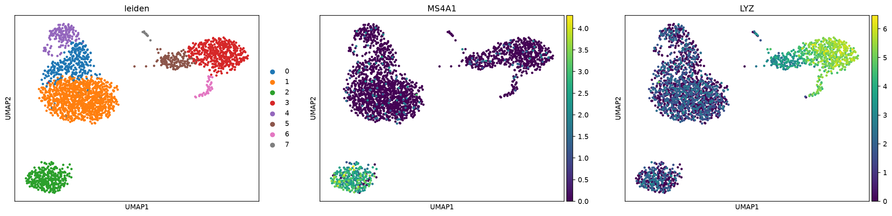
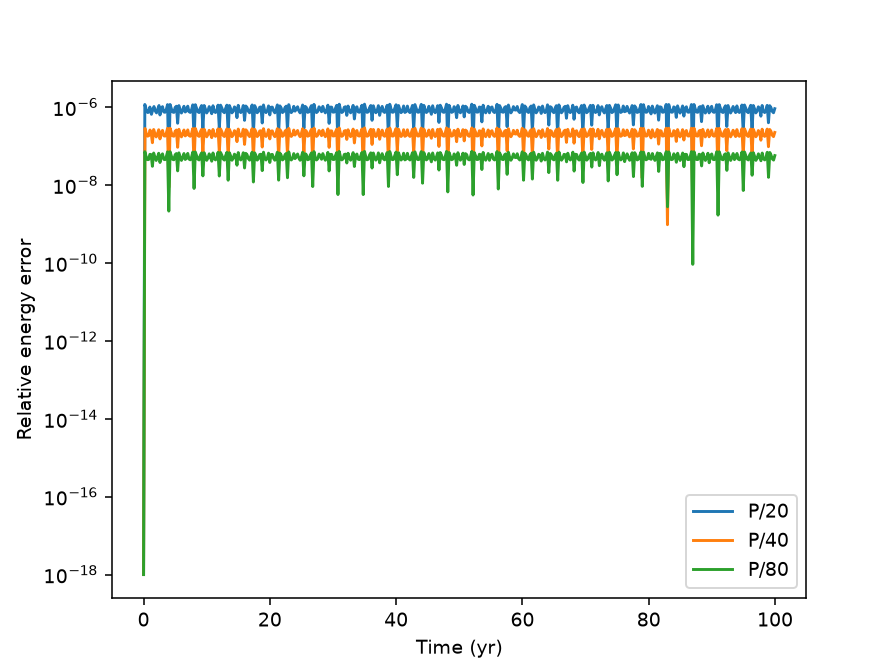
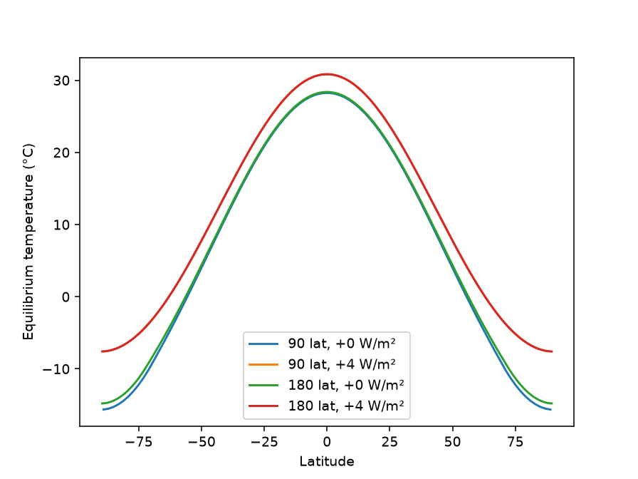
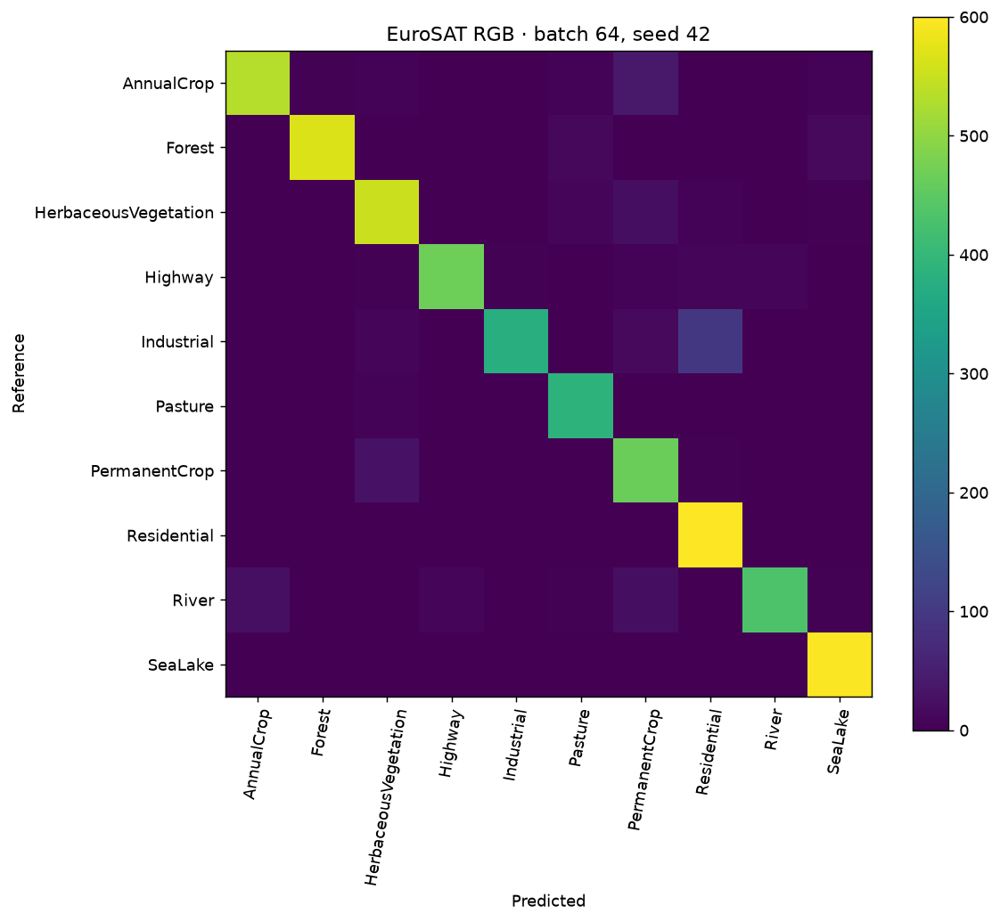
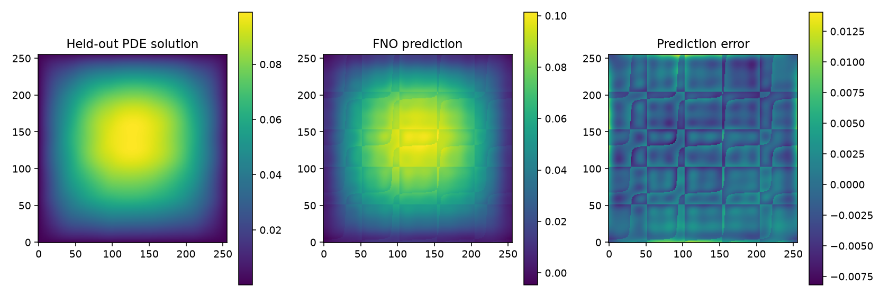

# Real-science LANTA campaign — 26 September 2026

Accounting snapshot: **2026-09-26T05:48:14.378324+00:00**. Account `pv915002`. This is a live campaign, not a claim that every proposed catalog experiment is complete.

## Executed protocols

| Application | Scientific workload | Repeats/comparisons |
|---|---|---|
| GROMACS 2026.3 | Public benchMEM, 50,000 steps (100 ps) | CPU versus A100; three repeats each |
| miniWeather | Thermal and density current, 1,000 model seconds | 200×100 and 400×200; 1/2/4 ranks; three repeats |
| OpenFOAM v2512 | Re=100 cavity, 10,000 steps to 5 s | 20²/40²/80²; 1/2 ranks; three repeats |
| Quantum ESPRESSO | Four upstream pwscf benchmark inputs, converged SCF | 1/2/4 ranks; three repeats per case |
| Athena++ | Sod shock to t=0.25 | 128/256/512 cells; 1/2/4 ranks; three repeats |
| MITgcm | 62×62×15 baroclinic gyre, 30 model days | 1/4 ranks; three repeats |
| Scanpy | Full PBMC3k QC→normalization→PCA→UMAP→Leiden→markers | Three seeded repeats |
| climlab | EBM equilibrium, control/+4 W m⁻² | 90/180 latitude cells, tolerance-based stop |
| REBOUND | Specified three-body system, 100 inner orbits | Three timesteps × three repeats, IAS15 reference |
| Astropy / SunPy | Real Horsehead FITS / AIA171 solar image | Three repeats, WCS round-trip and data checks |
| EuroSAT | All 27,000 RGB chips; ResNet18 trained from scratch | Batch 64/128 × three seeds × ten epochs |
| NVIDIA PhysicsNeMo | 256² Darcy FNO, 2,048 fresh PDE samples/epoch | Three 256-epoch jobs; 256 held-out samples |

“Full” means the stated protocol is completed, not a reproduction of every paper, production simulation, or upstream default. MITgcm is a 30-day transient, not an equilibrated ocean; REBOUND is a small accuracy experiment; miniWeather is a mini-application. WRF, CMIP6, Oceananigans, LAMMPS and other catalog alternatives are not executed by this campaign. Existing EnergyPlus/Mesa full-year evidence is archived separately.

## Resource ledger

Elapsed time includes setup/build where present. Reserved CPU-hours = allocated CPUs × elapsed seconds / 3,600; GPU-hours = allocated GPUs × elapsed seconds / 3,600. Neither is billed SHr. Running jobs show elapsed usage only. GNU time and Slurm step records provide CPU time and sampled RSS; MaxRSS is not node-wide summed memory. GPU CSVs record utilization, VRAM and power at one-second intervals.

| Job | Workflow | Slurm state | Elapsed | Reserved CPU-h | GPU-h |
|---|---|---|---:|---:|---:|
| 6340317 | gromacs:qualify-cpu | COMPLETED | 00:00:14 | 0.0622 | 0.0000 |
| 6340318 | gromacs:qualify-gpu | FAILED | 00:00:08 | 0.0356 | 0.0022 |
| 6340319 | miniweather:thermal-density-matrix | COMPLETED | 00:24:47 | 2.0653 | 0.0000 |
| 6340323 | qe:case1-rank-repeat | FAILED | 00:00:04 | 0.0056 | 0.0000 |
| 6340324 | athena:sod-resolution-rank-repeat | COMPLETED | 00:01:51 | 0.1542 | 0.0000 |
| 6340325 | gromacs:full-cpu | COMPLETED | 00:11:20 | 3.0222 | 0.0000 |
| 6340327 | gromacs:qualify-gpu-fixed-reset | COMPLETED | 00:00:07 | 0.0311 | 0.0019 |
| 6340328 | rebound:full-workflow | COMPLETED | 00:00:12 | 0.0067 | 0.0000 |
| 6340329 | climlab:full-workflow | FAILED | 00:00:17 | 0.0094 | 0.0000 |
| 6340333 | astropy:full-workflow | COMPLETED | 00:00:08 | 0.0089 | 0.0000 |
| 6340334 | scanpy:full-workflow | COMPLETED | 00:01:23 | 0.0922 | 0.0000 |
| 6340335 | mitgcm:gyre-30day-rank-repeat | FAILED | 00:00:35 | 0.0486 | 0.0000 |
| 6340336 | gromacs:full-gpu | COMPLETED | 00:02:03 | 0.5467 | 0.0342 |
| 6340337 | athena:sod-corrected-matrix | COMPLETED | 00:01:53 | 0.1569 | 0.0000 |
| 6340338 | qe:case1-stack-fix | FAILED | 00:00:01 | 0.0014 | 0.0000 |
| 6340339 | climlab:dependencies-fixed | COMPLETED | 00:00:06 | 0.0033 | 0.0000 |
| 6340344 | sunpy:full-map-analysis | FAILED | 00:00:10 | 0.0111 | 0.0000 |
| 6340345 | mitgcm:mpi-headers-fixed | COMPLETED | 00:02:50 | 0.2361 | 0.0000 |
| 6340346 | qe:7.2-compatibility | COMPLETED | 00:00:30 | 0.0417 | 0.0000 |
| 6340347 | qe:case2-compatibility | COMPLETED | 00:00:59 | 0.0819 | 0.0000 |
| 6340350 | cfd:Re100-full-transient-matrix | COMPLETED | 00:06:18 | 0.2100 | 0.0000 |
| 6340351 | physicsnemo:CUDA-qualification | COMPLETED | 00:02:05 | 0.2778 | 0.0347 |
| 6340352 | qe:full-case1 | COMPLETED | 00:02:29 | 0.2069 | 0.0000 |
| 6340353 | qe:full-case2 | COMPLETED | 00:05:13 | 0.4347 | 0.0000 |
| 6340354 | qe:full-case3 | RUNNING | 00:13:51 | 1.1542 | 0.0000 |
| 6340355 | qe:full-case4 | RUNNING | 00:13:51 | 1.1542 | 0.0000 |
| 6340357 | sunpy:actual-lfs-data | COMPLETED | 00:00:05 | 0.0056 | 0.0000 |
| 6340358 | native:scientific-validation | COMPLETED | 00:00:04 | 0.0033 | 0.0000 |
| 6340362 | eurosat:full-data-six-trainings | RUNNING | 00:05:42 | 0.7600 | 0.0950 |
| 6340363 | darcy:full-resolution-timing-pilot | COMPLETED | 00:01:21 | 0.1800 | 0.0225 |
| 6340366 | darcy:full-256-epochs-repeat-1 | RUNNING | 00:03:18 | 0.4400 | 0.0550 |
| 6340367 | darcy:full-256-epochs-repeat-2 | RUNNING | 00:03:17 | 0.4378 | 0.0547 |
| 6340368 | darcy:full-256-epochs-repeat-3 | RUNNING | 00:03:17 | 0.4378 | 0.0547 |
| 6340370 | evidence:final-snapshot | PENDING | 00:00:00 | 0.0000 | 0.0000 |

All attempts, including failed qualifications and running elapsed usage: **12.3233 reserved CPU-hours; 0.3550 GPU-hours**.

## Scientific checks and measured examples

- `athena-6340337`: PASS, 27 numerical comparisons. See [validation.json](validation.json).
- `miniweather-6340319`: PASS, 36 numerical comparisons. See [validation.json](validation.json).
- `mitgcm-6340345`: PASS, 6 numerical comparisons. See [validation.json](validation.json).
- GROMACS CPU: 3 repeats, median **38.764 ns/day** (values [38.523, 38.816, 38.764]). Energy output contains only the endpoint at 100 ps, not an equilibrium distribution.
- GROMACS GPU: 3 repeats, median **272.211 ns/day** (values [272.211, 275.581, 271.136]). Energy output contains only the endpoint at 100 ps, not an equilibrium distribution.
- [cfd-6340350: recorded performance and checks](results/cfd-6340350/performance.json), 18 records. A partially written file does not establish completion; check its job state above.
- [scanpy-6340334: recorded performance and checks](results/scanpy-6340334/performance.json), 3 records. A partially written file does not establish completion; check its job state above.
- [rebound-6340328: recorded performance and checks](results/rebound-6340328/performance.json), 9 records. A partially written file does not establish completion; check its job state above.
- [climlab-6340339: recorded performance and checks](results/climlab-6340339/performance.json), 4 records. A partially written file does not establish completion; check its job state above.
- [astropy-6340333: recorded performance and checks](results/astropy-6340333/performance.json), 3 records. A partially written file does not establish completion; check its job state above.
- [sunpy-6340357: recorded performance and checks](results/sunpy-6340357/performance.json), 3 records. A partially written file does not establish completion; check its job state above.
- [eurosat-6340362: recorded performance and checks](results/eurosat-6340362/performance.json), 3 records. A partially written file does not establish completion; check its job state above.
- [darcy-6340363: recorded performance and checks](results/darcy-6340363/performance.json), 1 records. A partially written file does not establish completion; check its job state above.
- [qe-6340346: recorded performance and checks](results/qe-6340346/performance.json), 1 records. A partially written file does not establish completion; check its job state above.
- [qe-6340347: recorded performance and checks](results/qe-6340347/performance.json), 1 records. A partially written file does not establish completion; check its job state above.
- [qe-6340352: recorded performance and checks](results/qe-6340352/performance.json), 9 records. A partially written file does not establish completion; check its job state above.
- [qe-6340353: recorded performance and checks](results/qe-6340353/performance.json), 9 records. A partially written file does not establish completion; check its job state above.
- [qe-6340354: recorded performance and checks](results/qe-6340354/performance.json), 4 records. A partially written file does not establish completion; check its job state above.
- [qe-6340355: recorded performance and checks](results/qe-6340355/performance.json), 2 records. A partially written file does not establish completion; check its job state above.

## Actual output figures

## Caveats and failed attempts

- Job 6340324 exited zero but Athena++ printed a fatal meshblock error. It is scientifically INVALID, despite Slurm COMPLETED. Corrected job 6340337 passed global analytic-solution checks; upstream per-block shock-errors.dat is not treated as global error.
- GROMACS short GPU qualification 6340318 failed when reset overlapped PME tuning. Corrected short and longer jobs succeeded.
- QE 7.3.1 crashes with the legacy case-1 nitrogen RRKJ pseudopotential (6340323/6340338). Case 1 uses qualified QE 7.2; cases 2–4 use 7.3.1. This is not a cross-version performance comparison.
- Missing pooch, an MPI preprocessing include, and a downloaded Git LFS pointer caused 6340329, 6340335 and 6340344 to fail. Their corrected runs are retained separately, not overwritten.
- Scanpy first-run JIT/cache cost must be separated from warm repeats. Identical seeds measure repeatability, not biological robustness.
- EuroSAT uses a stratified random chip split: geographic leakage is not excluded. Accuracy is not evidence of crop-yield prediction or spatial generalization.
- PhysicsNeMo is a pinned development checkout (2.3.0a0), not a stable-release claim. The four-epoch job is a timing pilot only. Three full jobs repeat seed 42 to measure performance repeatability; they do not estimate seed uncertainty.
- Proposed accuracy thresholds are tutorial checks, not proof of physical validity. Plots here are actual computed outputs, not generated expected-result images.

## Reproduce and inspect

[Source commits and input SHA-256](provenance.json), [submission receipts](submissions.jsonl), [raw accounting including job steps](accounting.psv), and [retained-file inventory](inventory.json). Large grids, trajectories and model checkpoints remain under `/project/pv915002-hpcign/wdiazcar/real-benchmarks-20260926/results/` on LANTA. Run scripts are in [benchmarks/real](../../../benchmarks/real/).

Stage sources/data through the transfer host, inspect the pinned versions, qualify dependencies in Slurm, then submit reviewed scripts from the campaign root. Do not execute solver/training scripts on a login node. The scripts rely on staged inputs and qualified environments; they are not a one-command portable installer.

Refresh the remote bounded evidence with `python scripts/collect.py "$PWD"`, then build this report with `python scripts/report.py evidence`. Transfer the evidence folder back using rsync.

## Primary sources and attribution

- [GROMACS benchMEM](https://www.mpinat.mpg.de/grubmueller/bench): CC BY 4.0, Department of Theoretical and Computational Biophysics, Max Planck Institute, Göttingen.
- [miniWeather](https://github.com/mrnorman/miniWeather), [QE benchmarks](https://github.com/QEF/benchmarks), [Athena++](https://github.com/PrincetonUniversity/athena), [MITgcm](https://github.com/MITgcm/MITgcm). Upstream license/notices apply; QE benchmark script retains its GPL notice.
- [PBMC3k workflow](https://scanpy.readthedocs.io/en/stable/tutorials/basics/clustering-2017.html), [Astropy FITS tutorial](https://learn.astropy.org/tutorials/FITS-images.html), [SunPy sample data](https://github.com/sunpy/data).
- [PhysicsNeMo Darcy FNO](https://github.com/NVIDIA/physicsnemo/tree/main/examples/cfd/darcy_fno), [EuroSAT](https://github.com/phelber/EuroSAT), [pinned dataset mirror used by torchvision](https://github.com/pytorch/vision/blob/main/torchvision/datasets/eurosat.py). Original authors/data terms apply; this archive does not redistribute the datasets.
