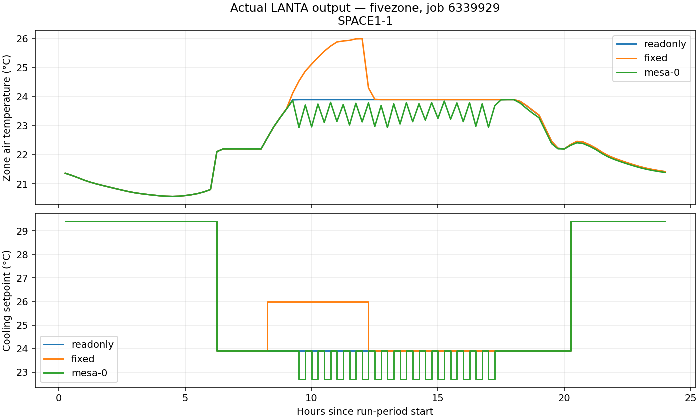
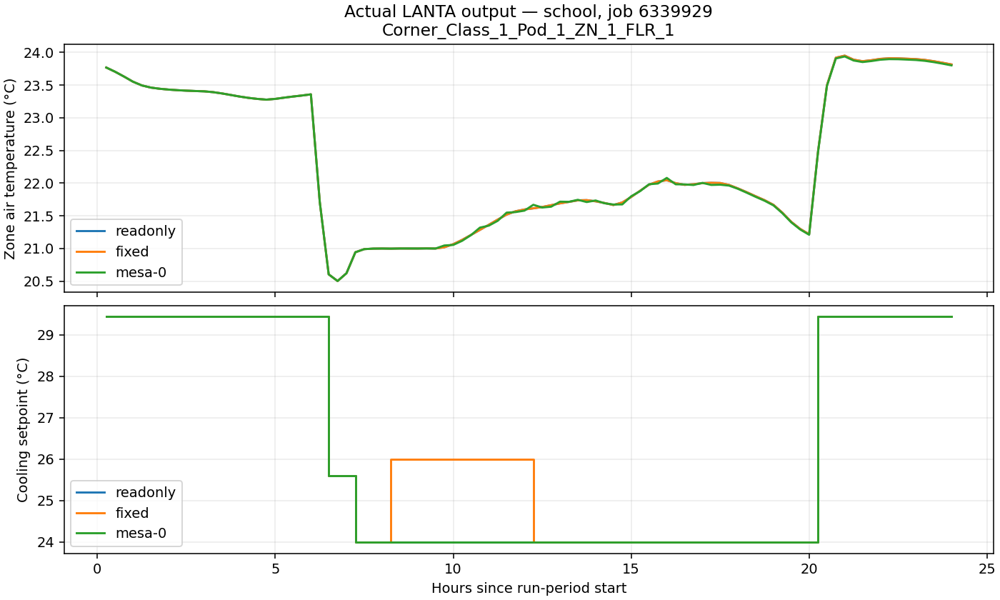

# Reference-building EnergyPlus/Mesa qualification — LANTA, 2026-09-26

The reference-building coupling now passes the staged correctness tests.
This is a **new synchronous CPU benchmark adapter**, not a claim that the
student's original threaded Twin-B implementation or Boonchoo geometry is fixed.
See the [tutorial and reproduction commands](../../TWINB_REFERENCE_BENCHMARKS.md)
and [Bash reference](../../BASH_COMMAND_REFERENCE_TH.md).

## Completed scientific-software checks

Account `pv915002`, EnergyPlus 25.1.0, Mesa 3.5.1, seed 42. Each qualified case
contains eight simulations: CLI baseline, read-only API, native-control reset,
fixed 26 °C intervention/release, five-agent smoke, and three full-agent repeats.
All qualified simulations have zero severe/fatal errors. The school retains
reference-model warnings; this is not a warning-free engineering validation.

| Job | Model/weather | Request agents | Steps per simulation | Result |
|---|---|---:|---:|---|
| 6339929 | Five-zone / Chicago | 50 | 96 | PASS |
| 6339929 | School / Buckley-Denver | 1,875 | 96 | PASS |
| 6339932 | Five-zone / Chicago | 50 | 288 | PASS |
| 6339932 | School / Buckley-Denver | 1,875 | 288 | PASS |
| 6339932 | Five-zone / Lampang, original design-day sizing | 50 | 288 | PASS |
| 6339935 | Five-zone / Chicago, one CPU | 50 | 96 | PASS |
| 6339935 | School / Buckley-Denver, one CPU | 1,875 | 96 | PASS |

Read-only and reset outputs agree with standalone EnergyPlus to the configured
1e-7 tolerance. Fixed commands track 26 °C, affect output, and release back to
native setpoints. Each Mesa repeat advances exactly once per zone interval;
three seeded traces per case have identical SHA-256. Postprocessing also checks
every nonempty Mesa command against the reported cooling setpoint in all repeats.

There are six zones/five controlled zones in the small model and 46 controlled
zones in the school. The return plenum is not assigned a thermostat. The school
agent count is a software stress workload, not an asserted physical occupancy.
Native EnergyPlus people and their heat gains remain intact.

## Actual results, not generated screenshots

The request/reset policy visibly oscillates in the small model. It is deliberately
simple and not an optimized comfort/energy controller. For the one-day cases:

| Model | Native facility electricity | Mesa facility electricity |
|---|---:|---:|
| Five-zone | 172.418 kWh | 176.710 kWh |
| School | 5,378.698 kWh | 5,800.183 kWh |

These sums come from the timestep `Electricity:Facility [J]` meter divided by
3,600,000. They exclude warmup and sizing. They demonstrate an intervention,
**not energy savings**; synthetic preferences are not calibrated occupant data.

## Performance and resource usage

For job 6339929's three repeated full-agent simulations:

| Model | Median process wall | Median simulation wall | Median callback time | Peak process RSS |
|---|---:|---:|---:|---:|
| Five-zone | 1.950 s | 0.454 s | 0.113 s | 297,336 KiB |
| School | 6.205 s | 4.705 s | 0.311 s | 363,024 KiB |

Process wall includes interpreter/import startup; simulation wall starts at the
EnergyPlus API call and includes sizing/warmup. Callback time includes safety
checks and diagnostic output. Whole-job elapsed also includes IDF preparation
and all eight simulations per building. Do not compare these distinct timings as
if they measured the same scope.

The four-CPU one-day job took 117 seconds; the four-CPU three-day/Thai job took
148 seconds. Full measurements for all completed cases are in
[performance-summary.json](performance-summary.json), with raw Slurm accounting
in [accounting.psv](accounting.psv). No GPU or distributed execution was used.
Slurm's periodic MaxRSS sampling can miss short-lived peaks; `/usr/bin/time -v`
measurements are retained separately. No billed-SHr savings are inferred.

**Resource optimization:** job 6339935 repeated both one-day qualifications with
one CPU and 1,800 MiB requested memory instead of four CPUs and 7 GiB. It completed
in 113 seconds, compared with 117 seconds for job 6339929, and produced identical
seeded trace hashes. [Numerical cross-allocation checks](resource-comparison.json)
compare all eight timestep output files for both models, including electricity.
The tutorial batch default is now one CPU/1,800 MiB: **75% fewer reserved CPUs**.
The small wall-time difference is not evidence of a statistically established
speedup; it is primarily an allocation-efficiency improvement. The three-day
cases were tested with four CPUs, not yet with this smaller allocation.

## What was fixed and what remains limited

- Removed the queue/thread coupling from the benchmark path: EnergyPlus owns
  time, and all API calls execute inside its callbacks.
- Moved thermostat actuation before the predictor. The initial after-HVAC-manager
  callback was one interval late and failed the fixed-control check.
- Added finite/range validation, explicit native-control reset, required handle
  checks, warmup/sizing exclusion, timestamp checks and callback failure propagation.
- Added a conservative cooling floor: maximum native heating schedule + 0.5 °C.
  This is 22.7 °C for the five-zone model and 21.5 °C for the school. It prevents
  conflicting heating/cooling commands without altering heating schedules.
- Each simulation has an external 480-second limit and each job a Slurm limit.
  Heartbeats aid diagnosis; no claim of a separate inactivity watchdog is made.
- The school one-day baseline and Mesa runs each report 82 warnings, including
  coil convergence, sizing, schedule and interzone-material warnings. These
  require further review before engineering-design or calibrated-energy claims.
  The three-day school Mesa case reports 84 warnings. The Lampang case has one
  site-location/weather mismatch warning, expected for this explicit weather-only
  experiment and retained in the error log.
- Lampang is a **weather-only sensitivity test with the original Chicago design
  assumptions**, not climate-specific resizing, a Thai-code prototype, or Boonchoo.
- Annual, GPU/DDP, validated occupant movement and calibrated behaviour remain
  outside this bounded benchmark qualification.

## Failed attempts retained for audit

| Job | Outcome and diagnosis |
|---|---|
| 6339918 | Missing weather after failed DOE download; initialization failed |
| 6339925 | Fixed-setpoint test caught one-timestep callback delay |
| 6339928 | 50-agent case requested 22.11 °C cooling against 22.20 °C heating; severe/fatal error correctly failed the gate |

The failed attempts are not counted as successful benchmark runs. Their raw logs
and summaries are preserved alongside the later passing runs.

## Evidence and provenance

[artifacts.tar.gz](artifacts.tar.gz) contains per-job model metadata and derived
IDFs, qualification reports, API inventories/handles, timestep CSVs, agent/control
traces, error logs, console logs, package lists, script hashes and timing files.
It also includes Slurm console logs and the upstream EnergyPlus license.
[Input SHA-256 values](inputs/SHA256SUMS) identify the original model/weather
downloads; each run additionally hashes its exact derived input and weather.
The original input sources and download commands are in the tutorial and
`scripts/fetch_twinb_benchmarks.sh`.

Large unselected native outputs remain under
`/project/pv915002-hpcign/wdiazcar/twinb-benchmarks-20260926/results/<job-id>/`.
Download/extract the archive to inspect raw evidence or regenerate plots with
`scripts/summarize_twinb_benchmarks.py`. The plots are generated from the real CSVs,
not AI-generated expected-result images.
