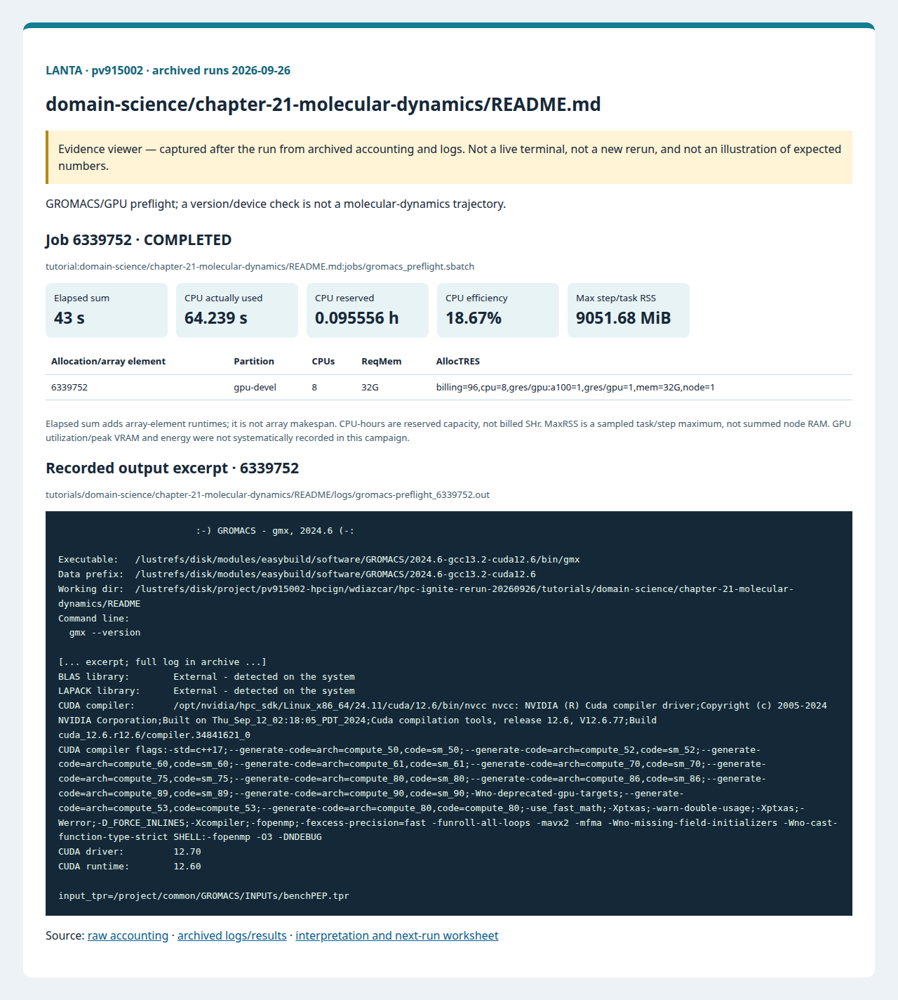

# บทที่ 21: Molecular Dynamics

<!-- resource-learning:start -->
## จากงานเล็กสู่การทดลองที่วัดผลได้ / Resource lab

Booklet flow: pages **33–36** of the [LANTA handbook](../../docs/lanta-hpc-experience-handbook.pdf). [Full learning sequence and worksheet](../../docs/RESOURCE_ESTIMATION_WORKBOOK.md).

<details><summary>ภาพแนวคิดจาก booklet / workflow illustration</summary>


Original booklet illustration, not a run screenshot. [Source and limitations](../../docs/images/booklet/README.md).

</details>

### 1. ขอบเขตและการประมาณก่อนรัน

GROMACS/GPU preflight; a version/device check is not a molecular-dynamics trajectory.

For the existing preflight, the requested GPU time is mostly software startup. Real MD requires atom count, timestep, steps, neighbor settings and output cadence; estimate time from a pilot's ns/day and trajectory storage from frames × atoms × bytes/coordinate.

### 2. ทรัพยากรที่ใช้จริงและตัวอย่าง output

Archived LANTA evidence, **2026-09-26**, account `pv915002`; these are historical measurements, not a new run or a future performance promise.

| Job | State | Elements | Sum elapsed (s) | CPU used (s) | Reserved CPU-h | Max step/task RSS (MiB) |
|---|---|---:|---:|---:|---:|---:|
| 6339752 | COMPLETED | 1 | 43 | 64.239 | 0.095556 | 9051.68 |

Elapsed is summed across array elements, not array makespan. CPU used is `TotalCPU`; reserved CPU-hours include idle allocation time. MaxRSS is the largest sampled task/step value, **not total node RAM**. Missing GPU/energy telemetry must not be interpreted as zero.



Browser screenshot of the [archived evidence viewer](../../docs/tutorial-evidence/domain-science-chapter-21-molecular-dynamics-readme.html); not a live terminal capture. Open the viewer for exact requested/allocated resources and job-specific log excerpts.

**Read the numbers:** job `6339752` used 64.239 CPU-seconds over 43 summed elapsed seconds: about **1.49 busy CPU cores per running element on average**. This describes CPU work across the whole allocation, including setup; it does not measure GPU utilization. For a seconds-long run, startup and coarse memory sampling can dominate. Do not reduce RAM to the displayed RSS or claim scaling without a longer pilot.

<details><summary>ตัวอย่าง output ที่บันทึกจริง / archived stdout excerpt</summary>

Job `6339752` · archive member `tutorials/domain-science/chapter-21-molecular-dynamics/README/logs/gromacs-preflight_6339752.out`

```text
                         :-) GROMACS - gmx, 2024.6 (-:

Executable:   /lustrefs/disk/modules/easybuild/software/GROMACS/2024.6-gcc13.2-cuda12.6/bin/gmx
Data prefix:  /lustrefs/disk/modules/easybuild/software/GROMACS/2024.6-gcc13.2-cuda12.6
Working dir:  /lustrefs/disk/project/pv915002-hpcign/wdiazcar/hpc-ignite-rerun-20260926/tutorials/domain-science/chapter-21-molecular-dynamics/README
Command line:
  gmx --version

[... excerpt; full log in archive ...]
BLAS library:        External - detected on the system
LAPACK library:      External - detected on the system
CUDA compiler:       /opt/nvidia/hpc_sdk/Linux_x86_64/24.11/cuda/12.6/bin/nvcc nvcc: NVIDIA (R) Cuda compiler driver;Copyright (c) 2005-2024 NVIDIA Corporation;Built on Thu_Sep_12_02:18:05_PDT_2024;Cuda compilation tools, release 12.6, V12.6.77;Build cuda_12.6.r12.6/compiler.34841621_0
CUDA compiler flags:-std=c++17;--generate-code=arch=compute_50,code=sm_50;--generate-code=arch=compute_52,code=sm_52;--generate-code=arch=compute_60,code=sm_60;--generate-code=arch=compute_61,code=sm_61;--generate-code=arch=compute_70,code=sm_70;--generate-code=arch=compute_75,code=sm_75;--generate-code=arch=compute_80,code=sm_80;--generate-code=arch=compute_86,code=sm_86;--generate-code=arch=compute_89,code=sm_89;--generate-code=arch=compute_90,code=sm_90;-Wno-deprecated-gpu-targets;--generate-code=arch=compute_53,code=compute_53;--generate-code=arch=compute_80,code=compute_80;-use_fast_math;-Xptxas;-warn-double-usage;-Xptxas;-Werror;-D_FORCE_INLINES;-Xcompiler;-fopenmp;-fexcess-precision=fast -funroll-all-loops -mavx2 -mfma -Wno-missing-field-initializers -Wno-cast-function-type-strict SHELL:-fopenmp -O3 -DNDEBUG
CUDA driver:         12.70
CUDA runtime:        12.60

input_tpr=/project/common/GROMACS/INPUTs/benchPEP.tpr
```

</details>

### 3. ขยายงานทีละแกนและตรวจความถูกต้อง

Prepare a public, documented GROMACS input as a separate extension. After equilibration, compare CPU and one-GPU runs for identical steps and output cadence; report ns/day, energy stability and CPU/GPU balance. Do not extrapolate production speed from this preflight.

**Correctness gate:** Require a trajectory, mdrun performance report and physical checks before claiming MD completion. The current version output proves installation only.

[Public applications and research-backed experiments](../../docs/REAL_APPLICATION_EXPERIMENTS.md#molecular-simulation) provide the next workload. Proposed resource budgets there are not measured requirements.

Before the next run, write down input size, expected time/RAM, requested CPUs/GPUs, and a stop condition. Afterwards record job ID, actual allocation, elapsed, CPU time, memory, result check and one change for the next run. Use three repeats and report spread; do not claim speedup from one short smoke run.

<!-- resource-learning:end -->

ผลรันซ้ำ LANTA บัญชี `pv915002` วันที่ 2026-09-26: [สถานะ ขอบเขต ผลลัพธ์ และ resource usage](../../docs/lanta-runs/2026-09-26-pv915002/README.md) · [วิธีประเมินและปรับปรุง performance](../../docs/PERFORMANCE_EVALUATION_OPTIMIZATION_TH.md)

คำสั่งในหน้านี้อธิบายรวมไว้ที่ [../../docs/BASH_COMMAND_REFERENCE_TH.md](../../docs/BASH_COMMAND_REFERENCE_TH.md).

เริ่มจาก SSH ตาม [../../LANTA_SETUP.md#1-ssh-to-lanta](../../LANTA_SETUP.md#1-ssh-to-lanta) แล้วแปะ block ในหัวข้อ Copy-Paste บน LANTA

หน้านี้เป็น standalone hand-on ผู้ใช้แปะคำสั่งบน LANTA แล้วได้ workspace, source file, Slurm script, log และ result ครบใน `$HOME/hpc-ignite-standalone/md-gromacs` โดยตรง

## เป้าหมาย

1. ตรวจ GROMACS module และ GPU allocation
2. ใช้ shared benchPEP เมื่อมีใน /project/common
3. บันทึก version, input และ performance summary

## Copy-Paste บน LANTA

แปะทีละ block ตามลำดับ แต่ละ block ทำหนึ่งงานหลักและมีหลักฐานให้ตรวจทันทีหลังรัน

### ขั้นที่ 1: เตรียม workspace และตัวแปร

ขั้นนี้กำหนดพื้นที่ทำงานของบท สร้าง folder มาตรฐาน และตั้งค่า account/partition ที่ใช้ซ้ำในขั้นถัดไป

```bash
mkdir -p "$HOME/hpc-ignite-standalone/md-gromacs"
cd "$HOME/hpc-ignite-standalone/md-gromacs"
mkdir -p jobs logs notes results

if [ -z "${LANTA_GPU_PARTITION:-}" ]; then export LANTA_GPU_PARTITION="gpu-devel"; fi
if [ -z "${LANTA_ACCOUNT:-}" ]; then read -rp "Slurm project account, blank for site default: " LANTA_ACCOUNT; export LANTA_ACCOUNT; fi
SBATCH_ACCOUNT=(); if [ -n "${LANTA_ACCOUNT:-}" ]; then SBATCH_ACCOUNT=(-A "$LANTA_ACCOUNT"); fi
```

### ขั้นที่ 2: สร้าง Slurm script `jobs/gromacs_preflight.sbatch`

ขั้นนี้สร้างไฟล์ Slurm ที่ระบุ resource, module, working directory และคำสั่งที่รันบน compute node

```bash
cat > jobs/gromacs_preflight.sbatch <<'SLURM'
#!/bin/bash
#SBATCH --job-name=gromacs-preflight
#SBATCH --nodes=1
#SBATCH --ntasks=1
#SBATCH --cpus-per-task=8
#SBATCH --gpus-per-node=1
#SBATCH --mem=32G
#SBATCH --time=00:10:00
#SBATCH --output=logs/%x_%j.out
#SBATCH --error=logs/%x_%j.err
set -euo pipefail
module purge
module load GROMACS/2024.6-cpeGNU-25.03-CUDA-12.6 2>/dev/null || true
cd "$SLURM_SUBMIT_DIR"
OUT="results/${SLURM_JOB_ID}"; mkdir -p "$OUT"
gmx --version | tee "$OUT/gmx_version.txt"
TPR="$(find /project/common/GROMACS -name 'benchPEP.tpr' -print -quit 2>/dev/null || true)"
if [ -n "$TPR" ]; then echo "input_tpr=$TPR" | tee "$OUT/summary.txt"; gmx mdrun -s "$TPR" -deffnm "$OUT/benchPEP" -nsteps 100 -ntomp "${SLURM_CPUS_PER_TASK:-1}" | tee "$OUT/mdrun_stdout.txt"; grep -E "Performance|Finished mdrun|Writing final coordinates" "$OUT/benchPEP.log" > "$OUT/performance_summary.txt" || true; else echo "tpr_status=shared_benchpep_pending" | tee "$OUT/summary.txt"; fi
SLURM
```

### ขั้นที่ 3: ส่งงานเข้า Slurm

ขั้นนี้ส่ง job script ที่เพิ่งสร้างไว้ด้วย `sbatch` แล้วบันทึก job id เพื่อใช้ตามคิวและอ่าน log ภายหลัง

```bash
job_id=$(sbatch "${SBATCH_ACCOUNT[@]}" -p "$LANTA_GPU_PARTITION" --parsable jobs/gromacs_preflight.sbatch)
echo "$job_id	gromacs_preflight	$(date -Is)" >> notes/job-history.tsv
echo "Submitted job: $job_id"
echo "Read: tail -100 logs/gromacs-preflight_${job_id}.out"
```

## Check

```bash
cd "$HOME/hpc-ignite-standalone/md-gromacs"
find results -maxdepth 2 -type f | sort
tail -100 logs/gromacs-preflight_*.out
```

## การตรวจผล

หลัง job จบ ให้ผู้ใช้ตรวจสามชั้นหลักฐาน:

1. `sacct` แสดง `COMPLETED` และ `ExitCode` เป็น `0:0`
2. `logs/` มี stdout/stderr ของ job id นั้น
3. `results/` มีไฟล์ output ที่ระบุในหัวข้อ Check

## ใช้ Repo เป็น Reference

ถ้าผู้ใช้ clone repo แล้ว สามารถเทียบแนวคิดกับไฟล์ใน repo ได้ เช่น `slurm/`, `requirements/`, `environments/` และ `jobs/` ของแต่ละบท แต่ block ด้านบนออกแบบให้รันได้จากหน้า hand-on นี้โดยตรง
