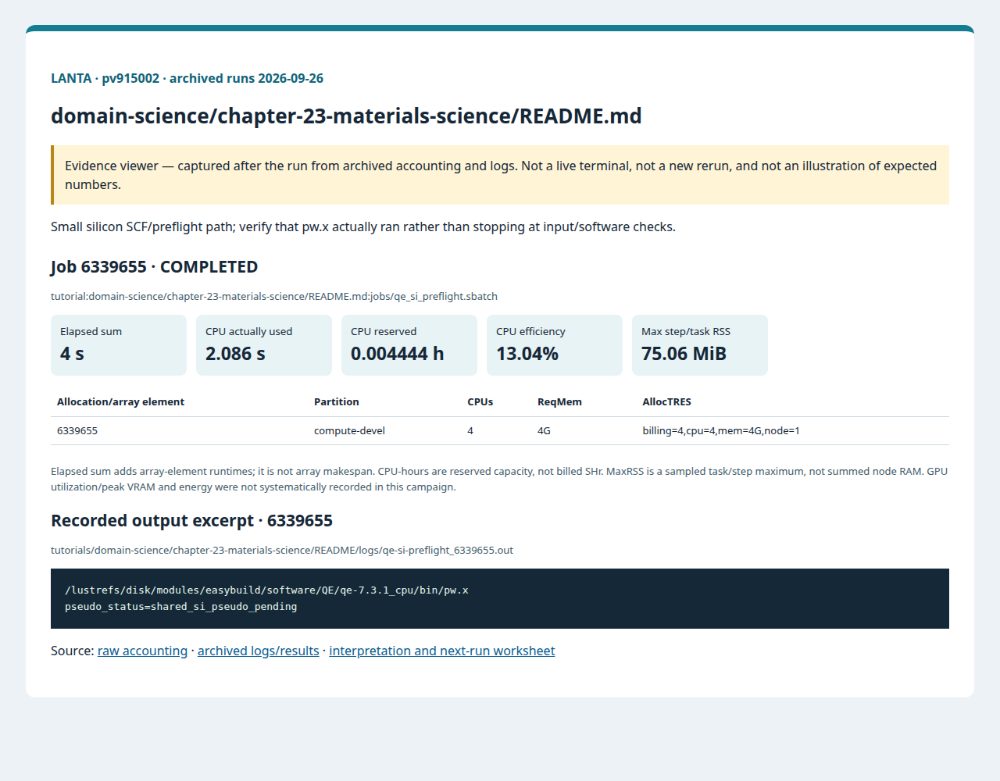

# บทที่ 23: วัสดุศาสตร์

<!-- resource-learning:start -->
## จากงานเล็กสู่การทดลองที่วัดผลได้ / Resource lab

Booklet flow: pages **33–36** of the [LANTA handbook](../../docs/lanta-hpc-experience-handbook.pdf). [Full learning sequence and worksheet](../../docs/RESOURCE_ESTIMATION_WORKBOOK.md).

<details><summary>ภาพแนวคิดจาก booklet / workflow illustration</summary>


Original booklet illustration, not a run screenshot. [Source and limitations](../../docs/images/booklet/README.md).

</details>

### 1. ขอบเขตและการประมาณก่อนรัน

Small silicon SCF/preflight path; verify that pw.x actually ran rather than stopping at input/software checks.

Plane-wave memory depends on cell volume, energy cutoff, bands and k-points; doubling atoms is not a reliable linear memory estimate. Pilot the provided small system, record QE's memory estimates and iterations, then tune ranks.

### 2. ทรัพยากรที่ใช้จริงและตัวอย่าง output

Archived LANTA evidence, **2026-09-26**, account `pv915002`; these are historical measurements, not a new run or a future performance promise.

| Job | State | Elements | Sum elapsed (s) | CPU used (s) | Reserved CPU-h | Max step/task RSS (MiB) |
|---|---|---:|---:|---:|---:|---:|
| 6339655 | COMPLETED | 1 | 4 | 2.086 | 0.004444 | 75.06 |

Elapsed is summed across array elements, not array makespan. CPU used is `TotalCPU`; reserved CPU-hours include idle allocation time. MaxRSS is the largest sampled task/step value, **not total node RAM**. Missing GPU/energy telemetry must not be interpreted as zero.



Browser screenshot of the [archived evidence viewer](../../docs/tutorial-evidence/domain-science-chapter-23-materials-science-readme.html); not a live terminal capture. Open the viewer for exact requested/allocated resources and job-specific log excerpts.

**Read the numbers:** job `6339655` used 2.086 CPU-seconds over 4 summed elapsed seconds: about **0.52 busy CPU cores per running element on average**. This describes CPU work across the whole allocation, including setup; it does not measure GPU utilization. For a seconds-long run, startup and coarse memory sampling can dominate. Do not reduce RAM to the displayed RSS or claim scaling without a longer pilot.

<details><summary>ตัวอย่าง output ที่บันทึกจริง / archived stdout excerpt</summary>

Job `6339655` · archive member `tutorials/domain-science/chapter-23-materials-science/README/logs/qe-si-preflight_6339655.out`

```text
/lustrefs/disk/modules/easybuild/software/QE/qe-7.3.1_cpu/bin/pw.x
pseudo_status=shared_si_pseudo_pending
```

</details>

### 3. ขยายงานทีละแกนและตรวจความถูกต้อง

Hold cell, pseudopotential hash, cutoffs and k-grid fixed for 1/2/4-rank timing. Treat cutoff/k-point convergence as a separate accuracy study. Record total energy, iterations, elapsed and per-rank memory; reject unconverged faster runs.

**Correctness gate:** Require convergence and JOB DONE in the scientific output, plus energy agreement within a stated tolerance. A successful module/preflight step alone is insufficient.

[Public applications and research-backed experiments](../../docs/REAL_APPLICATION_EXPERIMENTS.md#quantum-espresso) provide the next workload. Proposed resource budgets there are not measured requirements.

Before the next run, write down input size, expected time/RAM, requested CPUs/GPUs, and a stop condition. Afterwards record job ID, actual allocation, elapsed, CPU time, memory, result check and one change for the next run. Use three repeats and report spread; do not claim speedup from one short smoke run.

<!-- resource-learning:end -->

ผลรันซ้ำ LANTA บัญชี `pv915002` วันที่ 2026-09-26: [สถานะ ขอบเขต ผลลัพธ์ และ resource usage](../../docs/lanta-runs/2026-09-26-pv915002/README.md) · [วิธีประเมินและปรับปรุง performance](../../docs/PERFORMANCE_EVALUATION_OPTIMIZATION_TH.md)

คำสั่งในหน้านี้อธิบายรวมไว้ที่ [../../docs/BASH_COMMAND_REFERENCE_TH.md](../../docs/BASH_COMMAND_REFERENCE_TH.md).

เริ่มจาก SSH ตาม [../../LANTA_SETUP.md#1-ssh-to-lanta](../../LANTA_SETUP.md#1-ssh-to-lanta) แล้วแปะ block ในหัวข้อ Copy-Paste บน LANTA

หน้านี้เป็น standalone hand-on ผู้ใช้แปะคำสั่งบน LANTA แล้วได้ workspace, source file, Slurm script, log และ result ครบใน `$HOME/hpc-ignite-standalone/materials-qe` โดยตรง

## เป้าหมาย

1. ตรวจ Quantum ESPRESSO module
2. สร้าง input Si SCF ขนาดเล็กเมื่อ pseudopotential พร้อม
3. บันทึก energy หรือ preflight summary

## Copy-Paste บน LANTA

แปะทีละ block ตามลำดับ แต่ละ block ทำหนึ่งงานหลักและมีหลักฐานให้ตรวจทันทีหลังรัน

### ขั้นที่ 1: เตรียม workspace และตัวแปร

ขั้นนี้กำหนดพื้นที่ทำงานของบท สร้าง folder มาตรฐาน และตั้งค่า account/partition ที่ใช้ซ้ำในขั้นถัดไป

```bash
mkdir -p "$HOME/hpc-ignite-standalone/materials-qe"
cd "$HOME/hpc-ignite-standalone/materials-qe"
mkdir -p input jobs logs notes results

if [ -z "${LANTA_CPU_PARTITION:-}" ]; then export LANTA_CPU_PARTITION="compute-devel"; fi
if [ -z "${LANTA_ACCOUNT:-}" ]; then read -rp "Slurm project account, blank for site default: " LANTA_ACCOUNT; export LANTA_ACCOUNT; fi
SBATCH_ACCOUNT=(); if [ -n "${LANTA_ACCOUNT:-}" ]; then SBATCH_ACCOUNT=(-A "$LANTA_ACCOUNT"); fi
```

### ขั้นที่ 2: สร้าง Quantum ESPRESSO input template

ขั้นนี้สร้าง input deck ของ Si SCF แยกจาก job script เพื่อให้ผู้ใช้อ่านพารามิเตอร์ทางวัสดุศาสตร์ เช่น lattice, `ecutwfc`, และ k-point ได้ชัดเจน

```bash
cat > input/si_scf.in.template <<'EOF'
&CONTROL
  calculation = 'scf',
  prefix = 'si_smoke',
  pseudo_dir = '__PSEUDO_DIR__',
  outdir = '__OUTDIR__'
/
&SYSTEM
  ibrav = 2,
  celldm(1) = 10.20,
  nat = 2,
  ntyp = 1,
  ecutwfc = 18.0
/
&ELECTRONS
  conv_thr = 1.0d-6
/
ATOMIC_SPECIES
Si 28.0855 __PSEUDO_NAME__
ATOMIC_POSITIONS alat
Si 0.00 0.00 0.00
Si 0.25 0.25 0.25
K_POINTS automatic
2 2 2 0 0 0
EOF
```

### ขั้นที่ 3: สร้าง Slurm script `jobs/qe_si_preflight.sbatch`

ขั้นนี้สร้างไฟล์ Slurm ที่หา pseudopotential, เติมค่าใน template, แล้วรัน `pw.x` บน compute node

```bash
cat > jobs/qe_si_preflight.sbatch <<'SLURM'
#!/bin/bash
#SBATCH --job-name=qe-si-preflight
#SBATCH --nodes=1
#SBATCH --ntasks=4
#SBATCH --cpus-per-task=1
#SBATCH --mem=4G
#SBATCH --time=00:15:00
#SBATCH --output=logs/%x_%j.out
#SBATCH --error=logs/%x_%j.err
set -euo pipefail
module purge
module load QuantumESPRESSO/7.3.1-libxc-6.2.2-cpu 2>/dev/null || true
cd "$SLURM_SUBMIT_DIR"
OUT="results/${SLURM_JOB_ID}"; mkdir -p "$OUT"
command -v pw.x | tee "$OUT/pw_path.txt"
PSEUDO_FILE="$(find /project/common/QuantumEspresso -iname 'Si*.UPF' -print -quit 2>/dev/null || true)"
if [ -z "$PSEUDO_FILE" ]; then
    pw.x -h > "$OUT/pw_help.txt" 2>&1 || true
    echo "pseudo_status=shared_si_pseudo_pending" | tee "$OUT/summary.txt"
    exit 0
fi
PSEUDO_DIR="$(dirname "$PSEUDO_FILE")"
PSEUDO_NAME="$(basename "$PSEUDO_FILE")"
export ESPRESSO_TMPDIR="${ESPRESSO_TMPDIR:-${SCRATCH:-/tmp}/qe_${SLURM_JOB_ID}}"
mkdir -p "$ESPRESSO_TMPDIR"
sed -e "s#__PSEUDO_DIR__#$PSEUDO_DIR#g" -e "s#__PSEUDO_NAME__#$PSEUDO_NAME#g" -e "s#__OUTDIR__#$ESPRESSO_TMPDIR#g" input/si_scf.in.template > "$OUT/si_scf.in"
srun -n "$SLURM_NTASKS" pw.x -inp "$OUT/si_scf.in" | tee "$OUT/si_scf.out"
grep -E "total energy|convergence has been achieved" "$OUT/si_scf.out" > "$OUT/qe_summary.txt" || true
SLURM
```

### ขั้นที่ 4: ส่งงานเข้า Slurm

ขั้นนี้ส่ง job script ที่เพิ่งสร้างไว้ด้วย `sbatch` แล้วบันทึก job id เพื่อใช้ตามคิวและอ่าน log ภายหลัง

```bash
job_id=$(sbatch "${SBATCH_ACCOUNT[@]}" -p "$LANTA_CPU_PARTITION" --parsable jobs/qe_si_preflight.sbatch)
echo "$job_id	qe_si_preflight	$(date -Is)" >> notes/job-history.tsv
echo "Submitted job: $job_id"
echo "Read: tail -100 logs/qe-si-preflight_${job_id}.out"
```

## Check

```bash
cd "$HOME/hpc-ignite-standalone/materials-qe"
find results -maxdepth 2 -type f | sort
tail -120 logs/qe-si-preflight_*.out
```

## การตรวจผล

หลัง job จบ ให้ผู้ใช้ตรวจสามชั้นหลักฐาน:

1. `sacct` แสดง `COMPLETED` และ `ExitCode` เป็น `0:0`
2. `logs/` มี stdout/stderr ของ job id นั้น
3. `results/` มีไฟล์ output ที่ระบุในหัวข้อ Check

## ใช้ Repo เป็น Reference

ถ้าผู้ใช้ clone repo แล้ว สามารถเทียบแนวคิดกับไฟล์ใน repo ได้ เช่น `slurm/`, `requirements/`, `environments/` และ `jobs/` ของแต่ละบท แต่ block ด้านบนออกแบบให้รันได้จากหน้า hand-on นี้โดยตรง
