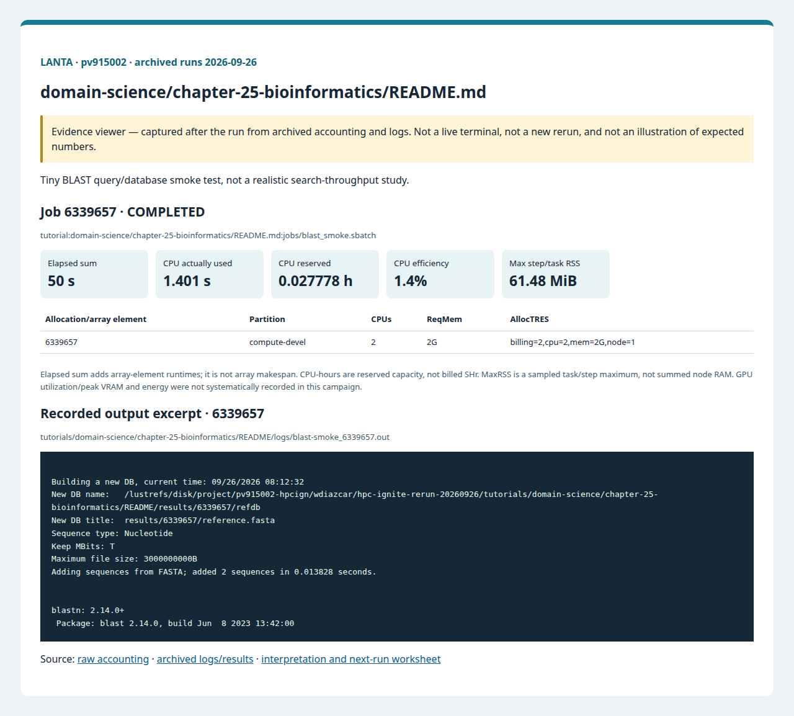

# บทที่ 25: ชีวสารสนเทศศาสตร์

<!-- resource-learning:start -->
## จากงานเล็กสู่การทดลองที่วัดผลได้ / Resource lab

Booklet flow: pages **33–36** of the [LANTA handbook](../../docs/lanta-hpc-experience-handbook.pdf). [Full learning sequence and worksheet](../../docs/RESOURCE_ESTIMATION_WORKBOOK.md).

<details><summary>ภาพแนวคิดจาก booklet / workflow illustration</summary>


Original booklet illustration, not a run screenshot. [Source and limitations](../../docs/images/booklet/README.md).

</details>

### 1. ขอบเขตและการประมาณก่อนรัน

Tiny BLAST query/database smoke test, not a realistic search-throughput study.

Database/index residency may dominate RAM; query bytes alone are insufficient. Pilot a bounded database subset with fixed version and checksum; record queries, total bases, hits and database size.

### 2. ทรัพยากรที่ใช้จริงและตัวอย่าง output

Archived LANTA evidence, **2026-09-26**, account `pv915002`; these are historical measurements, not a new run or a future performance promise.

| Job | State | Elements | Sum elapsed (s) | CPU used (s) | Reserved CPU-h | Max step/task RSS (MiB) |
|---|---|---:|---:|---:|---:|---:|
| 6339657 | COMPLETED | 1 | 50 | 1.401 | 0.027778 | 61.48 |

Elapsed is summed across array elements, not array makespan. CPU used is `TotalCPU`; reserved CPU-hours include idle allocation time. MaxRSS is the largest sampled task/step value, **not total node RAM**. Missing GPU/energy telemetry must not be interpreted as zero.



Browser screenshot of the [archived evidence viewer](../../docs/tutorial-evidence/domain-science-chapter-25-bioinformatics-readme.html); not a live terminal capture. Open the viewer for exact requested/allocated resources and job-specific log excerpts.

**Read the numbers:** job `6339657` used 1.401 CPU-seconds over 50 summed elapsed seconds: about **0.03 busy CPU cores per running element on average**. This describes CPU work across the whole allocation, including setup; it does not measure GPU utilization. For a seconds-long run, startup and coarse memory sampling can dominate. Do not reduce RAM to the displayed RSS or claim scaling without a longer pilot.

<details><summary>ตัวอย่าง output ที่บันทึกจริง / archived stdout excerpt</summary>

Job `6339657` · archive member `tutorials/domain-science/chapter-25-bioinformatics/README/logs/blast-smoke_6339657.out`

```text


Building a new DB, current time: 09/26/2026 08:12:32
New DB name:   /lustrefs/disk/project/pv915002-hpcign/wdiazcar/hpc-ignite-rerun-20260926/tutorials/domain-science/chapter-25-bioinformatics/README/results/6339657/refdb
New DB title:  results/6339657/reference.fasta
Sequence type: Nucleotide
Keep MBits: T
Maximum file size: 3000000000B
Adding sequences from FASTA; added 2 sequences in 0.013828 seconds.


blastn: 2.14.0+
 Package: blast 2.14.0, build Jun  8 2023 13:42:00
```

</details>

### 3. ขยายงานทีละแกนและตรวจความถูกต้อง

At fixed database and query set, compare 1/2/4 threads with three repeats. Then scale query count 10× without changing search sensitivity. Include cold/warm database-cache effects and separate database construction from query time.

**Correctness gate:** Compare hit IDs, scores and E-values at fixed settings. A no-hit result can be valid, but software --version alone is not a search.

[Public applications and research-backed experiments](../../docs/REAL_APPLICATION_EXPERIMENTS.md#bioinformatics) provide the next workload. Proposed resource budgets there are not measured requirements.

Before the next run, write down input size, expected time/RAM, requested CPUs/GPUs, and a stop condition. Afterwards record job ID, actual allocation, elapsed, CPU time, memory, result check and one change for the next run. Use three repeats and report spread; do not claim speedup from one short smoke run.

<!-- resource-learning:end -->

ผลรันซ้ำ LANTA บัญชี `pv915002` วันที่ 2026-09-26: [สถานะ ขอบเขต ผลลัพธ์ และ resource usage](../../docs/lanta-runs/2026-09-26-pv915002/README.md) · [วิธีประเมินและปรับปรุง performance](../../docs/PERFORMANCE_EVALUATION_OPTIMIZATION_TH.md)

คำสั่งในหน้านี้อธิบายรวมไว้ที่ [../../docs/BASH_COMMAND_REFERENCE_TH.md](../../docs/BASH_COMMAND_REFERENCE_TH.md).

เริ่มจาก SSH ตาม [../../LANTA_SETUP.md#1-ssh-to-lanta](../../LANTA_SETUP.md#1-ssh-to-lanta) แล้วแปะ block ในหัวข้อ Copy-Paste บน LANTA

หน้านี้เป็น standalone hand-on ผู้ใช้แปะคำสั่งบน LANTA แล้วได้ workspace, source file, Slurm script, log และ result ครบใน `$HOME/hpc-ignite-standalone/bio-blast` โดยตรง

## เป้าหมาย

1. สร้าง FASTA reference และ query
2. สร้าง BLAST database ขนาดเล็ก
3. ตรวจ hit table และ BLAST version

## Copy-Paste บน LANTA

แปะทีละ block ตามลำดับ แต่ละ block ทำหนึ่งงานหลักและมีหลักฐานให้ตรวจทันทีหลังรัน

### ขั้นที่ 1: เตรียม workspace และตัวแปร

ขั้นนี้กำหนดพื้นที่ทำงานของบท สร้าง folder มาตรฐาน และตั้งค่า account/partition ที่ใช้ซ้ำในขั้นถัดไป

```bash
mkdir -p "$HOME/hpc-ignite-standalone/bio-blast"
cd "$HOME/hpc-ignite-standalone/bio-blast"
mkdir -p jobs logs notes results

if [ -z "${LANTA_CPU_PARTITION:-}" ]; then export LANTA_CPU_PARTITION="compute-devel"; fi
if [ -z "${LANTA_ACCOUNT:-}" ]; then read -rp "Slurm project account, blank for site default: " LANTA_ACCOUNT; export LANTA_ACCOUNT; fi
SBATCH_ACCOUNT=(); if [ -n "${LANTA_ACCOUNT:-}" ]; then SBATCH_ACCOUNT=(-A "$LANTA_ACCOUNT"); fi
```

### ขั้นที่ 2: สร้าง Slurm script `jobs/blast_smoke.sbatch`

ขั้นนี้สร้างไฟล์ Slurm ที่ระบุ resource, module, working directory และคำสั่งที่รันบน compute node

```bash
cat > jobs/blast_smoke.sbatch <<'SLURM'
#!/bin/bash
#SBATCH --job-name=blast-smoke
#SBATCH --nodes=1
#SBATCH --ntasks=1
#SBATCH --cpus-per-task=2
#SBATCH --mem=2G
#SBATCH --time=00:05:00
#SBATCH --output=logs/%x_%j.out
#SBATCH --error=logs/%x_%j.err
set -euo pipefail
module purge
module load BLAST+/2.14.0-cpeGNU-23.03 2>/dev/null || true
cd "$SLURM_SUBMIT_DIR"
OUT="results/${SLURM_JOB_ID}"; mkdir -p "$OUT"
cat > "$OUT/reference.fasta" <<'EOF'
>ref_alpha
ACGTACGTACGTACGTACGT
>ref_beta
TTTTACGTGGGGACGTCCCC
EOF
cat > "$OUT/query.fasta" <<'EOF'
>query_1
ACGTACGT
EOF
makeblastdb -in "$OUT/reference.fasta" -dbtype nucl -out "$OUT/refdb" | tee "$OUT/makeblastdb.txt"
blastn -query "$OUT/query.fasta" -db "$OUT/refdb" -outfmt "6 qseqid sseqid pident length evalue bitscore" -out "$OUT/blast_hits.tsv"
blastn -version | tee "$OUT/blast_version.txt"
cat "$OUT/blast_hits.tsv"
SLURM
```

### ขั้นที่ 3: ส่งงานเข้า Slurm

ขั้นนี้ส่ง job script ที่เพิ่งสร้างไว้ด้วย `sbatch` แล้วบันทึก job id เพื่อใช้ตามคิวและอ่าน log ภายหลัง

```bash
job_id=$(sbatch "${SBATCH_ACCOUNT[@]}" -p "$LANTA_CPU_PARTITION" --parsable jobs/blast_smoke.sbatch)
echo "$job_id	blast_smoke	$(date -Is)" >> notes/job-history.tsv
echo "Submitted job: $job_id"
echo "Read: tail -80 logs/blast-smoke_${job_id}.out"
```

## Check

```bash
cd "$HOME/hpc-ignite-standalone/bio-blast"
find results -maxdepth 2 -type f | sort
cat results/*/blast_hits.tsv
```

## การตรวจผล

หลัง job จบ ให้ผู้ใช้ตรวจสามชั้นหลักฐาน:

1. `sacct` แสดง `COMPLETED` และ `ExitCode` เป็น `0:0`
2. `logs/` มี stdout/stderr ของ job id นั้น
3. `results/` มีไฟล์ output ที่ระบุในหัวข้อ Check

## ใช้ Repo เป็น Reference

ถ้าผู้ใช้ clone repo แล้ว สามารถเทียบแนวคิดกับไฟล์ใน repo ได้ เช่น `slurm/`, `requirements/`, `environments/` และ `jobs/` ของแต่ละบท แต่ block ด้านบนออกแบบให้รันได้จากหน้า hand-on นี้โดยตรง
