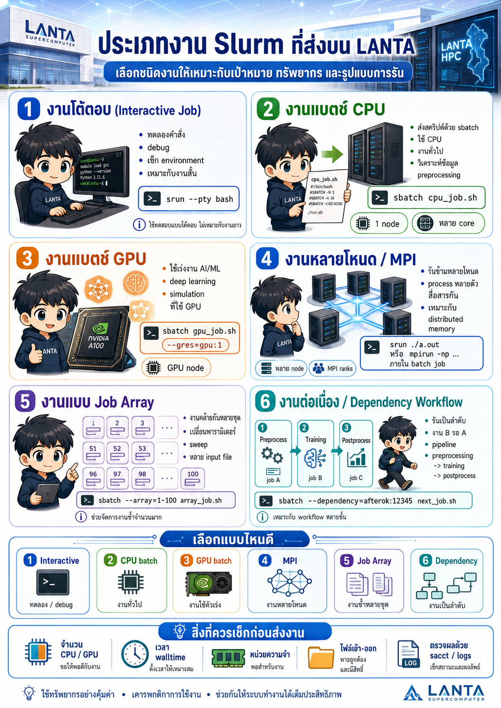
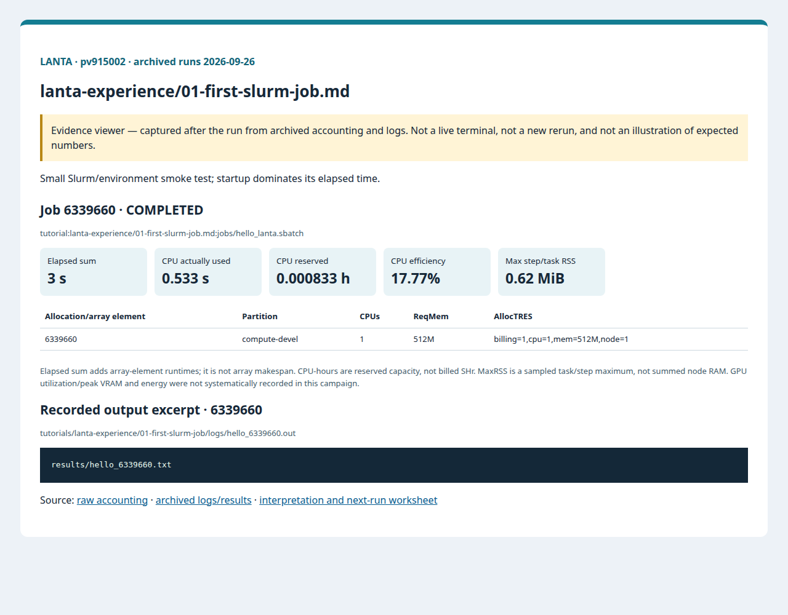
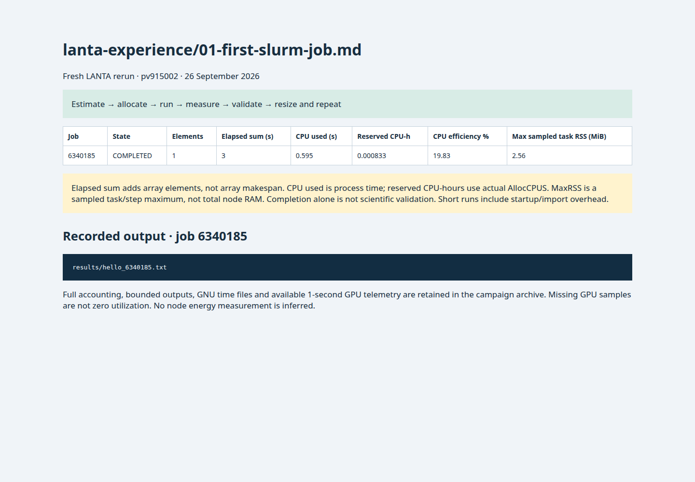

# 01 First Slurm Job

<!-- resource-learning:start -->
## จากงานเล็กสู่การทดลองที่วัดผลได้ / Resource lab

Booklet flow: pages **19–23** of the [LANTA handbook](../docs/lanta-hpc-experience-handbook.pdf). [Full learning sequence and worksheet](../docs/RESOURCE_ESTIMATION_WORKBOOK.md).

<details><summary>ภาพแนวคิดจาก booklet / workflow illustration</summary>



Original booklet illustration, not a run screenshot. [Source and limitations](../docs/images/booklet/README.md).

</details>

### 1. ขอบเขตและการประมาณก่อนรัน

Small Slurm/environment smoke test; startup dominates its elapsed time.

One task and one CPU are sufficient for printing context and writing a small file. A 1 GiB / 5 minute initial ceiling is a teaching budget, not measured need. Reserved capacity at that ceiling is 1 × 300 / 3600 = 0.0833 CPU-hours.

### 2. ทรัพยากรที่ใช้จริงและตัวอย่าง output

Archived LANTA evidence, **2026-09-26**, account `pv915002`; these are historical measurements, not a new run or a future performance promise.

| Job | State | Elements | Sum elapsed (s) | CPU used (s) | Reserved CPU-h | Max step/task RSS (MiB) |
|---|---|---:|---:|---:|---:|---:|
| 6339660 | COMPLETED | 1 | 3 | 0.533 | 0.000833 | 0.62 |

Elapsed is summed across array elements, not array makespan. CPU used is `TotalCPU`; reserved CPU-hours include idle allocation time. MaxRSS is the largest sampled task/step value, **not total node RAM**. Missing GPU/energy telemetry must not be interpreted as zero.



Browser screenshot of the [archived evidence viewer](../docs/tutorial-evidence/lanta-experience-01-first-slurm-job.html); not a live terminal capture. Open the viewer for exact requested/allocated resources and job-specific log excerpts.

**Read the numbers:** job `6339660` used 0.533 CPU-seconds over 3 summed elapsed seconds: about **0.18 busy CPU cores per running element on average**. This describes CPU work across the whole allocation, including setup; it does not measure GPU utilization. For a seconds-long run, startup and coarse memory sampling can dominate. Do not reduce RAM to the displayed RSS or claim scaling without a longer pilot.

<details><summary>ตัวอย่าง output ที่บันทึกจริง / archived stdout excerpt</summary>

Job `6339660` · archive member `tutorials/lanta-experience/01-first-slurm-job/logs/hello_6339660.out`

```text
results/hello_6339660.txt
```

</details>

### 3. ขยายงานทีละแกนและตรวจความถูกต้อง

Run the unchanged job three times. Compare queue wait, job elapsed and program time separately; do not infer parallel speedup from a hello-world job.

**Correctness gate:** Match the job ID and compute hostname in the log and result. COMPLETED alone does not prove the intended program ran.

[Public applications and research-backed experiments](../docs/REAL_APPLICATION_EXPERIMENTS.md#miniweather) provide the next workload. Proposed resource budgets there are not measured requirements.

Before the next run, write down input size, expected time/RAM, requested CPUs/GPUs, and a stop condition. Afterwards record job ID, actual allocation, elapsed, CPU time, memory, result check and one change for the next run. Use three repeats and report spread; do not claim speedup from one short smoke run.

<!-- resource-learning:end -->

ผลรันซ้ำ LANTA บัญชี `pv915002` วันที่ 2026-09-26: [สถานะ ขอบเขต ผลลัพธ์ และ resource usage](../docs/lanta-runs/2026-09-26-pv915002/README.md) · [วิธีประเมินและปรับปรุง performance](../docs/PERFORMANCE_EVALUATION_OPTIMIZATION_TH.md)

สร้าง Python script และ Slurm job script ด้วย heredoc แล้วส่งด้วย `sbatch` โดยตรง.

คำสั่งในหน้านี้อธิบายรวมไว้ที่ [../docs/BASH_COMMAND_REFERENCE_TH.md](../docs/BASH_COMMAND_REFERENCE_TH.md) เช่น heredoc, `sbatch`, `squeue`, `sacct`, `tail`, `cat`, `module purge`, `module load` และ `SLURM_SUBMIT_DIR`

เริ่มจาก SSH ตาม [../LANTA_SETUP.md#1-ssh-to-lanta](../LANTA_SETUP.md#1-ssh-to-lanta) แล้วรัน block เตรียมพื้นที่ใน [README.md](README.md) สำหรับ workspace ของกิจกรรม

## Copy-Paste

แปะทีละ block ตามลำดับ แต่ละ block ทำหนึ่งงานหลักและมีหลักฐานให้ตรวจทันทีหลังรัน

### ขั้นที่ 1: เตรียม workspace และตัวแปร

ขั้นนี้กำหนดพื้นที่ทำงานของบท สร้าง folder มาตรฐาน และตั้งค่า account/partition ที่ใช้ซ้ำในขั้นถัดไป

```bash
cd "$HOME/lanta-experience"
mkdir -p configs input jobs logs notes results src

if [ -z "${LANTA_ACCOUNT:-}" ]; then
    read -rp "Slurm project account: " LANTA_ACCOUNT
    export LANTA_ACCOUNT
fi
export LANTA_CPU_PARTITION="${LANTA_CPU_PARTITION:-compute-devel}"
```

### ขั้นที่ 2: สร้าง source code `src/hello_lanta.py`

ขั้นนี้สร้างไฟล์โปรแกรมหลัก ให้ผู้ใช้อ่านส่วน import, parameter, output path และ sanity check ก่อนส่งงาน

```bash
cat > src/hello_lanta.py <<'PY'
from pathlib import Path
import os
import platform
import time

Path("results").mkdir(exist_ok=True)
job_id = os.environ.get("SLURM_JOB_ID", "manual")
out = Path("results") / f"hello_{job_id}.txt"

lines = [
    f"job_id={job_id}",
    f"host={platform.node()}",
    f"user={os.environ.get('USER', 'unknown')}",
    f"submit_dir={os.environ.get('SLURM_SUBMIT_DIR', os.getcwd())}",
    f"time={time.strftime('%Y-%m-%d %H:%M:%S')}",
]
out.write_text("\n".join(lines) + "\n", encoding="utf-8")
print(out)
PY
```


### ขั้นที่ 3: สร้าง Slurm script `jobs/hello_lanta.sbatch`

ขั้นนี้สร้างไฟล์ Slurm ที่ระบุ resource, module, working directory และคำสั่งที่รันบน compute node

```bash
cat > jobs/hello_lanta.sbatch <<'SLURM'
#!/bin/bash
#SBATCH --job-name=hello_lanta
#SBATCH --nodes=1
#SBATCH --ntasks=1
#SBATCH --cpus-per-task=1
#SBATCH --mem=512M
#SBATCH --time=00:05:00
#SBATCH --output=logs/hello_%j.out
#SBATCH --error=logs/hello_%j.err

set -euo pipefail
module purge
module load cray-python/3.10.10 2>/dev/null || module load python 2>/dev/null || true
cd "$SLURM_SUBMIT_DIR"
python src/hello_lanta.py
SLURM
```

### ขั้นที่ 4: ส่งงานเข้า Slurm

ขั้นนี้ส่ง job script ที่เพิ่งสร้างไว้ด้วย `sbatch` แล้วบันทึก job id เพื่อใช้ตามคิวและอ่าน log ภายหลัง

```bash
job_id=$(sbatch -A "$LANTA_ACCOUNT" -p "$LANTA_CPU_PARTITION" --parsable jobs/hello_lanta.sbatch)
echo "$job_id	hello_lanta	$(date -Is)" >> notes/job-history.tsv
echo "Submitted job: $job_id"
echo "Monitor: squeue -j $job_id"
echo "After completion:"
echo "  sacct -j $job_id --format=JobID,JobName,State,Elapsed,AllocCPUS,MaxRSS,ExitCode"
echo "  tail -50 logs/hello_${job_id}.out"
echo "  cat results/hello_${job_id}.txt"
```

### คำอธิบาย

ในขั้นตอนนี้ ผู้ใช้จะสร้างไฟล์สองไฟล์ คือ `src/hello_lanta.py` สำหรับงาน Python และ `jobs/hello_lanta.sbatch` สำหรับบอก Slurm ว่าต้องใช้ทรัพยากรเท่าใด

เมื่อส่งด้วย `sbatch` งานจะเข้า queue เพื่อให้ Slurm จัดไปยัง compute node ไฟล์ log จะถูกเก็บใน `logs/` และผลลัพธ์ของ Python จะถูกเก็บใน `results/`

เมื่อสำเร็จ `sbatch` จะคืน job id ให้ผู้ใช้ จากนั้นใช้ `squeue -j <job-id>` เพื่อตรวจสถานะ และใช้ `sacct` หลังงานจบเพื่อตรวจว่าเป็น `COMPLETED` เมื่อ submit error ให้ตรวจ `LANTA_ACCOUNT` เมื่อ job ค้างให้ดู reason ใน `squeue` เมื่อ log แจ้งว่า Python หาย ให้ตรวจ `module avail python` และส่งงาน Slurm ผ่าน `sbatch`

## Modify

เปลี่ยนข้อความที่เขียนใน `src/hello_lanta.py` หรือเปลี่ยน `--time` ใน `jobs/hello_lanta.sbatch` แล้วส่งใหม่.

<!-- performance-rerun:start -->
## Fresh measured rerun — 26 September 2026

| Job | State | Elements | Sum elapsed (s) | CPU used (s) | Reserved CPU-h | Max step/task RSS (MiB) |
|---|---|---:|---:|---:|---:|---:|
| 6340185 | COMPLETED | 1 | 3 | 0.595 | 0.000833 | 2.56 |

These are new measured jobs, not estimates. One campaign pass does not establish scaling or runtime variance. Allocated CPU-hours are not billed SHr; sampled RSS is not total node memory.

[Accounting, output archive and measurement limitations](../docs/lanta-runs/2026-09-26-performance/README.md)


<!-- performance-rerun:end -->
