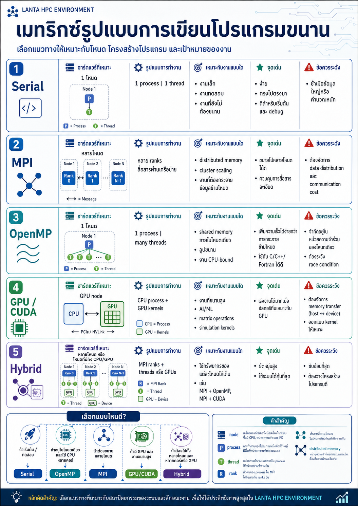
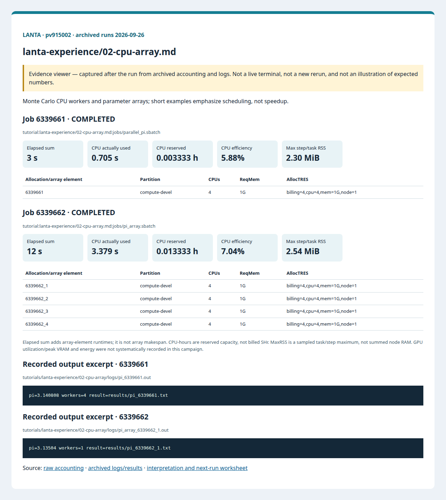

# 02 CPU And Job Array

<!-- resource-learning:start -->
## จากงานเล็กสู่การทดลองที่วัดผลได้ / Resource lab

Booklet flow: pages **24–27** of the [LANTA handbook](../docs/lanta-hpc-experience-handbook.pdf). [Full learning sequence and worksheet](../docs/RESOURCE_ESTIMATION_WORKBOOK.md).

<details><summary>ภาพแนวคิดจาก booklet / workflow illustration</summary>



Original booklet illustration, not a run screenshot. [Source and limitations](../docs/images/booklet/README.md).

</details>

### 1. ขอบเขตและการประมาณก่อนรัน

Monte Carlo CPU workers and parameter arrays; short examples emphasize scheduling, not speedup.

Work is proportional to samples N; streaming samples avoids storing N points. Workers each need their own Python runtime. Pilot 0.5M samples, then 5M and 50M only if the previous budget permits. Estimate T(N)=startup + N/rate from two pilots. For K array elements, sum each element's CPU-seconds; concurrency changes makespan, not total reserved work.

### 2. ทรัพยากรที่ใช้จริงและตัวอย่าง output

Archived LANTA evidence, **2026-09-26**, account `pv915002`; these are historical measurements, not a new run or a future performance promise.

| Job | State | Elements | Sum elapsed (s) | CPU used (s) | Reserved CPU-h | Max step/task RSS (MiB) |
|---|---|---:|---:|---:|---:|---:|
| 6339661 | COMPLETED | 1 | 3 | 0.705 | 0.003333 | 2.30 |
| 6339662 | COMPLETED | 4 | 12 | 3.379 | 0.013333 | 2.54 |

Elapsed is summed across array elements, not array makespan. CPU used is `TotalCPU`; reserved CPU-hours include idle allocation time. MaxRSS is the largest sampled task/step value, **not total node RAM**. Missing GPU/energy telemetry must not be interpreted as zero.



Browser screenshot of the [archived evidence viewer](../docs/tutorial-evidence/lanta-experience-02-cpu-array.html); not a live terminal capture. Open the viewer for exact requested/allocated resources and job-specific log excerpts.

**Read the numbers:** job `6339661` used 0.705 CPU-seconds over 3 summed elapsed seconds: about **0.23 busy CPU cores per running element on average**. This describes CPU work across the whole allocation, including setup; it does not measure GPU utilization. For a seconds-long run, startup and coarse memory sampling can dominate. Do not reduce RAM to the displayed RSS or claim scaling without a longer pilot.

<details><summary>ตัวอย่าง output ที่บันทึกจริง / archived stdout excerpt</summary>

Job `6339661` · archive member `tutorials/lanta-experience/02-cpu-array/logs/pi_6339661.out`

```text
pi=3.140808 workers=4 result=results/pi_6339661.txt
```

</details>

### 3. ขยายงานทีละแกนและตรวจความถูกต้อง

Hold N fixed and compare 1, 2, 4 workers with three repeats. Set workers no larger than allocated CPUs and cap array concurrency. This code changes random streams with worker count, so compare error distributions, not byte-identical pi values.

**Correctness gate:** Check exact sample count, finite pi near 3.14, unique array output paths and every array exit code. Monte Carlo uncertainty decreases approximately as 1/sqrt(N).

[Public applications and research-backed experiments](../docs/REAL_APPLICATION_EXPERIMENTS.md#miniweather) provide the next workload. Proposed resource budgets there are not measured requirements.

Before the next run, write down input size, expected time/RAM, requested CPUs/GPUs, and a stop condition. Afterwards record job ID, actual allocation, elapsed, CPU time, memory, result check and one change for the next run. Use three repeats and report spread; do not claim speedup from one short smoke run.

<!-- resource-learning:end -->

ผลรันซ้ำ LANTA บัญชี `pv915002` วันที่ 2026-09-26: [สถานะ ขอบเขต ผลลัพธ์ และ resource usage](../docs/lanta-runs/2026-09-26-pv915002/README.md) · [วิธีประเมินและปรับปรุง performance](../docs/PERFORMANCE_EVALUATION_OPTIMIZATION_TH.md)

ต่อจากงานแรกด้วยงาน CPU ที่ใช้หลาย worker และ job array สำหรับหลายชุดพารามิเตอร์.

คำสั่งในหน้านี้อธิบายรวมไว้ที่ [../docs/BASH_COMMAND_REFERENCE_TH.md](../docs/BASH_COMMAND_REFERENCE_TH.md) เช่น `sed`, job array, `SLURM_ARRAY_TASK_ID`, `sbatch`, `squeue`, `ls`, `OMP_NUM_THREADS` และ `python`

เริ่มจาก SSH ตาม [../LANTA_SETUP.md#1-ssh-to-lanta](../LANTA_SETUP.md#1-ssh-to-lanta) แล้วรัน block เตรียมพื้นที่ใน [README.md](README.md) สำหรับ workspace ของกิจกรรม

## Copy-Paste CPU Baseline

แปะทีละ block ตามลำดับ แต่ละ block ทำหนึ่งงานหลักและมีหลักฐานให้ตรวจทันทีหลังรัน

### ขั้นที่ 1: เตรียม workspace และตัวแปร

ขั้นนี้กำหนดพื้นที่ทำงานของบท สร้าง folder มาตรฐาน และตั้งค่า account/partition ที่ใช้ซ้ำในขั้นถัดไป

```bash
cd "$HOME/lanta-experience"
mkdir -p configs jobs logs notes results src

if [ -z "${LANTA_ACCOUNT:-}" ]; then
    read -rp "Slurm project account: " LANTA_ACCOUNT
    export LANTA_ACCOUNT
fi
export LANTA_CPU_PARTITION="${LANTA_CPU_PARTITION:-compute-devel}"
```

### ขั้นที่ 2: สร้าง source code `src/parallel_pi.py`

ขั้นนี้สร้างไฟล์โปรแกรมหลัก ให้ผู้ใช้อ่านส่วน import, parameter, output path และ sanity check ก่อนส่งงาน

```bash
cat > src/parallel_pi.py <<'PY'
import argparse
import math
import multiprocessing as mp
import os
import random
import time
from pathlib import Path

def count_inside(seed_and_n):
    seed, n = seed_and_n
    rng = random.Random(seed)
    inside = 0
    for _ in range(n):
        x, y = rng.random(), rng.random()
        inside += (x * x + y * y) <= 1.0
    return inside

parser = argparse.ArgumentParser()
parser.add_argument("--samples", type=int, default=1_000_000)
parser.add_argument("--workers", type=int, default=int(os.environ.get("SLURM_CPUS_PER_TASK", "1")))
args = parser.parse_args()

workers = max(1, args.workers)
chunk = math.ceil(args.samples / workers)
t0 = time.time()
with mp.Pool(processes=workers) as pool:
    inside = sum(pool.map(count_inside, [(1000 + i, min(chunk, args.samples - i * chunk)) for i in range(workers)]))
pi = 4.0 * inside / args.samples

Path("results").mkdir(exist_ok=True)
job_id = os.environ.get("SLURM_JOB_ID", "manual")
array_job_id = os.environ.get("SLURM_ARRAY_JOB_ID")
task_id = os.environ.get("SLURM_ARRAY_TASK_ID")
run_id = f"{array_job_id}_{task_id}" if array_job_id and task_id else job_id
Path(f"results/pi_{run_id}.txt").write_text(
    f"job_id={job_id}\narray_job_id={array_job_id or ''}\ntask_id={task_id or ''}\nsamples={args.samples}\nworkers={workers}\npi={pi}\nelapsed={time.time() - t0:.3f}\n",
    encoding="utf-8",
)
print(f"pi={pi} workers={workers} result=results/pi_{run_id}.txt")
PY
```


### ขั้นที่ 3: สร้าง Slurm script `jobs/parallel_pi.sbatch`

ขั้นนี้สร้างไฟล์ Slurm ที่ระบุ resource, module, working directory และคำสั่งที่รันบน compute node

```bash
cat > jobs/parallel_pi.sbatch <<'SLURM'
#!/bin/bash
#SBATCH --job-name=parallel_pi
#SBATCH --nodes=1
#SBATCH --ntasks=1
#SBATCH --cpus-per-task=4
#SBATCH --mem=1G
#SBATCH --time=00:10:00
#SBATCH --output=logs/pi_%j.out
#SBATCH --error=logs/pi_%j.err

set -euo pipefail
module purge
module load cray-python/3.10.10 2>/dev/null || module load python 2>/dev/null || true
cd "$SLURM_SUBMIT_DIR"
export OMP_NUM_THREADS=1
export OPENBLAS_NUM_THREADS=1
export MKL_NUM_THREADS=1
python src/parallel_pi.py --samples 500000 --workers "${SLURM_CPUS_PER_TASK:-1}"
SLURM
```

### ขั้นที่ 4: ส่งงานเข้า Slurm

ขั้นนี้ส่ง job script ที่เพิ่งสร้างไว้ด้วย `sbatch` แล้วบันทึก job id เพื่อใช้ตามคิวและอ่าน log ภายหลัง

```bash
job_id=$(sbatch -A "$LANTA_ACCOUNT" -p "$LANTA_CPU_PARTITION" --parsable jobs/parallel_pi.sbatch)
echo "$job_id	parallel_pi	$(date -Is)" >> notes/job-history.tsv
echo "Submitted job: $job_id"
echo "Monitor: squeue -j $job_id"
echo "Read: tail -50 logs/pi_${job_id}.out && cat results/pi_${job_id}.txt"
```

### คำอธิบาย

ในขั้นตอนนี้ ผู้ใช้จะรันโปรแกรม `parallel_pi.py` เพื่อประมาณค่า pi ด้วย Monte Carlo โปรแกรมจะแบ่งงานตามจำนวน worker ที่อ่านจาก `SLURM_CPUS_PER_TASK`

Slurm script ขอ 4 CPU cores และตั้ง `OMP_NUM_THREADS`, `OPENBLAS_NUM_THREADS`, และ `MKL_NUM_THREADS` เป็น 1 เพื่อจำกัดจำนวน thread ภายใน Python ให้สอดคล้องกับ resource ที่ขอไว้

เมื่อสำเร็จ log จะมีข้อความ `pi=... workers=4` และไฟล์ `results/pi_<job-id>.txt` จะมีจำนวน sample, worker, ค่า pi และเวลารัน ค่า pi ควรอยู่ใกล้ 3.14 เมื่องานใช้เวลานาน ให้ลด sample เมื่อ worker คลาดจาก CPU ที่ขอไว้ ให้ตรวจ `#SBATCH --cpus-per-task` และ argument `--workers`

## Copy-Paste Job Array

แปะทีละ block ตามลำดับ แต่ละ block ทำหนึ่งงานหลักและมีหลักฐานให้ตรวจทันทีหลังรัน

### ขั้นที่ 1: เตรียม workspace และตัวแปร

ขั้นนี้กำหนดพื้นที่ทำงานของบท สร้าง folder มาตรฐาน และตั้งค่า account/partition ที่ใช้ซ้ำในขั้นถัดไป

```bash
cd "$HOME/lanta-experience"
mkdir -p configs jobs logs notes results src

if [ -z "${LANTA_ACCOUNT:-}" ]; then
    read -rp "Slurm project account: " LANTA_ACCOUNT
    export LANTA_ACCOUNT
fi
export LANTA_CPU_PARTITION="${LANTA_CPU_PARTITION:-compute-devel}"
```

### ขั้นที่ 2: สร้าง config `configs/pi-params.csv`

ขั้นนี้สร้างค่ากำกับการทดลอง เพื่อให้ parameter แยกจาก code และตรวจซ้ำได้

```bash
cat > configs/pi-params.csv <<'EOF'
100000,1
200000,2
400000,4
800000,4
EOF
```


### ขั้นที่ 3: สร้าง source code `src/array_pi.py`

ขั้นนี้สร้างไฟล์โปรแกรมหลัก ให้ผู้ใช้อ่านส่วน import, parameter, output path และ sanity check ก่อนส่งงาน

```bash
cat > src/array_pi.py <<'PY'
import argparse
import subprocess

parser = argparse.ArgumentParser()
parser.add_argument("--line", required=True)
args = parser.parse_args()
samples, workers = args.line.split(",")
subprocess.check_call([
    "python", "src/parallel_pi.py",
    "--samples", samples,
    "--workers", workers,
])
PY
```


### ขั้นที่ 4: สร้าง Slurm script `jobs/pi_array.sbatch`

ขั้นนี้สร้างไฟล์ Slurm ที่ระบุ resource, module, working directory และคำสั่งที่รันบน compute node

```bash
cat > jobs/pi_array.sbatch <<'SLURM'
#!/bin/bash
#SBATCH --job-name=pi_array
#SBATCH --nodes=1
#SBATCH --ntasks=1
#SBATCH --cpus-per-task=4
#SBATCH --mem=1G
#SBATCH --time=00:10:00
#SBATCH --array=1-4
#SBATCH --output=logs/pi_array_%A_%a.out
#SBATCH --error=logs/pi_array_%A_%a.err

set -euo pipefail
module purge
module load cray-python/3.10.10 2>/dev/null || module load python 2>/dev/null || true
cd "$SLURM_SUBMIT_DIR"
export OMP_NUM_THREADS=1
export OPENBLAS_NUM_THREADS=1
export MKL_NUM_THREADS=1
LINE=$(sed -n "${SLURM_ARRAY_TASK_ID}p" configs/pi-params.csv)
python src/array_pi.py --line "$LINE"
SLURM
```

### ขั้นที่ 5: ส่งงานเข้า Slurm

ขั้นนี้ส่ง job script ที่เพิ่งสร้างไว้ด้วย `sbatch` แล้วบันทึก job id เพื่อใช้ตามคิวและอ่าน log ภายหลัง

```bash
job_id=$(sbatch -A "$LANTA_ACCOUNT" -p "$LANTA_CPU_PARTITION" --parsable jobs/pi_array.sbatch)
echo "$job_id	pi_array	$(date -Is)" >> notes/job-history.tsv
echo "Submitted array job: $job_id"
echo "Monitor: squeue -j $job_id"
echo "Read: ls logs/pi_array_${job_id}_*.out results/pi_${job_id}_*.txt"
```

### คำอธิบาย

หลังจากงานเดี่ยวรันได้แล้ว ให้ผู้ใช้รันงานแบบ job array ไฟล์ `configs/pi-params.csv` เป็นตารางพารามิเตอร์ โดยแต่ละบรรทัดคือหนึ่งชุดทดลอง

Slurm ใช้ `SLURM_ARRAY_TASK_ID` เพื่อเลือกบรรทัดจากไฟล์ config และใช้ `%A_%a` ในชื่อ log เพื่อแยก array job id กับ task id ออกจากกัน วิธีนี้เหมาะกับงานหลาย seed หลาย input file หรือหลายค่าพารามิเตอร์

เมื่อสำเร็จ ผู้ใช้จะเห็น log หลายไฟล์ เช่น `logs/pi_array_<jobid>_1.out` และผลลัพธ์หลายไฟล์ เช่น `results/pi_<array-jobid>_1.txt` เมื่อต้องแก้ task ใด ให้เปิด error log ของ task นั้นก่อน เมื่อ `sed` อ่านบรรทัดว่าง ให้เทียบช่วง `--array` กับจำนวนบรรทัดในไฟล์ config
