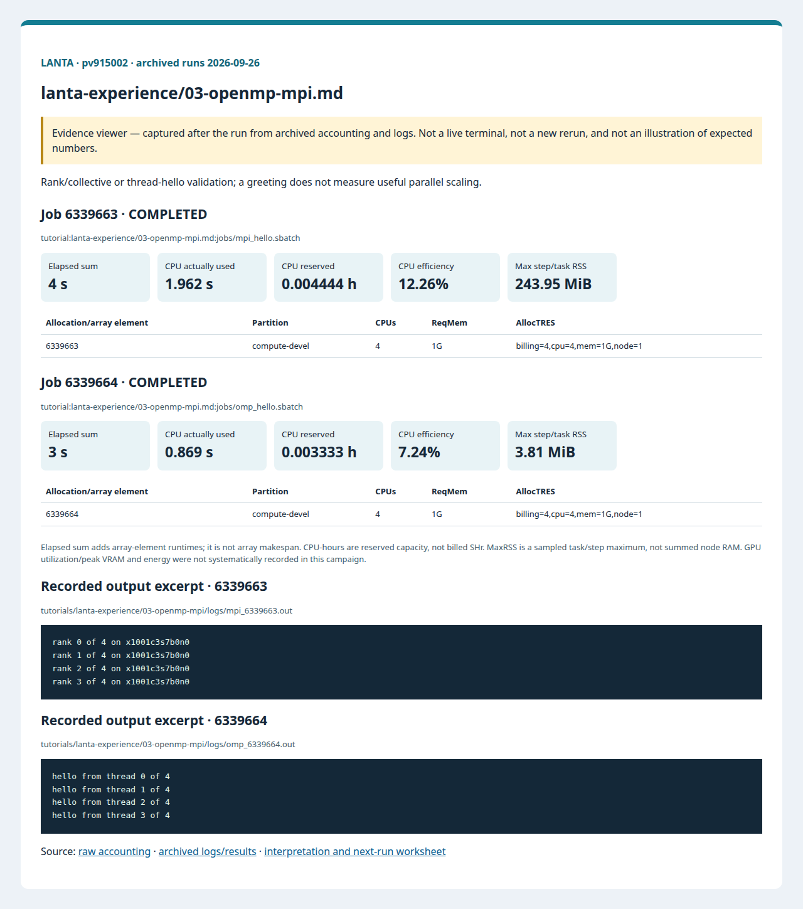

# 03 OpenMP And MPI

<!-- resource-learning:start -->
## จากงานเล็กสู่การทดลองที่วัดผลได้ / Resource lab

Booklet flow: pages **27–31** of the [LANTA handbook](../docs/lanta-hpc-experience-handbook.pdf). [Full learning sequence and worksheet](../docs/RESOURCE_ESTIMATION_WORKBOOK.md).

<details><summary>ภาพแนวคิดจาก booklet / workflow illustration</summary>


Original booklet illustration, not a run screenshot. [Source and limitations](../docs/images/booklet/README.md).

</details>

### 1. ขอบเขตและการประมาณก่อนรัน

Rank/collective or thread-hello validation; a greeting does not measure useful parallel scaling.

MPI: requested CPUs = ranks × threads/rank; OpenMP: one rank with cpus-per-task equal to OMP_NUM_THREADS. For replicated arrays, node RAM grows with ranks; for decomposed arrays estimate local cells × bytes/field × fields plus halos and runtime overhead.

### 2. ทรัพยากรที่ใช้จริงและตัวอย่าง output

Archived LANTA evidence, **2026-09-26**, account `pv915002`; these are historical measurements, not a new run or a future performance promise.

| Job | State | Elements | Sum elapsed (s) | CPU used (s) | Reserved CPU-h | Max step/task RSS (MiB) |
|---|---|---:|---:|---:|---:|---:|
| 6339663 | COMPLETED | 1 | 4 | 1.962 | 0.004444 | 243.95 |
| 6339664 | COMPLETED | 1 | 3 | 0.869 | 0.003333 | 3.81 |

Elapsed is summed across array elements, not array makespan. CPU used is `TotalCPU`; reserved CPU-hours include idle allocation time. MaxRSS is the largest sampled task/step value, **not total node RAM**. Missing GPU/energy telemetry must not be interpreted as zero.



Browser screenshot of the [archived evidence viewer](../docs/tutorial-evidence/lanta-experience-03-openmp-mpi.html); not a live terminal capture. Open the viewer for exact requested/allocated resources and job-specific log excerpts.

**Read the numbers:** job `6339663` used 1.962 CPU-seconds over 4 summed elapsed seconds: about **0.49 busy CPU cores per running element on average**. This describes CPU work across the whole allocation, including setup; it does not measure GPU utilization. For a seconds-long run, startup and coarse memory sampling can dominate. Do not reduce RAM to the displayed RSS or claim scaling without a longer pilot.

<details><summary>ตัวอย่าง output ที่บันทึกจริง / archived stdout excerpt</summary>

Job `6339663` · archive member `tutorials/lanta-experience/03-openmp-mpi/logs/mpi_6339663.out`

```text
rank 0 of 4 on x1001c3s7b0n0
rank 1 of 4 on x1001c3s7b0n0
rank 2 of 4 on x1001c3s7b0n0
rank 3 of 4 on x1001c3s7b0n0
```

</details>

### 3. ขยายงานทีละแกนและตรวจความถูกต้อง

After hello/collective checks, implement a fixed-size reduction or stencil lasting at least about 60 seconds. Compare 1, 2, 4 ranks or threads with three repeats, then a two-node run at the same total rank count to expose communication cost. Do not change input size in a strong-scaling comparison.

**Correctness gate:** Require all ranks/threads to appear and collective sums to match a serial reference. Preserve reduction tolerances because floating-point summation order can change.

[Public applications and research-backed experiments](../docs/REAL_APPLICATION_EXPERIMENTS.md#miniweather) provide the next workload. Proposed resource budgets there are not measured requirements.

Before the next run, write down input size, expected time/RAM, requested CPUs/GPUs, and a stop condition. Afterwards record job ID, actual allocation, elapsed, CPU time, memory, result check and one change for the next run. Use three repeats and report spread; do not claim speedup from one short smoke run.

<!-- resource-learning:end -->

ผลรันซ้ำ LANTA บัญชี `pv915002` วันที่ 2026-09-26: [สถานะ ขอบเขต ผลลัพธ์ และ resource usage](../docs/lanta-runs/2026-09-26-pv915002/README.md) · [วิธีประเมินและปรับปรุง performance](../docs/PERFORMANCE_EVALUATION_OPTIMIZATION_TH.md)

ในบทนี้ผู้ใช้จะรัน OpenMP เพื่อดู thread ใน node เดียว และรัน MPI เพื่อดูหลาย process ที่สื่อสารกันผ่าน `srun`.

คำสั่งในหน้านี้อธิบายรวมไว้ที่ [../docs/BASH_COMMAND_REFERENCE_TH.md](../docs/BASH_COMMAND_REFERENCE_TH.md) เช่น `cc`, `srun`, `module load cpeCray`, `OMP_NUM_THREADS`, `#SBATCH --ntasks` และ `#SBATCH --cpus-per-task`

เริ่มจาก SSH ตาม [../LANTA_SETUP.md#1-ssh-to-lanta](../LANTA_SETUP.md#1-ssh-to-lanta) แล้วรัน block เตรียมพื้นที่ใน [README.md](README.md) สำหรับ workspace ของกิจกรรม

## Copy-Paste OpenMP

แปะทีละ block ตามลำดับ แต่ละ block ทำหนึ่งงานหลักและมีหลักฐานให้ตรวจทันทีหลังรัน

### ขั้นที่ 1: เตรียม workspace และตัวแปร

ขั้นนี้กำหนดพื้นที่ทำงานของบท สร้าง folder มาตรฐาน และตั้งค่า account/partition ที่ใช้ซ้ำในขั้นถัดไป

```bash
cd "$HOME/lanta-experience"
mkdir -p jobs logs notes results src

if [ -z "${LANTA_ACCOUNT:-}" ]; then
    read -rp "Slurm project account: " LANTA_ACCOUNT
    export LANTA_ACCOUNT
fi
export LANTA_CPU_PARTITION="${LANTA_CPU_PARTITION:-compute-devel}"
```

### ขั้นที่ 2: สร้างไฟล์ `src/omp_hello.c`

ขั้นนี้ทำงานหนึ่งส่วนของ workflow ให้แปะและตรวจผลก่อนขยับไปขั้นถัดไป

```bash
cat > src/omp_hello.c <<'C'
#include <stdio.h>
#include <omp.h>

int main(void) {
    #pragma omp parallel
    {
        int tid = omp_get_thread_num();
        int nthreads = omp_get_num_threads();
        printf("hello from thread %d of %d\n", tid, nthreads);
    }
    return 0;
}
C
```


### ขั้นที่ 3: สร้าง Slurm script `jobs/omp_hello.sbatch`

ขั้นนี้สร้างไฟล์ Slurm ที่ระบุ resource, module, working directory และคำสั่งที่รันบน compute node

```bash
cat > jobs/omp_hello.sbatch <<'SLURM'
#!/bin/bash
#SBATCH --job-name=omp_hello
#SBATCH --nodes=1
#SBATCH --ntasks=1
#SBATCH --cpus-per-task=4
#SBATCH --mem=1G
#SBATCH --time=00:10:00
#SBATCH --output=logs/omp_%j.out
#SBATCH --error=logs/omp_%j.err

set -euo pipefail
module purge
module load cpeCray/25.03 2>/dev/null || module load gcc 2>/dev/null || true
cd "$SLURM_SUBMIT_DIR"
mkdir -p results
cc -fopenmp src/omp_hello.c -o results/omp_hello
export OMP_NUM_THREADS="${SLURM_CPUS_PER_TASK:-1}"
export OMP_PLACES=cores
export OMP_PROC_BIND=close
srun -c "${SLURM_CPUS_PER_TASK:-1}" results/omp_hello | sort
SLURM
```

### ขั้นที่ 4: ส่งงานเข้า Slurm

ขั้นนี้ส่ง job script ที่เพิ่งสร้างไว้ด้วย `sbatch` แล้วบันทึก job id เพื่อใช้ตามคิวและอ่าน log ภายหลัง

```bash
job_id=$(sbatch -A "$LANTA_ACCOUNT" -p "$LANTA_CPU_PARTITION" --parsable jobs/omp_hello.sbatch)
echo "$job_id	omp_hello	$(date -Is)" >> notes/job-history.tsv
echo "Submitted OpenMP job: $job_id"
echo "Read: tail -50 logs/omp_${job_id}.out"
```

### คำอธิบาย

ในขั้นตอนนี้ ผู้ใช้จะ compile โปรแกรม C ที่ใช้ OpenMP แล้วรันบน node เดียว โปรแกรมจะพิมพ์ข้อความจากแต่ละ thread เพื่อให้เห็นจำนวน thread ที่เกิดขึ้นจริง

Slurm script ขอ `--cpus-per-task=4` แล้วตั้ง `OMP_NUM_THREADS` จากค่านี้ ผู้ใช้จึงเห็นความสัมพันธ์ระหว่าง CPU ที่ขอจาก Slurm กับ thread ที่โปรแกรมใช้จริง

เมื่อสำเร็จ log จะมีข้อความ `hello from thread ...` หลายบรรทัด และมีไฟล์ binary `results/omp_hello` เมื่อ compile error ที่ `omp.h` ให้ตรวจ compiler module เมื่อได้ thread เพียงตัวเดียว ให้ตรวจ `OMP_NUM_THREADS` และ `#SBATCH --cpus-per-task`

## Copy-Paste MPI

แปะทีละ block ตามลำดับ แต่ละ block ทำหนึ่งงานหลักและมีหลักฐานให้ตรวจทันทีหลังรัน

### ขั้นที่ 1: เตรียม workspace และตัวแปร

ขั้นนี้กำหนดพื้นที่ทำงานของบท สร้าง folder มาตรฐาน และตั้งค่า account/partition ที่ใช้ซ้ำในขั้นถัดไป

```bash
cd "$HOME/lanta-experience"
mkdir -p jobs logs notes results src

if [ -z "${LANTA_ACCOUNT:-}" ]; then
    read -rp "Slurm project account: " LANTA_ACCOUNT
    export LANTA_ACCOUNT
fi
export LANTA_CPU_PARTITION="${LANTA_CPU_PARTITION:-compute-devel}"
```

### ขั้นที่ 2: สร้างไฟล์ `src/mpi_hello.c`

ขั้นนี้ทำงานหนึ่งส่วนของ workflow ให้แปะและตรวจผลก่อนขยับไปขั้นถัดไป

```bash
cat > src/mpi_hello.c <<'C'
#include <mpi.h>
#include <stdio.h>

int main(int argc, char **argv) {
    MPI_Init(&argc, &argv);
    int rank, size;
    char name[MPI_MAX_PROCESSOR_NAME];
    int len = 0;
    MPI_Comm_rank(MPI_COMM_WORLD, &rank);
    MPI_Comm_size(MPI_COMM_WORLD, &size);
    MPI_Get_processor_name(name, &len);
    printf("rank %d of %d on %s\n", rank, size, name);
    MPI_Finalize();
    return 0;
}
C
```


### ขั้นที่ 3: สร้าง Slurm script `jobs/mpi_hello.sbatch`

ขั้นนี้สร้างไฟล์ Slurm ที่ระบุ resource, module, working directory และคำสั่งที่รันบน compute node

```bash
cat > jobs/mpi_hello.sbatch <<'SLURM'
#!/bin/bash
#SBATCH --job-name=mpi_hello
#SBATCH --nodes=1
#SBATCH --ntasks=4
#SBATCH --cpus-per-task=1
#SBATCH --mem=1G
#SBATCH --time=00:10:00
#SBATCH --output=logs/mpi_%j.out
#SBATCH --error=logs/mpi_%j.err

set -euo pipefail
module purge
module load cpeCray/25.03 2>/dev/null || module load cray-mpich 2>/dev/null || true
cd "$SLURM_SUBMIT_DIR"
mkdir -p results
cc src/mpi_hello.c -o results/mpi_hello
srun -n "${SLURM_NTASKS:-4}" results/mpi_hello | sort
SLURM
```

### ขั้นที่ 4: ส่งงานเข้า Slurm

ขั้นนี้ส่ง job script ที่เพิ่งสร้างไว้ด้วย `sbatch` แล้วบันทึก job id เพื่อใช้ตามคิวและอ่าน log ภายหลัง

```bash
job_id=$(sbatch -A "$LANTA_ACCOUNT" -p "$LANTA_CPU_PARTITION" --parsable jobs/mpi_hello.sbatch)
echo "$job_id	mpi_hello	$(date -Is)" >> notes/job-history.tsv
echo "Submitted MPI job: $job_id"
echo "Read: tail -50 logs/mpi_${job_id}.out"
```

### คำอธิบาย

ในขั้นตอนนี้ ผู้ใช้จะ compile โปรแกรม MPI แล้วรันด้วย `srun -n 4` โปรแกรมจะให้แต่ละ rank พิมพ์ลำดับของตนเอง จำนวน process ทั้งหมด และชื่อเครื่องที่รันอยู่

ตัวอย่างนี้เริ่มจาก 1 node และ 4 tasks เพื่อให้ตรวจง่ายก่อนขยายไปหลาย node การใช้ `srun` ทำให้ Slurm เป็นผู้จัดการ rank และทรัพยากรของงานโดยตรง

เมื่อสำเร็จ log จะมี 4 บรรทัดจาก `rank 0 of 4` ถึง rank สุดท้าย เมื่อ compile error ที่ `mpi.h` ให้ตรวจ `cpeCray` หรือ MPI module เมื่อจำนวน rank คลาดจากที่ขอ ให้ตรวจ `#SBATCH --ntasks` และคำสั่ง `srun -n`
