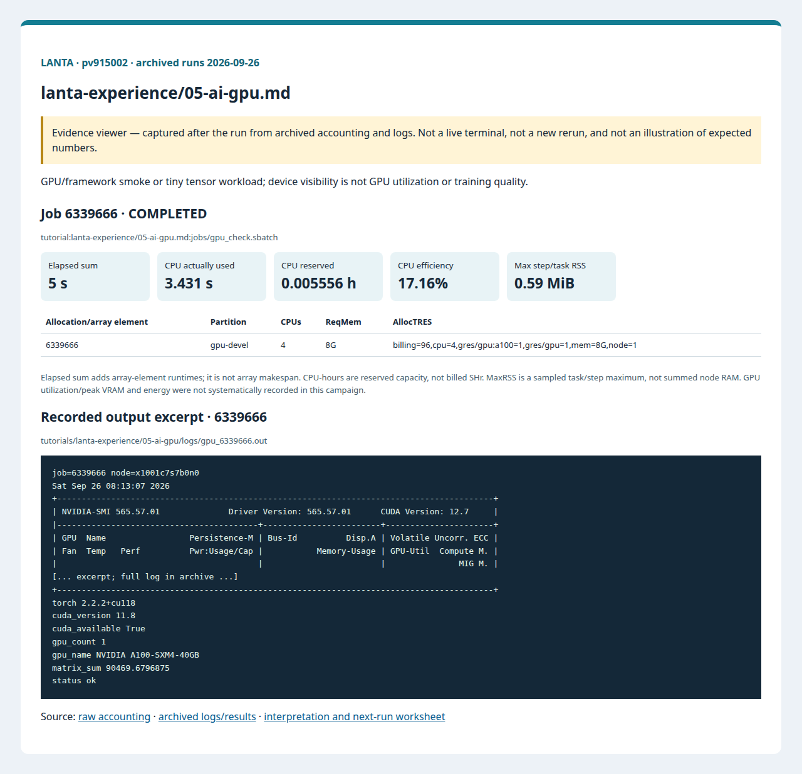
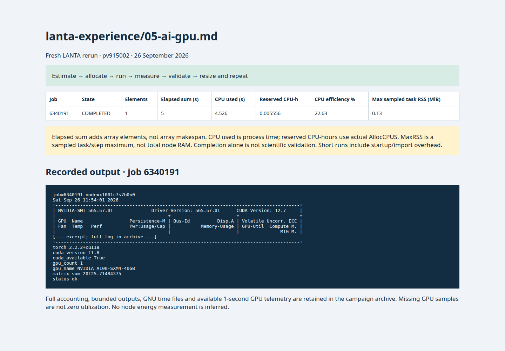

# 05 AI And GPU Check

<!-- resource-learning:start -->
## จากงานเล็กสู่การทดลองที่วัดผลได้ / Resource lab

Booklet flow: pages **37–38** of the [LANTA handbook](../docs/lanta-hpc-experience-handbook.pdf). [Full learning sequence and worksheet](../docs/RESOURCE_ESTIMATION_WORKBOOK.md).

<details><summary>ภาพแนวคิดจาก booklet / workflow illustration</summary>


Original booklet illustration, not a run screenshot. [Source and limitations](../docs/images/booklet/README.md).

</details>

### 1. ขอบเขตและการประมาณก่อนรัน

GPU/framework smoke or tiny tensor workload; device visibility is not GPU utilization or training quality.

Separate host RAM from GPU VRAM. Dense float32 n×n matrices occupy 4n² bytes each; three 4096² tensors alone need 192 MiB, excluding library workspace. Start on one GPU and measure peak allocated/reserved VRAM before increasing tensor or batch size.

### 2. ทรัพยากรที่ใช้จริงและตัวอย่าง output

Archived LANTA evidence, **2026-09-26**, account `pv915002`; these are historical measurements, not a new run or a future performance promise.

| Job | State | Elements | Sum elapsed (s) | CPU used (s) | Reserved CPU-h | Max step/task RSS (MiB) |
|---|---|---:|---:|---:|---:|---:|
| 6339666 | COMPLETED | 1 | 5 | 3.431 | 0.005556 | 0.59 |

Elapsed is summed across array elements, not array makespan. CPU used is `TotalCPU`; reserved CPU-hours include idle allocation time. MaxRSS is the largest sampled task/step value, **not total node RAM**. Missing GPU/energy telemetry must not be interpreted as zero.



Browser screenshot of the [archived evidence viewer](../docs/tutorial-evidence/lanta-experience-05-ai-gpu.html); not a live terminal capture. Open the viewer for exact requested/allocated resources and job-specific log excerpts.

**Read the numbers:** job `6339666` used 3.431 CPU-seconds over 5 summed elapsed seconds: about **0.69 busy CPU cores per running element on average**. This describes CPU work across the whole allocation, including setup; it does not measure GPU utilization. For a seconds-long run, startup and coarse memory sampling can dominate. Do not reduce RAM to the displayed RSS or claim scaling without a longer pilot.

<details><summary>ตัวอย่าง output ที่บันทึกจริง / archived stdout excerpt</summary>

Job `6339666` · archive member `tutorials/lanta-experience/05-ai-gpu/logs/gpu_6339666.out`

```text
job=6339666 node=x1001c7s7b0n0
Sat Sep 26 08:13:07 2026
+-----------------------------------------------------------------------------------------+
| NVIDIA-SMI 565.57.01              Driver Version: 565.57.01      CUDA Version: 12.7     |
|-----------------------------------------+------------------------+----------------------+
| GPU  Name                 Persistence-M | Bus-Id          Disp.A | Volatile Uncorr. ECC |
| Fan  Temp   Perf          Pwr:Usage/Cap |           Memory-Usage | GPU-Util  Compute M. |
|                                         |                        |               MIG M. |
[... excerpt; full log in archive ...]
+-----------------------------------------------------------------------------------------+
torch 2.2.2+cu118
cuda_version 11.8
cuda_available True
gpu_count 1
gpu_name NVIDIA A100-SXM4-40GB
matrix_sum 90469.6796875
status ok
```

</details>

### 3. ขยายงานทีละแกนและตรวจความถูกต้อง

Warm up kernels, synchronize CUDA around timing, and measure repeated fixed-size kernels separately from imports and transfers. Compare CPU and GPU at identical precision and input. Increase problem size until compute is measurable, without exceeding measured VRAM headroom.

**Correctness gate:** Require CUDA availability, the expected device and a numerical comparison with CPU output. nvidia-smi showing a device does not demonstrate sustained utilization.

[Public applications and research-backed experiments](../docs/REAL_APPLICATION_EXPERIMENTS.md#nvidia-and-ai) provide the next workload. Proposed resource budgets there are not measured requirements.

Before the next run, write down input size, expected time/RAM, requested CPUs/GPUs, and a stop condition. Afterwards record job ID, actual allocation, elapsed, CPU time, memory, result check and one change for the next run. Use three repeats and report spread; do not claim speedup from one short smoke run.

<!-- resource-learning:end -->

ผลรันซ้ำ LANTA บัญชี `pv915002` วันที่ 2026-09-26: [สถานะ ขอบเขต ผลลัพธ์ และ resource usage](../docs/lanta-runs/2026-09-26-pv915002/README.md) · [วิธีประเมินและปรับปรุง performance](../docs/PERFORMANCE_EVALUATION_OPTIMIZATION_TH.md)

ใช้ตรวจว่า job ได้ GPU จริงก่อนเริ่มงาน AI ที่กินทรัพยากรมาก.

คำสั่งในหน้านี้อธิบายรวมไว้ที่ [../docs/BASH_COMMAND_REFERENCE_TH.md](../docs/BASH_COMMAND_REFERENCE_TH.md) เช่น `nvidia-smi`, `conda activate`, `python - <<'PY'`, `sbatch`, `squeue`, `tail` และ `CUDA_VISIBLE_DEVICES`

เริ่มจาก SSH ตาม [../LANTA_SETUP.md#1-ssh-to-lanta](../LANTA_SETUP.md#1-ssh-to-lanta) แล้วรัน block เตรียมพื้นที่ใน [README.md](README.md) สำหรับ workspace ของกิจกรรม

## Copy-Paste

แปะทีละ block ตามลำดับ แต่ละ block ทำหนึ่งงานหลักและมีหลักฐานให้ตรวจทันทีหลังรัน

### ขั้นที่ 1: เตรียม workspace และตัวแปร

ขั้นนี้กำหนดพื้นที่ทำงานของบท สร้าง folder มาตรฐาน และตั้งค่า account/partition ที่ใช้ซ้ำในขั้นถัดไป

```bash
cd "$HOME/lanta-experience"
mkdir -p jobs logs notes results src

if [ -z "${LANTA_ACCOUNT:-}" ]; then
    read -rp "Slurm project account: " LANTA_ACCOUNT
    export LANTA_ACCOUNT
fi
export LANTA_GPU_PARTITION="${LANTA_GPU_PARTITION:-gpu-devel}"
```

### ขั้นที่ 2: สร้าง Slurm script `jobs/gpu_check.sbatch`

ขั้นนี้สร้างไฟล์ Slurm ที่ระบุ resource, module, working directory และคำสั่งที่รันบน compute node

```bash
cat > jobs/gpu_check.sbatch <<'SLURM'
#!/bin/bash
#SBATCH --job-name=gpu_check
#SBATCH --nodes=1
#SBATCH --ntasks=1
#SBATCH --cpus-per-task=4
#SBATCH --gpus-per-node=1
#SBATCH --mem=8G
#SBATCH --time=00:10:00
#SBATCH --output=logs/gpu_%j.out
#SBATCH --error=logs/gpu_%j.err

set -euo pipefail
module purge
module load Mamba/23.11.0-0
conda activate pytorch-2.2.2
export PATH="/lustrefs/disk/modules/easybuild/software/Mamba/23.11.0-0/envs/pytorch-2.2.2/bin:${PATH}"
cd "$SLURM_SUBMIT_DIR"

echo "job=${SLURM_JOB_ID} node=$(hostname)"
nvidia-smi
python - <<'PY'
import torch

print("torch", torch.__version__)
print("cuda_version", torch.version.cuda)
print("cuda_available", torch.cuda.is_available())
print("gpu_count", torch.cuda.device_count())
if not torch.cuda.is_available() or torch.cuda.device_count() < 1:
    raise SystemExit("PyTorch cannot see the allocated GPU")

x = torch.randn(2000, 2000, device="cuda")
y = x @ x
torch.cuda.synchronize()
print("gpu_name", torch.cuda.get_device_name(0))
print("matrix_sum", float(y.sum().cpu()))
print("status", "ok")
PY
SLURM
```

### ขั้นที่ 3: ส่งงานเข้า Slurm

ขั้นนี้ส่ง job script ที่เพิ่งสร้างไว้ด้วย `sbatch` แล้วบันทึก job id เพื่อใช้ตามคิวและอ่าน log ภายหลัง

```bash
job_id=$(sbatch -A "$LANTA_ACCOUNT" -p "$LANTA_GPU_PARTITION" --parsable jobs/gpu_check.sbatch)
echo "$job_id	gpu_check	$(date -Is)" >> notes/job-history.tsv
echo "Submitted GPU check: $job_id"
echo "Monitor: squeue -j $job_id"
echo "Read: tail -80 logs/gpu_${job_id}.out"
```

### คำอธิบาย

ก่อนรัน training จริง ให้ผู้ใช้ตรวจว่า job ได้ GPU จริงก่อน คำสั่งนี้สร้าง Slurm job ที่ขอ GPU หนึ่งใบ แล้วโหลด `Mamba/23.11.0-0` และ activate environment `pytorch-2.2.2`

ใน job นี้ `nvidia-smi` ใช้ตรวจระดับเครื่อง ส่วน `torch.cuda.is_available()` ใช้ตรวจระดับ Python หากสองคำสั่งนี้ผ่าน ผู้ใช้จึงค่อยขยายไปสู่ model training

เมื่อสำเร็จ log จะมีตารางจาก `nvidia-smi`, ค่า `cuda_available True`, จำนวน GPU มากกว่าศูนย์ และ `status ok` หลังคำนวณ matrix บน GPU เมื่อ `conda activate pytorch-2.2.2` error ให้ใช้ `conda env list` ตรวจ environment เมื่อ `nvidia-smi` ผ่านแต่ PyTorch ยังรายงาน CUDA unavailable ให้ตรวจว่า job ส่งผ่าน `sbatch` และ log มี `CUDA_VISIBLE_DEVICES`

## Next Modification

หลังเห็น `nvidia-smi` และ `cuda_available True` แล้ว ค่อยเปลี่ยน Python block ให้โหลดโมเดลหรือข้อมูลขนาดเล็กของทีม.

<!-- performance-rerun:start -->
## Fresh measured rerun — 26 September 2026

| Job | State | Elements | Sum elapsed (s) | CPU used (s) | Reserved CPU-h | Max step/task RSS (MiB) |
|---|---|---:|---:|---:|---:|---:|
| 6340191 | COMPLETED | 1 | 5 | 4.526 | 0.005556 | 0.13 |

These are new measured jobs, not estimates. One campaign pass does not establish scaling or runtime variance. Allocated CPU-hours are not billed SHr; sampled RSS is not total node memory.

[Accounting, output archive and measurement limitations](../docs/lanta-runs/2026-09-26-performance/README.md)


<!-- performance-rerun:end -->
