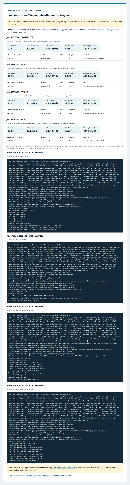
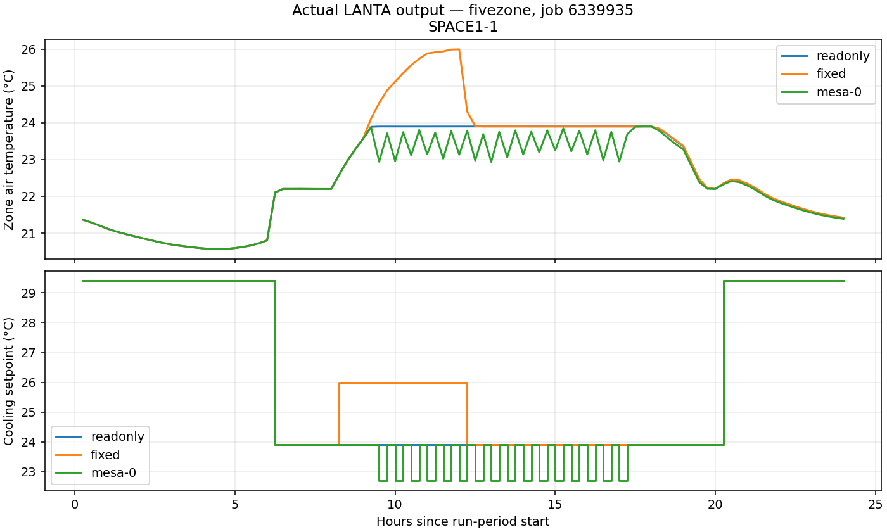
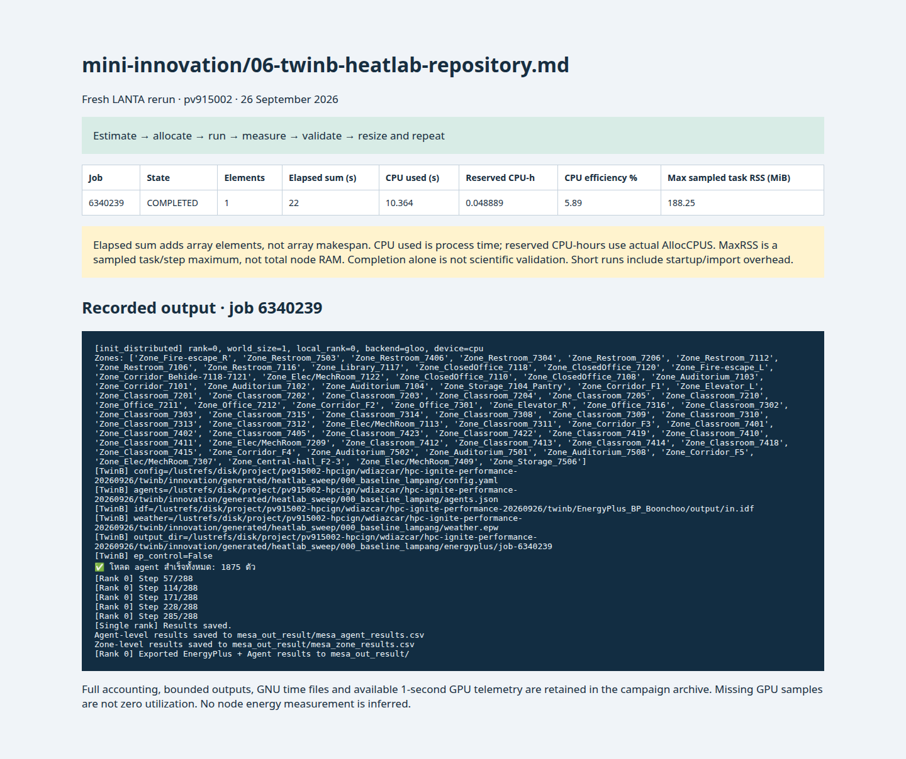

# 06 ใช้โครงการจริง HPC Ignite Twin-B เป็น Twin-B HeatLab

<!-- resource-learning:start -->
## จากงานเล็กสู่การทดลองที่วัดผลได้ / Resource lab

Booklet flow: pages **33–36** of the [LANTA handbook](../docs/lanta-hpc-experience-handbook.pdf). [Full learning sequence and worksheet](../docs/RESOURCE_ESTIMATION_WORKBOOK.md).

<details><summary>ภาพแนวคิดจาก booklet / workflow illustration</summary>


Original booklet illustration, not a run screenshot. [Source and limitations](../docs/images/booklet/README.md).

</details>

### 1. ขอบเขตและการประมาณก่อนรัน

Older synthetic Twin-B / Heatlab runs are distinct from the later real EnergyPlus + Mesa reference-building benchmarks. Original student geometry failures remain recorded.

The synchronous reference adapter advances Mesa once per EnergyPlus zone interval: 96 intervals/day at four timesteps/hour. Agent-side work scales roughly with agents × intervals; EnergyPlus sizing/warmup and HVAC solves add non-linear overhead. Pilot one day before three days or a year.

### 2. ทรัพยากรที่ใช้จริงและตัวอย่าง output

Archived LANTA evidence, **2026-09-26**, account `pv915002`; these are historical measurements, not a new run or a future performance promise.

| Job | State | Elements | Sum elapsed (s) | CPU used (s) | Reserved CPU-h | Max step/task RSS (MiB) |
|---|---|---:|---:|---:|---:|---:|
| 6339794 | COMPLETED | 1 | 22 | 8.979 | 0.048889 | 187.41 |
| 6339812 | FAILED | 1 | 122 | 4.793 | 0.271111 | 545.65 |
| 6339819 | FAILED | 1 | 112 | 112.429 | 0.248889 | 640.82 |
| 6339815 | FAILED | 1 | 122 | 122.309 | 0.271111 | 814.06 |

Elapsed is summed across array elements, not array makespan. CPU used is `TotalCPU`; reserved CPU-hours include idle allocation time. MaxRSS is the largest sampled task/step value, **not total node RAM**. Missing GPU/energy telemetry must not be interpreted as zero.



Browser screenshot of the [archived evidence viewer](../docs/tutorial-evidence/mini-innovation-06-twinb-heatlab-repository.html); not a live terminal capture. Open the viewer for exact requested/allocated resources and job-specific log excerpts.

**Read the numbers:** job `6339794` used 8.979 CPU-seconds over 22 summed elapsed seconds: about **0.41 busy CPU cores per running element on average**. This describes CPU work across the whole allocation, including setup; it does not measure GPU utilization. For a seconds-long run, startup and coarse memory sampling can dominate. Do not reduce RAM to the displayed RSS or claim scaling without a longer pilot.

<details><summary>ตัวอย่าง output ที่บันทึกจริง / archived stdout excerpt</summary>

Job `6339794` · archive member `twinb/logs/twinb-cpu_6339794.out`

```text
[init_distributed] rank=0, world_size=1, local_rank=0, backend=gloo, device=cpu
Zones: ['Zone_Fire-escape_R', 'Zone_Restroom_7503', 'Zone_Restroom_7406', 'Zone_Restroom_7304', 'Zone_Restroom_7206', 'Zone_Restroom_7112', 'Zone_Restroom_7106', 'Zone_Restroom_7116', 'Zone_Library_7117', 'Zone_ClosedOffice_7118', 'Zone_ClosedOffice_7120', 'Zone_Fire-escape_L', 'Zone_Corridor_Behide-7118-7121', 'Zone_Elec/MechRoom_7122', 'Zone_ClosedOffice_7110', 'Zone_ClosedOffice_7108', 'Zone_Auditorium_7103', 'Zone_Corridor_7101', 'Zone_Auditorium_7102', 'Zone_Auditorium_7104', 'Zone_Storage_7104_Pantry', 'Zone_Corridor_F1', 'Zone_Elevator_L', 'Zone_Classroom_7201', 'Zone_Classroom_7202', 'Zone_Classroom_7203', 'Zone_Classroom_7204', 'Zone_Classroom_7205', 'Zone_Classroom_7210', 'Zone_Office_7211', 'Zone_Office_7212', 'Zone_Corridor_F2', 'Zone_Office_7301', 'Zone_Elevator_R', 'Zone_Office_7316', 'Zone_Classroom_7302', 'Zone_Classroom_7303', 'Zone_Classroom_7315', 'Zone_Classroom_7314', 'Zone_Classroom_7308', 'Zone_Classroom_7309', 'Zone_Classroom_7310', 'Zone_Classroom_7313', 'Zone_Classroom_7312', 'Zone_Elec/MechRoom_7113', 'Zone_Classroom_7311', 'Zone_Corridor_F3', 'Zone_Classroom_7401', 'Zone_Classroom_7402', 'Zone_Classroom_7405', 'Zone_Classroom_7423', 'Zone_Classroom_7422', 'Zone_Classroom_7419', 'Zone_Classroom_7410', 'Zone_Classroom_7411', 'Zone_Elec/MechRoom_7209', 'Zone_Classroom_7412', 'Zone_Classroom_7413', 'Zone_Classroom_7414', 'Zone_Classroom_7418', 'Zone_Classroom_7415', 'Zone_Corridor_F4', 'Zone_Auditorium_7502', 'Zone_Auditorium_7501', 'Zone_Auditorium_7508', 'Zone_Corridor_F5', 'Zone_Elec/MechRoom_7307', 'Zone_Central-hall_F2-3', 'Zone_Elec/MechRoom_7409', 'Zone_Storage_7506']
[TwinB] config=/lustrefs/disk/project/pv915002-hpcign/wdiazcar/hpc-ignite-rerun-20260926/twinb/innovation/generated/heatlab_sweep/000_baseline_lampang/config.yaml
[TwinB] agents=/lustrefs/disk/project/pv915002-hpcign/wdiazcar/hpc-ignite-rerun-20260926/twinb/innovation/generated/heatlab_sweep/000_baseline_lampang/agents.json
[TwinB] idf=/lustrefs/disk/project/pv915002-hpcign/wdiazcar/hpc-ignite-rerun-20260926/twinb/EnergyPlus_BP_Boonchoo/output/in.idf
[TwinB] weather=/lustrefs/disk/project/pv915002-hpcign/wdiazcar/hpc-ignite-rerun-20260926/twinb/innovation/generated/heatlab_sweep/000_baseline_lampang/weather.epw
[TwinB] output_dir=/lustrefs/disk/project/pv915002-hpcign/wdiazcar/hpc-ignite-rerun-20260926/twinb/innovation/generated/heatlab_sweep/000_baseline_lampang/energyplus/job-6339794
[TwinB] ep_control=False
✅ โหลด agent สำเร็จทั้งหมด: 1875 ตัว
[Rank 0] Step 57/288
[Rank 0] Step 114/288
[Rank 0] Step 171/288
[Rank 0] Step 228/288
[Rank 0] Step 285/288
[Single rank] Results saved.
Agent-level results saved to mesa_out_result/mesa_agent_results.csv
Zone-level results saved to mesa_out_result/mesa_zone_results.csv
[Rank 0] Exported EnergyPlus + Agent results to mesa_out_result/
```

</details>

### 3. ขยายงานทีละแกนและตรวจความถูกต้อง

Use the qualified five-zone (50 agents) and school (1875 synthetic request agents) benchmarks. Compare one versus four allocated CPUs at identical input, then one versus three days separately. The serial adapter cannot use four cores merely because Slurm reserves them. See the reference-building guide for exact commands and newer evidence.

**Correctness gate:** Require zero severe/fatal EnergyPlus errors, valid handles, one Mesa step per zone interval, read-only/reset equivalence, intervention response and reproducible traces. School warnings and lack of Thai calibration remain limitations.

[Public applications and research-backed experiments](../docs/REAL_APPLICATION_EXPERIMENTS.md#energyplus-mesa) provide the next workload. Proposed resource budgets there are not measured requirements.

Before the next run, write down input size, expected time/RAM, requested CPUs/GPUs, and a stop condition. Afterwards record job ID, actual allocation, elapsed, CPU time, memory, result check and one change for the next run. Use three repeats and report spread; do not claim speedup from one short smoke run.

**Newer real coupled evidence:** [reference-building tutorial](../docs/TWINB_REFERENCE_BENCHMARKS.md) and [measured benchmark results](../docs/lanta-runs/2026-09-26-twinb-benchmarks/README.md). Keep these separate from the original student-model failures and synthetic examples above.

The later one-day qualification reserved four CPUs for 117 seconds (job `6339929`) versus one CPU for 113 seconds (job `6339935`). Reserved capacity was therefore 0.1300 versus 0.0314 CPU-hours for these observed jobs; the [comparison checks](../docs/lanta-runs/2026-09-26-twinb-benchmarks/resource-comparison.json) found equal timestep outputs and seeded trace hashes. This is evidence of avoidable over-allocation, not a reliable 3.5% speedup claim from single job timings.



Actual benchmark-output plot, job `6339935`; not a booklet illustration. The school case retains documented warnings, and the reference buildings are not calibrated models of the student building.

<!-- resource-learning:end -->


ภาพแนวคิด ไม่ใช่ผลรันที่ยืนยันแล้ว: ต้องตรวจ warmup, timestamp, actuator และ synchronization ก่อนเชื่อผล coupled simulation สถานะจริงของ campaign ยังไม่ผ่านขั้นนี้. อ่าน [คู่มือเริ่มต้นด้วยภาพ](../docs/BEGINNER_VISUAL_GUIDE_TH.md) สำหรับคำอธิบายทีละขั้น

ผลรันซ้ำ LANTA บัญชี `pv915002` วันที่ 2026-09-26: [สถานะ ขอบเขต ผลลัพธ์ และ resource usage](../docs/lanta-runs/2026-09-26-pv915002/README.md) · [วิธีประเมินและปรับปรุง performance](../docs/PERFORMANCE_EVALUATION_OPTIMIZATION_TH.md)

บทนี้เชื่อม tutorial กับโครงการจริงที่อยู่บนเครื่องผู้สอนที่ `/home/ubuntu/lanta/ghq/github.com/wdiazcarballo/hpcignite-twinb/` และ remote `https://github.com/wdiazcarballo/hpcignite-twinb.git` โครงการนี้รวม EnergyPlus, Mesa occupants, PyTorch distributed communication, ข้อมูลอาคาร Boonchoo และอากาศ Lampang

เริ่มจาก [04-building-cosimulation-twinb.md](04-building-cosimulation-twinb.md) เพื่อเข้าใจ coupling contract แบบย่อก่อน แล้วใช้บทนี้เมื่อจะตรวจ source จริง สร้าง scenario sweep และประเมินว่า CPU/GPU/distributed configuration ใดคุ้มค่า

คำสั่ง Bash, Git, `rsync` และ Slurm อธิบายไว้ใน [../docs/BASH_COMMAND_REFERENCE_TH.md](../docs/BASH_COMMAND_REFERENCE_TH.md) ส่วนวิธีออกแบบ baseline, repeats, speedup และ efficiency อยู่ใน [../docs/PERFORMANCE_EVALUATION_OPTIMIZATION_TH.md](../docs/PERFORMANCE_EVALUATION_OPTIMIZATION_TH.md)

การแก้ full integration เริ่มแล้ว แต่ยังไม่ผ่าน baseline: งาน `6339887` และ
`6339889` พบ severe errors 3 รายการ และ lobby spaces ไม่มี floor surfaces.
อ่าน [ผล gate, geometry audit, resource usage และขั้นตอนที่ยังรอ](../docs/lanta-runs/2026-09-26-twinb-fix/README.md).
ต้องตรวจแก้ฟิสิกส์อาคารก่อนประกาศว่า EnergyPlus/Mesa ใช้งานร่วมกันได้ครบถ้วน

สำหรับการพัฒนา coupling โดยไม่เดาฟิสิกส์อาคาร Boonchoo ให้ใช้
[reference-building benchmarks: five-zone → school](../docs/TWINB_REFERENCE_BENCHMARKS.md).
เป็นแบบจำลองทดสอบแยกต่างหาก ไม่ใช่การรับรองว่า geometry ของ Boonchoo ถูกแก้แล้ว

## สิ่งที่ต้องแยกให้ออก

| ชั้น | หน้าที่ | รันเมื่อใด |
|---|---|---|
| EnergyPlus | คำนวณฟิสิกส์อาคารจาก IDF/EPW | เมื่อ runtime, IDD, IDF และ EPW พร้อม |
| Mesa | จำลองผู้อยู่อาศัย ความสบาย และคำขอ setpoint | CPU smoke ก่อน |
| PyTorch distributed | รวมคำขอข้าม rank/GPU | หลัง single-rank ถูกต้อง |
| HeatLab sweep | กระจาย weather/policy/material scenarios | job array เหมาะกว่าบังคับหนึ่ง simulation ใช้หลาย GPU |

การเพิ่ม GPU ไม่ทำให้ EnergyPlus หรือ Python agent logic เร็วขึ้นโดยอัตโนมัติ บทนี้จึงบังคับให้มี single-rank CPU baseline และตรวจ output equality ก่อน DDP

## ขั้นที่ 1: ตรวจ source บนเครื่องผู้สอนโดยไม่แก้ไฟล์

source นี้อาจมีงานที่ยังไม่ commit ห้าม `git reset`, `git checkout` หรือเขียนทับ ให้เก็บ provenance ก่อนสร้างสำเนา:

```bash
export TWINB_SOURCE=/home/ubuntu/lanta/ghq/github.com/wdiazcarballo/hpcignite-twinb
git -C "$TWINB_SOURCE" status --short --branch
git -C "$TWINB_SOURCE" rev-parse HEAD
git -C "$TWINB_SOURCE" remote -v
find "$TWINB_SOURCE" -maxdepth 2 -type f \
    \( -name 'main.py' -o -name 'model.py' -o -name 'agent.py' -o -name '*.slurm' \) -print
```

ณ วันที่ 2026-09-25 clean upstream commit ที่เห็นคือ `2d16b3a` แต่ local source มีการแก้ `main.py`, `model.py`, `.gitignore` และมี `innovation/` ที่ยังไม่ track ดังนั้นสำเนาสำหรับ LANTA ต้องบันทึกทั้ง commit และ diff/status ไม่ควรอ้างเพียง commit เดียว

## ขั้นที่ 2: สร้าง snapshot สำหรับส่งขึ้น LANTA

คำสั่งนี้สร้างสำเนาแยก ไม่แตะ working tree ต้นฉบับ และตัด cache/output ขนาดใหญ่ที่สร้างซ้ำได้:

```bash
export TWINB_STAGE="$HOME/twinb-heatlab-stage"
mkdir -p "$TWINB_STAGE/notes"
git -C "$TWINB_SOURCE" rev-parse HEAD > "$TWINB_STAGE/notes/source-commit.txt"
git -C "$TWINB_SOURCE" status --short --branch > "$TWINB_STAGE/notes/source-status.txt"
git -C "$TWINB_SOURCE" diff --binary > "$TWINB_STAGE/notes/source-working-tree.patch"
rsync -a --delete \
    --exclude='.git/' --exclude='__pycache__/' \
    --exclude='outEnergyPlus*/' --exclude='mesa_out_result/' \
    "$TWINB_SOURCE/" "$TWINB_STAGE/repo/"
```

ตรวจว่า snapshot มีไฟล์หลักและ HeatLab layer:

```bash
test -f "$TWINB_STAGE/repo/main.py"
test -f "$TWINB_STAGE/repo/model.py"
test -f "$TWINB_STAGE/repo/agent.py"
test -f "$TWINB_STAGE/repo/innovation/generate_sweep.py"
python -m py_compile "$TWINB_STAGE/repo/innovation/generate_sweep.py"
```

ถ้าใช้ public clone แทน local snapshot ให้ pin commit และตรวจว่า `innovation/` มีอยู่จริงก่อนทำต่อ เพราะ local innovation layer อาจยังไม่อยู่บน remote:

```bash
git clone https://github.com/wdiazcarballo/hpcignite-twinb.git twinb-public
git -C twinb-public checkout 2d16b3a
git -C twinb-public status --short --branch
test -d twinb-public/innovation || echo "innovation layer is not in this public commit"
```

## ขั้นที่ 3: ส่ง snapshot ผ่าน transfer host

จากเครื่องผู้สอน:

```bash
rsync -rvz --delete "$TWINB_STAGE/" \
    wdiazcar@transfer.lanta.nstda.or.th:/project/pv915002-hpcign/wdiazcar/twinb-heatlab/
```

จากนั้นเข้า login host และตั้งค่าร่วม:

```bash
ssh wdiazcar@lanta.nstda.or.th
export LANTA_ACCOUNT=pv915002
export LANTA_PROJECT=/project/pv915002-hpcign
export TWINB_WORK=$LANTA_PROJECT/wdiazcar/twinb-heatlab/repo
export EPI_MODULE_ROOT=$LANTA_PROJECT/wdiazcar/hpc-ignite-rerun-20260925/modulefiles
cd "$TWINB_WORK"
```

## ขั้นที่ 4: ตรวจ compatibility กับ Mesa 3.5.1

source Twin-B ปัจจุบันใช้ Mesa 2 API เช่น `RandomActivation` และ `schedule.add` จึงต้อง migrate ใน **snapshot เท่านั้น** ก่อนโหลด `hpc-mesa/3.5.1` ใช้ tool จาก repo hands-on แบบ dry-run ก่อน:

```bash
python /path/to/hpc-ignite-hands-on/scripts/migrate_twinb_mesa3.py "$TWINB_WORK"
```

เมื่อรายการไฟล์ถูกต้อง ให้ apply แล้วตรวจ syntax:

```bash
python /path/to/hpc-ignite-hands-on/scripts/migrate_twinb_mesa3.py "$TWINB_WORK" --apply
module purge
module use "$EPI_MODULE_ROOT"
module load hpc-mesa/3.5.1
python -m py_compile agent.py model.py main.py innovation/generate_sweep.py
python -c "import mesa; print(mesa.__version__)"
```

tool เปลี่ยนเฉพาะ `agent.py`, `model.py`, `requirements.txt` ในสำเนา ได้แก่ `Agent(model)`, automatic registration, `model.agents` และ `shuffle_do("step")` หลัง apply ต้อง review `git diff --no-index` หรือเทียบกับ `notes/source-working-tree.patch` ก่อนรันงานจริง

## ขั้นที่ 5: สร้าง HeatLab scenarios โดยไม่ใช้ compute node

scenario generator เป็นงานเตรียมไฟล์ขนาดเล็ก ใช้ transfer/login host ได้ถ้าจบในไม่กี่วินาที:

```bash
python innovation/generate_sweep.py
head -10 innovation/generated/heatlab_sweep/manifest.tsv
find innovation/generated/heatlab_sweep -maxdepth 2 -type f | sort | head -30
```

ตรวจทุก scenario ว่ามี `config.yaml`, `agents.json`, `weather.epw`, `scenario.json` และ path ไม่ชี้กลับไป project เก่า `lt200291`

## ขั้นที่ 6: ตรวจ EnergyPlus ก่อน submit

LANTA ไม่มี EnergyPlus module ที่ยืนยันได้จาก live module check ก่อนหน้า จึงต้องใช้ project-local runtime ที่ทีมมีสิทธิ์ใช้:

```bash
export ENERGYPLUS_HOME="$LANTA_PROJECT/wdiazcar/apps/EnergyPlus-25.1.0"
export ENERGYPLUS_EXE="$ENERGYPLUS_HOME/energyplus"
export ENERGYPLUS_IDD="$ENERGYPLUS_HOME/Energy+.idd"
test -x "$ENERGYPLUS_EXE"
test -f "$ENERGYPLUS_IDD"
test -f EnergyPlus_BP_Boonchoo/Boonchoo_Building.idf
test -f EnergyPlus_BP_Boonchoo/THA_NRG_Lampang.Agromet.483340_TMYx.2009-2023.epw
```

ถ้าขาดข้อใด ให้หยุดที่ scenario generation/Mesa-only path และบันทึก `BLOCKED: EnergyPlus runtime` ห้ามเปลี่ยนเป็น synthetic result แล้วเรียกว่า EnergyPlus

## ขั้นที่ 7: สร้าง CPU baseline

เริ่มจาก one rank, no GPU และ scenario เดียว งานต้องเขียน output ลง path ตาม job ID และบันทึก module/provenance:

```bash
export TWINB_VENV="$LANTA_PROJECT/wdiazcar/envs/twinb-mesa-3.5.1-cpu"
test -x "$TWINB_VENV/bin/python"
"$TWINB_VENV/bin/python" -c "import mesa, torch, pandas, yaml; print(mesa.__version__, torch.__version__)"
mkdir -p jobs logs results
```

`TWINB_VENV` เป็น environment แยกที่ clone จาก `hpc-mesa/3.5.1` แล้วเติม PyTorch CPU และ `eppy`; อย่าเพิ่ม PyTorch ขนาดใหญ่ลง environment กลางของผู้เรียนทุกคนถ้าใช้เฉพาะ Twin-B

สร้างงาน baseline แบบ standalone:

```bash
cat > jobs/twinb_cpu_baseline.sbatch <<'SLURM'
#!/bin/bash
#SBATCH --job-name=twinb-cpu
#SBATCH --partition=compute-devel
#SBATCH --nodes=1
#SBATCH --ntasks=1
#SBATCH --cpus-per-task=4
#SBATCH --mem=16G
#SBATCH --time=00:20:00
#SBATCH --output=logs/%x_%j.out
#SBATCH --error=logs/%x_%j.err

set -euo pipefail
cd "$SLURM_SUBMIT_DIR"
source "${TWINB_VENV:?set TWINB_VENV}/bin/activate"
export OMP_NUM_THREADS="${SLURM_CPUS_PER_TASK:-1}"
export TWINB_MANIFEST="${TWINB_MANIFEST:-innovation/generated/heatlab_sweep/manifest.tsv}"
row=$(awk -F '\t' 'NR == 2 {print}' "$TWINB_MANIFEST")
IFS=$'\t' read -r run_id run_name config agents idf weather output_dir policy material <<< "$row"
output_dir="${output_dir}/job-${SLURM_JOB_ID}"
mkdir -p "$output_dir" "results/${SLURM_JOB_ID}"
export TWINB_CONFIG="$config" TWINB_AGENTS="$agents" TWINB_IDF="$idf"
export TWINB_WEATHER="$weather" TWINB_OUTPUT_DIR="$output_dir"
module list 2> "results/${SLURM_JOB_ID}/modules.txt" || true
/usr/bin/time -v -o "results/${SLURM_JOB_ID}/time_verbose.txt" \
    timeout "${TWINB_TIMEOUT:-900}" srun -c "${SLURM_CPUS_PER_TASK:-1}" python main.py
SLURM
```

แล้วส่ง account ผ่าน command line:

```bash
job_id=$(sbatch -A "$LANTA_ACCOUNT" --export=ALL,TWINB_VENV,ENERGYPLUS_HOME,ENERGYPLUS_EXE,ENERGYPLUS_IDD --parsable jobs/twinb_cpu_baseline.sbatch)
echo "baseline=$job_id"
squeue -j "$job_id"
```

## ขั้นที่ 8: ตรวจ correctness ก่อน scaling

```bash
sacct -j "$job_id" -X \
    --format=JobID,JobName,State,Elapsed,AllocCPUS,MaxRSS,ExitCode
tail -100 "logs/twinb-cpu_${job_id}.out"
find results innovation/generated -type f \
    \( -name '*.csv' -o -name '*.json' \) -newermt '-1 day' | sort
```

ผ่านเมื่อ EnergyPlus ไม่มี severe/fatal error, Mesa จำนวน agents ตรง config, timestep ครบ, zone names map ได้, energy ไม่ติดลบโดยไม่มีเหตุผล และ comfort/setpoint อยู่ในช่วงที่ประกาศ

## ขั้นที่ 9: Performance experiment ที่เหมาะกับ Twin-B

รันอย่างน้อย 3 repeats ต่อจุดและใช้ scenario/input เดิม:

| Variant | ทรัพยากร | คำถาม |
|---|---|---|
| CPU-1 | 1 task, 4 CPUs | baseline และ EnergyPlus/Mesa serial fraction |
| CPU-array | 4-8 independent scenarios | ensemble throughput ดีขึ้นเท่าใด |
| GPU-1 | 1 GPU, 1 rank | tensor work มากพอชดเชย transfer หรือไม่ |
| GPU-2 | 2 GPUs, 2 ranks | DDP/all-gather เร็วกว่าหรือเพิ่ม synchronization |
| GPU-4 | 4 GPUs, 4 ranks | ทดสอบเฉพาะเมื่อ GPU-2 ยัง scale และ result เท่ากัน |

เก็บอย่างน้อย `ElapsedRaw`, `TotalCPU`, `MaxRSS`, `AllocTRES`, GPU utilization, EnergyPlus runtime, agent timesteps/s, collective time และ checksum/summary ของ energy-comfort output ใช้ [performance tutorial](../docs/PERFORMANCE_EVALUATION_OPTIMIZATION_TH.md) รวมผล

optimization ที่ควรทดลองตามลำดับ:

1. กระจาย independent scenarios ด้วย Slurm array
2. ลด Python object/tensor conversion ใน inner timestep
3. batch setpoint communication แทน small collective ถี่ ๆ
4. profile CPU/EnergyPlus fraction ก่อนเพิ่ม GPU
5. ใช้ DDP เฉพาะเมื่อ agent/tensor workload มีขนาดพอ

## เกณฑ์สรุป

### ผลรันจริง 2026-09-26 และข้อจำกัดที่ยังต้องแก้

Mesa-only ผ่านด้วย Mesa 3.5.1, 1,875 agents และ 288 steps (`6339794`) แต่ **EnergyPlus/Mesa coupled path ยังไม่ผ่าน** ดู [รายงานและ error ของทั้งสามครั้ง](../docs/lanta-runs/2026-09-26-pv915002/README.md#remaining-twin-b-integration-failure) runtime 25.1.0 ถูกติดตั้งใน campaign แล้ว จึงไม่ใช่ปัญหา “ไม่มี runtime” อีกต่อไป

IDF มี `HVACTemplate:*` ต้องใช้ `-x`/ExpandObjects; RunPeriod เดิมยาวทั้งปี ไม่สอดคล้องกับ qualification สั้น script `scripts/prepare_twinb_day_smoke.py` ใน repo hands-on สร้าง IDF หนึ่งวันใน snapshot, ปรับ Mesa เป็น 96 steps, ข้าม warmup callbacks และเพิ่ม queue timeout แต่การลองนั้นยังจบด้วย `_queue.Empty` จึงต้องแก้ readiness และ synchronization ก่อนใช้ผลพลังงานหรือทำ GPU scaling ห้ามนำ CSV เก่าของ Mesa-only มาอ้างเป็นผล coupled run

ตัว adapter เปลี่ยนเฉพาะ snapshot ไม่แตะ source ต้นฉบับ และไม่ควรใช้แทนการตรวจ scientific correctness ของ feedback loop

บทนี้ไม่ถือว่า “หลาย GPU ดีกว่า” จนกว่าจะเห็น:

- output energy/comfort เท่ากันภายใน tolerance
- mean elapsed จาก repeats ลดลง
- GPU utilization แสดงการคำนวณจริง ไม่ใช่รอ collective
- throughput ต่อ SHr ดีขึ้น
- startup, EnergyPlus, Mesa, communication และ I/O ถูกแยกเวลา

ถ้า GPU-2/GPU-4 ช้ากว่า ให้สรุปตามหลักฐานว่า Twin-B shape นี้เหมาะกับ CPU scenario arrays มากกว่า นั่นเป็นผล optimization ที่ถูกต้อง ไม่ใช่ความล้มเหลว

ข้อสรุปต้องรายงาน communication overhead แยกจาก EnergyPlus, Mesa agent stepping และ file I/O เพื่อไม่โทษ GPU จากเวลาที่ใช้ในส่วนอื่น

<!-- performance-rerun:start -->
## Fresh measured rerun — 26 September 2026

| Job | State | Elements | Sum elapsed (s) | CPU used (s) | Reserved CPU-h | Max step/task RSS (MiB) |
|---|---|---:|---:|---:|---:|---:|
| 6340239 | COMPLETED | 1 | 22 | 10.364 | 0.048889 | 188.25 |

These are new measured jobs, not estimates. One campaign pass does not establish scaling or runtime variance. Allocated CPU-hours are not billed SHr; sampled RSS is not total node memory.

[Accounting, output archive and measurement limitations](../docs/lanta-runs/2026-09-26-performance/README.md)


<!-- performance-rerun:end -->
