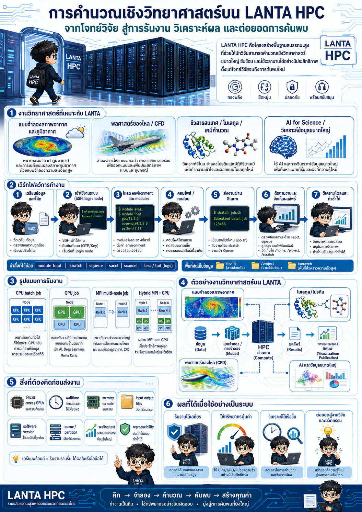
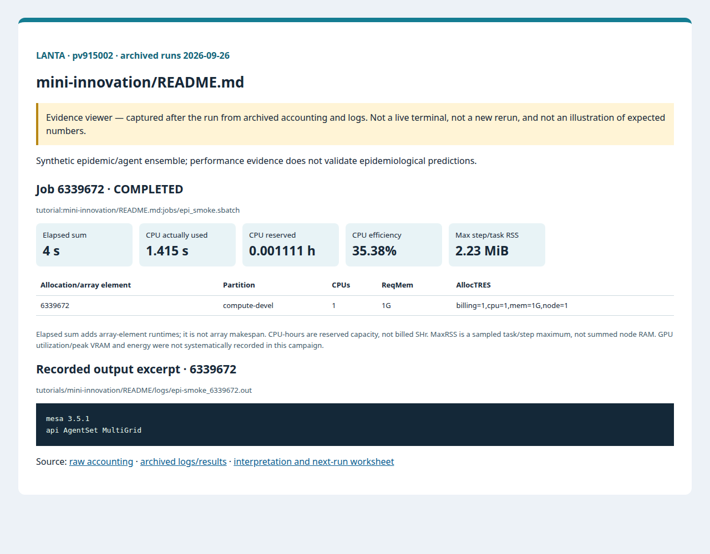
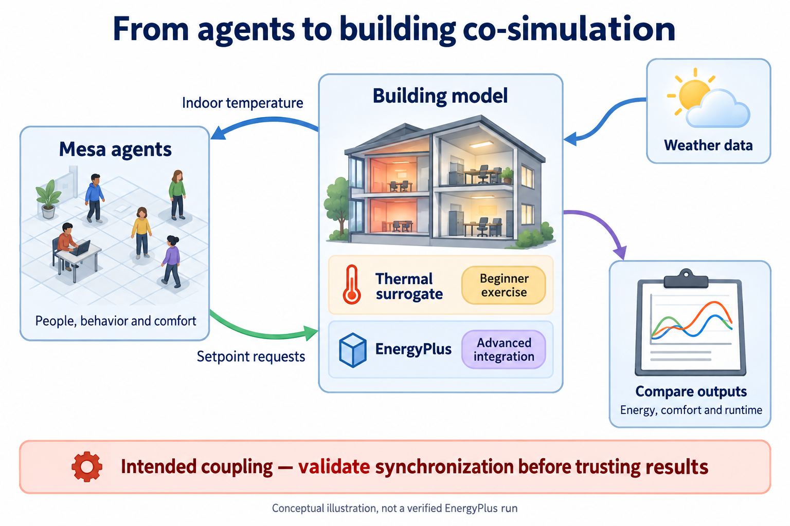
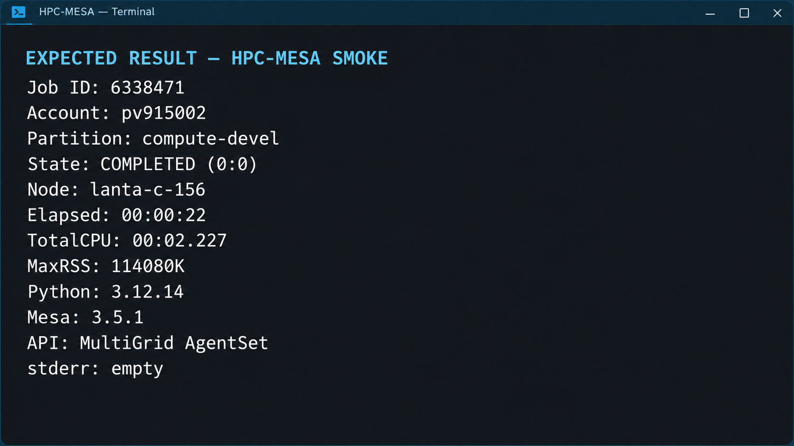
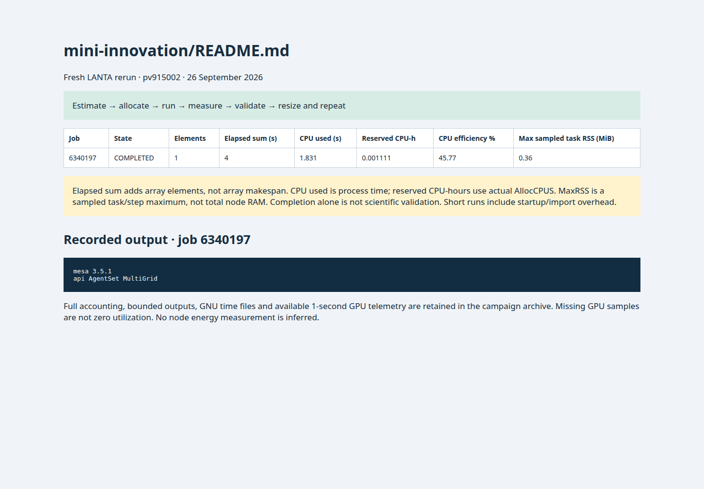

# Mini Innovation: LANTA EpiSprint และ Twin-B MicroCosim

<!-- resource-learning:start -->
## จากงานเล็กสู่การทดลองที่วัดผลได้ / Resource lab

Booklet flow: pages **33–36** of the [LANTA handbook](../docs/lanta-hpc-experience-handbook.pdf). [Full learning sequence and worksheet](../docs/RESOURCE_ESTIMATION_WORKBOOK.md).

<details><summary>ภาพแนวคิดจาก booklet / workflow illustration</summary>



Original booklet illustration, not a run screenshot. [Source and limitations](../docs/images/booklet/README.md).

</details>

### 1. ขอบเขตและการประมาณก่อนรัน

Synthetic epidemic/agent ensemble; performance evidence does not validate epidemiological predictions.

For local interactions, start with work proportional to agents × steps × repeats; all-pairs interactions can instead grow quadratically. Memory grows with agent state plus retained history. Pilot one seed before multiplying by scenarios.

### 2. ทรัพยากรที่ใช้จริงและตัวอย่าง output

Archived LANTA evidence, **2026-09-26**, account `pv915002`; these are historical measurements, not a new run or a future performance promise.

| Job | State | Elements | Sum elapsed (s) | CPU used (s) | Reserved CPU-h | Max step/task RSS (MiB) |
|---|---|---:|---:|---:|---:|---:|
| 6339672 | COMPLETED | 1 | 4 | 1.415 | 0.001111 | 2.23 |

Elapsed is summed across array elements, not array makespan. CPU used is `TotalCPU`; reserved CPU-hours include idle allocation time. MaxRSS is the largest sampled task/step value, **not total node RAM**. Missing GPU/energy telemetry must not be interpreted as zero.



Browser screenshot of the [archived evidence viewer](../docs/tutorial-evidence/mini-innovation-readme.html); not a live terminal capture. Open the viewer for exact requested/allocated resources and job-specific log excerpts.

**Read the numbers:** job `6339672` used 1.415 CPU-seconds over 4 summed elapsed seconds: about **0.35 busy CPU cores per running element on average**. This describes CPU work across the whole allocation, including setup; it does not measure GPU utilization. For a seconds-long run, startup and coarse memory sampling can dominate. Do not reduce RAM to the displayed RSS or claim scaling without a longer pilot.

<details><summary>ตัวอย่าง output ที่บันทึกจริง / archived stdout excerpt</summary>

Job `6339672` · archive member `tutorials/mini-innovation/README/logs/epi-smoke_6339672.out`

```text
mesa 3.5.1
api AgentSet MultiGrid
```

</details>

### 3. ขยายงานทีละแกนและตรวจความถูกต้อง

Compare fixed-size 1/2/4-worker or rank runs with three repeats, preserving seeds and input. Then vary agent count 10× separately. Limit concurrent array tasks and aggregate throughput only after checking every task.

**Correctness gate:** Check population conservation, finite/non-negative compartments and seed-specific output agreement. Compare stochastic distributions when implementations change random-stream ordering.

[Public applications and research-backed experiments](../docs/REAL_APPLICATION_EXPERIMENTS.md#agent-models) provide the next workload. Proposed resource budgets there are not measured requirements.

Before the next run, write down input size, expected time/RAM, requested CPUs/GPUs, and a stop condition. Afterwards record job ID, actual allocation, elapsed, CPU time, memory, result check and one change for the next run. Use three repeats and report spread; do not claim speedup from one short smoke run.

<!-- resource-learning:end -->



ภาพสถาปัตยกรรมที่ตั้งใจ: surrogate สำหรับฝึกพื้นฐานแยกจาก EnergyPlus integration ไม่ใช่หลักฐานว่าระบบ coupled ผ่านแล้ว. อ่าน [คู่มือเริ่มต้นด้วยภาพ](../docs/BEGINNER_VISUAL_GUIDE_TH.md) สำหรับคำอธิบายทีละขั้น

ผลรันซ้ำ LANTA บัญชี `pv915002` วันที่ 2026-09-26: [สถานะ ขอบเขต ผลลัพธ์ และ resource usage](../docs/lanta-runs/2026-09-26-pv915002/README.md) · [วิธีประเมินและปรับปรุง performance](../docs/PERFORMANCE_EVALUATION_OPTIMIZATION_TH.md)

แบบฝึกปฏิบัตินี้เป็นคู่มือภาษาไทยสำหรับกิจกรรมสดประมาณ 40 คน ประกอบด้วยนวัตกรรมย่อยสองแนวทางบน LANTA ได้แก่ **LANTA EpiSprint** สำหรับแบบจำลองโรคระบาดเชิงตัวแทน และ **Twin-B MicroCosim** สำหรับการจำลองร่วมระหว่างแบบจำลองอุณหภูมิของอาคารกับตัวแทนผู้อยู่อาศัยใน Mesa

ดูคำอธิบายคำสั่ง Bash, Slurm และรูปแบบคำสั่งที่ใช้ในชุดนวัตกรรมย่อยได้ที่ [../docs/BASH_COMMAND_REFERENCE_TH.md](../docs/BASH_COMMAND_REFERENCE_TH.md)

เริ่มจากการเข้าเครื่องด้วย SSH และเตรียมพื้นที่ทำงานตาม [00-connect-to-lanta.md](00-connect-to-lanta.md) จากนั้นเลือกหน้าถัดไปตามลำดับกิจกรรม

## บทนำแบบ Verse

ตั้งสถานะประชากร กำหนดเมล็ดสุ่มให้ย้อนรอยผลได้<br>
ให้ตัวแทนพบกันบนตารางพื้นที่ แล้วบันทึกผลทีละวัน<br>
ส่งสถานการณ์ทดลองเป็นงานชุดสั้นให้ LANTA กระจายการคำนวณ<br>
รวมผลเป็นตาราง เปรียบเทียบค่าสูงสุด อัตราการติดเชื้อสะสม และความไวต่อนโยบาย<br>
ผลที่ดีต้องตรวจซ้ำได้ มีบันทึกการรัน ค่าตั้งต้น รุ่นซอฟต์แวร์ และการตรวจความสมเหตุสมผลรองรับ

อ่านอุณหภูมิรายพื้นที่จากแบบจำลองอาคาร ส่งให้ตัวแทนประเมินความสบาย<br>
รวมคำขอปรับอุณหภูมิกลับไปคำนวณภาระทำความเย็น แล้วเดินเวลาไปทีละช่วง<br>
ให้ LANTA กระจายนโยบายและเมล็ดสุ่มเป็นงานสั้นหลายชุด<br>
ผลที่ดีต้องอธิบายการแลกเปลี่ยนระหว่างพลังงาน ความสบาย และหลักฐานจาก CSV ได้

## คำอธิบายเชิงวิชาการ

LANTA EpiSprint ใช้แบบจำลอง SEIR เชิงตัวแทนบน Mesa เพื่อศึกษาความสัมพันธ์ระหว่างพฤติกรรมรายบุคคล ค่าพารามิเตอร์ของการแพร่เชื้อ และผลรวมระดับประชากร เช่น จำนวนผู้ติดเชื้อสูงสุด วันที่เกิดค่าสูงสุด และอัตราการติดเชื้อสะสม

Twin-B MicroCosim ย่อแนวคิดจากแฝดดิจิทัลของอาคาร แบบจำลองทางวิทยาศาสตร์ส่งอุณหภูมิรายพื้นที่ให้แบบจำลองตัวแทน และรับคำขอตั้งอุณหภูมิกลับไปคำนวณพลังงานทำความเย็น แบบจำลองแทนเชิงความร้อนขนาดเล็กช่วยให้ผู้ใช้เห็นข้อตกลงการเชื่อมแบบจำลองและความไวของนโยบายในเวลาอบรมสั้น

แนวใช้ที่เหมาะสมคือเริ่มจากงานทดสอบสั้นเพื่อยืนยันสภาพแวดล้อม โมดูล บัญชีโครงการ และพาร์ทิชัน จากนั้นใช้ชุดงานแบบ array เพื่อรันหลายสถานการณ์จาก CSV และใช้งานหลายแกนภายในหนึ่งโหนดเพื่อรันกลุ่มการทดลอง การออกแบบเช่นนี้ทำให้ผู้ใช้เห็นกระบวนการวิทยาศาสตร์ขนาดย่อมที่แยกข้อมูลเข้า โค้ด หลักฐานจากระบบจัดคิว ผลลัพธ์ และตารางสรุปอย่างชัดเจน

ผลลัพธ์ถือว่าน่าเชื่อถือสำหรับการฝึกเมื่อบันทึกเมล็ดสุ่มและพารามิเตอร์ครบ จำนวนตัวแทนในสถานะ `S + E + I + R` สัมพันธ์กับประชากรที่ตั้งไว้ งานจบด้วย `COMPLETED` ไฟล์ CSV มีหัวตารางและจำนวนแถวตามจำนวนวัน และข้อสรุปเชิงนโยบายอ้างอิงหลายสถานการณ์หรือหลายเมล็ดสุ่มพร้อมการตรวจความไว

## หน้าเรียน

| หน้า | เรื่อง | ใช้เมื่อ |
|---|---|---|
| [00-connect-to-lanta.md](00-connect-to-lanta.md) | เข้า LANTA และเตรียมพื้นที่ทำงาน | เปิดกิจกรรมหรือใช้เป็นหน้าอ้างอิงร่วม |
| [01-custom-python-env-module.md](01-custom-python-env-module.md) | สร้างสภาพแวดล้อม Python และโมดูล Lmod สำหรับ Mesa | ใช้เมื่อทีมต้องเตรียมสภาพแวดล้อมกลาง |
| [02-jupyter-notebook.md](02-jupyter-notebook.md) | เปิด Jupyter Notebook ผ่านทรัพยากรที่ Slurm จัดให้ | สำรวจผลลัพธ์แบบโต้ตอบ |
| [03-epidemic-abs-examples.md](03-epidemic-abs-examples.md) | สร้างและรันแบบจำลองโรคระบาดเชิงตัวแทน 3 วิธี | บทเรียนหลักของนวัตกรรมย่อย |
| [04-building-cosimulation-twinb.md](04-building-cosimulation-twinb.md) | สร้างการจำลองร่วมแบบ Twin-B MicroCosim | แสดงการทำงานร่วมกันของแบบจำลองวิทยาศาสตร์และแบบจำลองตัวแทน |
| [05-output-display-jupyter-gnuplot.md](05-output-display-jupyter-gnuplot.md) | แสดงผล EpiSprint และ Twin-B ด้วย Jupyter, Matplotlib และ gnuplot | แปลงหลักฐานจาก CSV เป็นรูปและสมุดบันทึก |
| [06-twinb-heatlab-repository.md](06-twinb-heatlab-repository.md) | ใช้ source จริง `hpcignite-twinb` เป็น Twin-B HeatLab | snapshot งานที่ยังไม่ commit, migrate Mesa 3, รัน EnergyPlus/Mesa และเปรียบเทียบ CPU/GPU |
| [enhanced-seir/README.md](enhanced-seir/README.md) | แบบจำลอง SEIR ขั้นสูงด้วย C++/MPI และ PyTorch GPU/DDP | เอกสารอ้างอิงสำหรับการเลือกทรัพยากรและหลักฐานการรัน |
| [enhanced-seir/TRAINING_SHEET_TH.md](enhanced-seir/TRAINING_SHEET_TH.md) | แผ่นงานคัดลอกคำสั่งสำหรับสร้าง enhanced SEIR บน LANTA ด้วย heredoc | คลินิกสมรรถนะที่ผู้ใช้รันได้จากหน้าเดียว |
| [enhanced-seir/PERFORMANCE_WORKSHOP_TH.md](enhanced-seir/PERFORMANCE_WORKSHOP_TH.md) | เวิร์กช็อปประเมินสมรรถนะจาก enhanced SEIR ด้วย roofline, Amdahl, Gustafson, MPI solver และ Python overhead | ใช้ฝึกอ่านคอขวดและตัดสินใจรันครั้งถัดไปจากหลักฐานจริง |
| [weather-health-abs/README.md](weather-health-abs/README.md) | HPDS Weather-Health ABS ที่ครอบคลุมการย้ายข้อมูล การจัดแฟ้ม การอ่าน Lustre, Dask, แบบจำลองอาคาร, ABS และการแบ่งกราฟ | ใช้สอน High Performance Data Science จากกระบวนการข้อมูลจริง |
| [weather-health-abs/TRAINING_SHEET_TH.md](weather-health-abs/TRAINING_SHEET_TH.md) | แผ่นงานคัดลอกคำสั่งสำหรับ HPDS Weather-Health ABS บน LANTA | ผู้ใช้สร้างข้อมูล สภาพแวดล้อม โค้ด งาน Slurm ผลลัพธ์ และ prompt ตรวจหลักฐานจากหน้าเดียว |
| [weather-health-abs/DATA_RESCUE_CADC_TH.md](weather-health-abs/DATA_RESCUE_CADC_TH.md) | แผ่นงานกู้ข้อมูลจากกรณี CADC FITS ติดต่อปลายทางแล้วหมดเวลา ไปสู่ manifest, checksum และ `rsync --append-verify` | ใช้สอนการรับมือแหล่งข้อมูลใกล้หมดอายุหรือ host ที่ cluster ติดต่อแล้วหมดเวลา |

ทุกหน้าเริ่มจากเครื่องผู้ใช้ด้วย `ssh` เข้า LANTA หรือมีลิงก์กลับไปยังหน้าเชื่อมต่อกลาง ผู้ใช้จึงเปิดหน้าใดหน้าหนึ่งแล้วเริ่มทำต่อได้ทันที

## รูปแบบกิจกรรมสดที่แนะนำ

- แบ่งผู้ใช้ 40 คนเป็น 10 ทีม ทีมละ 4 คน
- ทีมจัดกิจกรรมเตรียมสภาพแวดล้อมตามหน้า 01 ไว้ล่วงหน้า
- ผู้ใช้แต่ละทีมรันงานทดสอบสั้นและชุดงาน array ขนาดเล็ก
- จำกัดจำนวนงาน array ที่รันพร้อมกันด้วย `%4` หรือ `%8`
- ใช้ `compute-devel` เป็นค่าเริ่มต้น
- งานแต่ละสถานการณ์ควรจบภายใน 30-120 วินาที

## สิ่งที่ mini innovation นี้สอน

- การเข้าเครื่อง พื้นที่ทำงาน โควตา บัญชีโครงการ และโมดูล
- การสร้างสภาพแวดล้อม Python ที่ใช้ร่วมกันในพื้นที่โครงการ
- การทำ module ส่วนตัวด้วย Lmod
- Jupyter บนโหนดคำนวณผ่าน Slurm และ SSH tunnel
- งาน Slurm แบบงานเดี่ยว
- Slurm job array
- Python หลายแกนภายในหนึ่งโหนด
- การออกแบบการทดลองที่รันซ้ำได้
- การออกแบบการจำลองร่วมและข้อตกลงข้อมูลระหว่างแบบจำลอง
- การแสดงผลจากตารางกลางด้วย Jupyter, Matplotlib และ gnuplot
- การเปรียบเทียบสมรรถนะของกลุ่มสถานการณ์ระหว่าง MPI บน CPU และ GPU/DDP
- การใช้ AI เป็นนั่งร้านการเรียนรู้สำหรับตั้งคำถาม ออกแบบสถานการณ์ ตรวจไฟล์ Slurm และอธิบายผลโดยอ้างอิงโค้ด ค่าตั้งต้น บันทึกการรัน และ CSV
- การประเมินสมรรถนะของทุกเส้นทางด้วย [tutorial กลาง](../docs/PERFORMANCE_EVALUATION_OPTIMIZATION_TH.md) โดยตรวจ correctness ก่อน speedup และรายงานผลต่อ SHr

## งานทดสอบสั้นแบบจบในหน้าเดียว

หลังเตรียมสภาพแวดล้อมและโมดูลแล้ว ผู้ใช้ตรวจ Mesa ได้ด้วยงานสั้น ๆ:

### ขั้นที่ 1: เตรียมพื้นที่ทำงานและตัวแปร

ขั้นนี้สร้างพื้นที่ทำงานสำหรับตรวจ Mesa แบบสั้น และตั้งค่าบัญชีโครงการกับพาร์ทิชันที่ใช้ส่งงานตรวจควัน

```bash
mkdir -p "$HOME/lanta-episprint"/{jobs,logs,results}
cd "$HOME/lanta-episprint"

if [ -z "${LANTA_ACCOUNT:-}" ]; then
    read -rp "Slurm project account เช่น ltXXXXXX หรือ tn999996: " LANTA_ACCOUNT
    export LANTA_ACCOUNT
fi
export LANTA_CPU_PARTITION="${LANTA_CPU_PARTITION:-compute-devel}"
export EPI_MODULE_ROOT="${EPI_MODULE_ROOT:-/project/<project>/modules}"
```

### ขั้นที่ 2: สร้างไฟล์ Slurm `jobs/epi_smoke.sbatch`

ขั้นนี้สร้างไฟล์ Slurm ที่ระบุทรัพยากร โมดูล ตำแหน่งทำงาน และคำสั่งที่รันบนโหนดคำนวณ

```bash
cat > jobs/epi_smoke.sbatch <<'SLURM'
#!/bin/bash
#SBATCH --job-name=epi-smoke
#SBATCH --nodes=1
#SBATCH --ntasks=1
#SBATCH --cpus-per-task=1
#SBATCH --mem=1G
#SBATCH --time=00:05:00
#SBATCH --output=logs/%x_%j.out
#SBATCH --error=logs/%x_%j.err

set -euo pipefail
module purge
module use "${EPI_MODULE_ROOT:?set EPI_MODULE_ROOT before sbatch}"
module load hpc-mesa/3.5.1
cd "$SLURM_SUBMIT_DIR"
mkdir -p "results/${SLURM_JOB_ID}"
python - <<'PY' | tee "results/${SLURM_JOB_ID}/mesa_check.txt"
import mesa
from mesa.space import MultiGrid
from mesa.agent import AgentSet
print("mesa", mesa.__version__)
print("api", AgentSet.__name__, MultiGrid.__name__)
PY
SLURM
```

### ขั้นที่ 3: ส่งงานเข้า Slurm

ขั้นนี้ส่งไฟล์งานที่เพิ่งสร้างไว้ด้วย `sbatch` แล้วบันทึกหมายเลขงานเพื่อใช้ติดตามคิวและอ่านบันทึกภายหลัง

```bash
SBATCH_ACCOUNT=()
if [ -n "${LANTA_ACCOUNT:-}" ]; then
    SBATCH_ACCOUNT=(-A "$LANTA_ACCOUNT")
fi
job_id=$(sbatch "${SBATCH_ACCOUNT[@]}" -p "$LANTA_CPU_PARTITION" --export=ALL,EPI_MODULE_ROOT="$EPI_MODULE_ROOT" --parsable jobs/epi_smoke.sbatch)
echo "Submitted smoke job: $job_id"
echo "Read: tail -50 logs/epi-smoke_${job_id}.out"
```

### ขั้นที่ 4: เก็บ output และการใช้ทรัพยากร

คำสั่งนี้แสดงทั้งแถว job และ `.batch`; อ่าน `MaxRSS` จาก `.batch` และเก็บ stdout/stderr ของ job id เดียวกันเสมอ

```bash
sacct -j "$job_id" -P \
  -o JobID,JobName,Account,Partition,State,ExitCode,Elapsed,TotalCPU,UserCPU,SystemCPU,AllocCPUS,ReqCPUS,ReqMem,MaxRSS,MaxVMSize,AveCPU,NodeList
cat "logs/epi-smoke_${job_id}.out"
cat "logs/epi-smoke_${job_id}.err"
```

ถ้าโมดูลอยู่คนละโครงการ ให้ตั้ง `EPI_MODULE_ROOT=/project/<project>/modules` ก่อน `sbatch`.

เมื่อสำเร็จ บันทึกการรันจะแสดง `mesa 3.5.1` และชื่อ API `AgentSet` กับ `MultiGrid` ที่ใช้ในบทเรียน

ผลตรวจจริงวันที่ 2026-09-25 คือ job `6338471`, บัญชี `pv915002`, สถานะ `COMPLETED (0:0)`, elapsed 22 วินาที, `TotalCPU=2.227` วินาที และ `MaxRSS=114080K`; stdout คือ `mesa 3.5.1` กับ `api MultiGrid AgentSet` และ stderr ว่าง ดู [หลักฐานครบ](../docs/lanta-runs/2026-09-25-pv915002/README.md#hpc-mesa-smoke-job-6338471)



## ขอบเขตความปลอดภัย

แบบจำลองนี้เป็นแบบจำลองสังเคราะห์เพื่อการเรียนรู้เท่านั้น

- ใช้ประชากรและพฤติกรรมจำลองที่สร้างขึ้นเพื่อการสอน
- ใช้สำหรับเรียนรู้ HPC, ABS, ความแปรปรวน และการตีความผลลัพธ์
- ใช้ผลลัพธ์เพื่ออภิปรายเชิงวิธีวิทยา เช่น การรันซ้ำ การตรวจความไว และเส้นทางหลักฐาน
- แยกงานฝึกออกจากการพยากรณ์โรคและการกำหนดนโยบายสาธารณสุขจริง

<!-- performance-rerun:start -->
## Fresh measured rerun — 26 September 2026

| Job | State | Elements | Sum elapsed (s) | CPU used (s) | Reserved CPU-h | Max step/task RSS (MiB) |
|---|---|---:|---:|---:|---:|---:|
| 6340197 | COMPLETED | 1 | 4 | 1.831 | 0.001111 | 0.36 |

These are new measured jobs, not estimates. One campaign pass does not establish scaling or runtime variance. Allocated CPU-hours are not billed SHr; sampled RSS is not total node memory.

[Accounting, output archive and measurement limitations](../docs/lanta-runs/2026-09-26-performance/README.md)


<!-- performance-rerun:end -->
