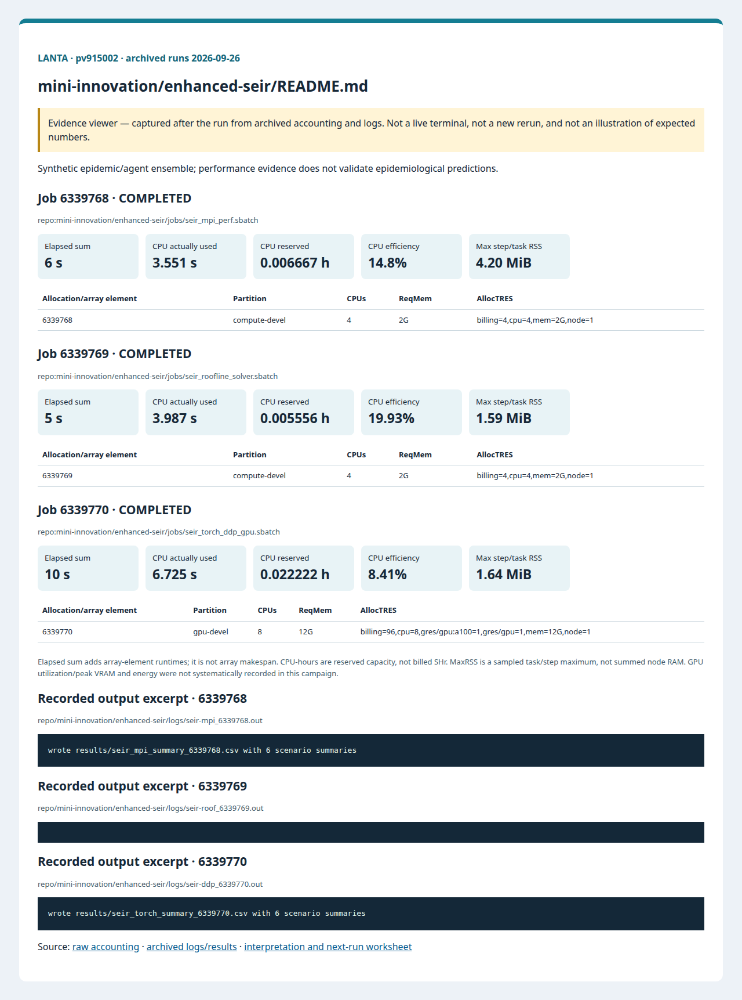

# แบบจำลอง SEIR ขั้นสูงสำหรับคลินิกสมรรถนะ

<!-- resource-learning:start -->
## จากงานเล็กสู่การทดลองที่วัดผลได้ / Resource lab

Booklet flow: pages **33–36** of the [LANTA handbook](../../docs/lanta-hpc-experience-handbook.pdf). [Full learning sequence and worksheet](../../docs/RESOURCE_ESTIMATION_WORKBOOK.md).

<details><summary>ภาพแนวคิดจาก booklet / workflow illustration</summary>


Original booklet illustration, not a run screenshot. [Source and limitations](../../docs/images/booklet/README.md).

</details>

### 1. ขอบเขตและการประมาณก่อนรัน

Synthetic epidemic/agent ensemble; performance evidence does not validate epidemiological predictions.

For local interactions, start with work proportional to agents × steps × repeats; all-pairs interactions can instead grow quadratically. Memory grows with agent state plus retained history. Pilot one seed before multiplying by scenarios.

### 2. ทรัพยากรที่ใช้จริงและตัวอย่าง output

Archived LANTA evidence, **2026-09-26**, account `pv915002`; these are historical measurements, not a new run or a future performance promise.

| Job | State | Elements | Sum elapsed (s) | CPU used (s) | Reserved CPU-h | Max step/task RSS (MiB) |
|---|---|---:|---:|---:|---:|---:|
| 6339768 | COMPLETED | 1 | 6 | 3.551 | 0.006667 | 4.20 |
| 6339769 | COMPLETED | 1 | 5 | 3.987 | 0.005556 | 1.59 |
| 6339770 | COMPLETED | 1 | 10 | 6.725 | 0.022222 | 1.64 |

Elapsed is summed across array elements, not array makespan. CPU used is `TotalCPU`; reserved CPU-hours include idle allocation time. MaxRSS is the largest sampled task/step value, **not total node RAM**. Missing GPU/energy telemetry must not be interpreted as zero.



Browser screenshot of the [archived evidence viewer](../../docs/tutorial-evidence/mini-innovation-enhanced-seir-readme.html); not a live terminal capture. Open the viewer for exact requested/allocated resources and job-specific log excerpts.

**Read the numbers:** job `6339768` used 3.551 CPU-seconds over 6 summed elapsed seconds: about **0.59 busy CPU cores per running element on average**. This describes CPU work across the whole allocation, including setup; it does not measure GPU utilization. For a seconds-long run, startup and coarse memory sampling can dominate. Do not reduce RAM to the displayed RSS or claim scaling without a longer pilot.

<details><summary>ตัวอย่าง output ที่บันทึกจริง / archived stdout excerpt</summary>

Job `6339768` · archive member `repo/mini-innovation/enhanced-seir/logs/seir-mpi_6339768.out`

```text
wrote results/seir_mpi_summary_6339768.csv with 6 scenario summaries
```

</details>

### 3. ขยายงานทีละแกนและตรวจความถูกต้อง

Compare fixed-size 1/2/4-worker or rank runs with three repeats, preserving seeds and input. Then vary agent count 10× separately. Limit concurrent array tasks and aggregate throughput only after checking every task.

**Correctness gate:** Check population conservation, finite/non-negative compartments and seed-specific output agreement. Compare stochastic distributions when implementations change random-stream ordering.

[Public applications and research-backed experiments](../../docs/REAL_APPLICATION_EXPERIMENTS.md#agent-models) provide the next workload. Proposed resource budgets there are not measured requirements.

Before the next run, write down input size, expected time/RAM, requested CPUs/GPUs, and a stop condition. Afterwards record job ID, actual allocation, elapsed, CPU time, memory, result check and one change for the next run. Use three repeats and report spread; do not claim speedup from one short smoke run.

<!-- resource-learning:end -->

ข้อควรระวังจากรันจริง 2026-09-26: คู่ deterministic ใน training sheet ผ่าน numerical comparison 36/36 ที่ `rtol=atol=1e-4` แต่คู่ source อ้างอิงใน `cpp_mpi/` และ `torch_ddp/` ไม่ผ่าน 30/36 comparisons เพราะ C++ เพิ่ม daily beta noise ซึ่งไม่มี noise series เดียวกันใน PyTorch ต้องทำให้ inputs/randomness ตรงกัน หรือเทียบเชิง ensemble ก่อนอ้าง CPU/GPU speedup ดู JSON correctness ในรายงานที่เชื่อมด้านล่าง

ผลรันซ้ำ LANTA บัญชี `pv915002` วันที่ 2026-09-26: [สถานะ ขอบเขต ผลลัพธ์ และ resource usage](../../docs/lanta-runs/2026-09-26-pv915002/README.md) · [วิธีประเมินและปรับปรุง performance](../../docs/PERFORMANCE_EVALUATION_OPTIMIZATION_TH.md)

คำสั่งในหน้านี้อธิบายรวมไว้ที่ [../../docs/BASH_COMMAND_REFERENCE_TH.md](../../docs/BASH_COMMAND_REFERENCE_TH.md).

โฟลเดอร์นี้เป็นแหล่งอ้างอิงสำหรับต่อยอดนวัตกรรมย่อยในห้องอบรมไปสู่การฝึกประเมินสมรรถนะตาม booklet หน้า 15-17 ผู้ใช้เริ่มจากคำถามวิทยาศาสตร์ แปลงคำถามเป็นงานคำนวณ เลือกทรัพยากรตามคอขวด แล้วเก็บหลักฐานของการรันให้ตรวจย้อนกลับได้

สำหรับกิจกรรมที่ผู้เรียนคัดลอกคำสั่งบน LANTA โดยตรง ให้ใช้ [TRAINING_SHEET_TH.md](TRAINING_SHEET_TH.md) ซึ่งสร้างโค้ด ข้อมูล และสคริปต์ Slurm ด้วย heredoc ครบในพื้นที่ทำงานของผู้เรียน

สำหรับ workshop ประเมินสมรรถนะ ให้ใช้ [PERFORMANCE_WORKSHOP_TH.md](PERFORMANCE_WORKSHOP_TH.md) หลังจากรัน training sheet หรือใช้เป็นหน้าเดียวจบเพื่อสร้าง MPI roofline solver, ตัวตรวจ Python overhead, รายงาน, รูปแสดงผลด้วย SVG/gnuplot และ prompt จากหลักฐานในพื้นที่ทำงานเดียวกัน

## งานวิจัยต้นแบบที่นำแนวคิดมาใช้

| งานวิจัย | แนวคิดที่ใช้ในตัวอย่าง |
|---|---|
| [Prem, Cook, and Jit, PLOS Computational Biology 2017](https://journals.plos.org/ploscompbiol/article?id=10.1371/journal.pcbi.1005697) | contact matrix ตามกลุ่มอายุและโครงสร้างประชากร |
| [Ram and Schaposnik, Scientific Reports 2021](https://www.nature.com/articles/s41598-021-94609-3) | force of infection ที่แยกตามอายุและผลของมาตรการลดการสัมผัส |
| [Balcan et al., BMC Medicine 2014](https://pmc.ncbi.nlm.nih.gov/articles/PMC3909360/) | metapopulation, mobility และการผสมของประชากรต่างพื้นที่ |
| [Colizza and Vespignani, Journal of Theoretical Biology 2008](https://www.sciencedirect.com/science/article/pii/S0022519307005991) | การเชื่อมพื้นที่ย่อยด้วย mobility network |
| [Applied Mathematical Modelling 2023 SEIQRD mobility model](https://www.sciencedirect.com/science/article/abs/pii/S0307904X23002810) | การฉีดวัคซีน ฤดูกาล พื้นที่ย่อย และการเปรียบเทียบนโยบาย |
| [Hinch et al., OpenABM-Covid19 preprint 2020](https://www.medrxiv.org/content/10.1101/2020.09.16.20195925v1.full) | ลำดับการดำเนินโรคหลายสถานะ ความเสี่ยงตามอายุ และหลักฐานด้านสมรรถนะของการทำให้รันได้จริง |

## โครงสร้างแบบจำลอง

ทั้ง C++/MPI และ PyTorch GPU/DDP ใช้ข้อมูลขนาดเล็กชุดเดียวกันใน `data/`

- `patches.csv`: พื้นที่จำลอง 3 patch และประชากร 4 กลุ่มอายุ
- `age_contact_4x4.csv`: contact matrix ตามกลุ่มอายุ
- `mobility.csv`: น้ำหนักการเดินทางหรือการผสมระหว่างพื้นที่ย่อย
- `scenarios.csv`: นโยบาย การลดการสัมผัส การลดการเดินทาง อัตราฉีดวัคซีน และจำนวนวัน

สถานะโรคคือ `S, V, E, Ip, Ia, Is, H, R, D`

- `S`: susceptible
- `V`: vaccinated และมีความเสี่ยงติดเชื้อลดลง
- `E`: exposed หรือ latent
- `Ip`: pre-symptomatic infectious
- `Ia`: asymptomatic infectious
- `Is`: symptomatic infectious
- `H`: hospitalized หรือ severe isolated
- `R`: recovered
- `D`: deaths

## รุ่นที่ 1: C++ Native MPI

ไฟล์หลักคือ `cpp_mpi/seir_mpi.cpp`

รุ่น MPI ใช้ประเมินสมรรถนะของชุดทดลองบน CPU แต่ละ rank รับสถานการณ์ทดลองคนละชุด รันแบบจำลองอายุและพื้นที่ย่อยในหน่วยความจำของ rank นั้น แล้วรวบรวมผลด้วย native MPI เพื่อเขียน CSV สรุปไฟล์เดียว

คำถามด้านสมรรถนะ:

> เมื่อเพิ่ม MPI rank แล้วเวลาจบงานของชุดสถานการณ์ทดลองดีขึ้นตาม CPU ที่ขอ หรือเห็น overhead จากงานที่เล็กเกินไป

หลักฐานที่ใช้ตัดสิน:

- `sacct`: `Elapsed`, `AllocCPUS`, `MaxRSS`, `ExitCode`
- `/usr/bin/time -v`: wall-clock, CPU และหลักฐานหน่วยความจำ
- `results/seir_mpi_summary_<jobid>.csv`: ผลวิทยาศาสตร์รายสถานการณ์ทดลอง

## รุ่นที่ 2: PyTorch GPU/DDP

ไฟล์หลักคือ `torch_ddp/seir_torch_ddp.py`

รุ่น PyTorch แปลงสถานการณ์ทดลองเป็น tensor batch บน GPU และพร้อมใช้ `torchrun` สำหรับการรันกระจายงานเมื่อใช้หลาย GPU แต่ละ rank รับชุดย่อยของสถานการณ์ทดลอง แล้วรวบรวมผลด้วย `torch.distributed`

คำถามด้านสมรรถนะ:

> ขนาดงานใหญ่พอสำหรับ GPU/DDP หรือ CPU/MPI ให้เวลาจบงานดีกว่าสำหรับแบบฝึกขนาดเล็ก

หลักฐานที่ใช้ตัดสิน:

- `nvidia-smi`: ชื่อ GPU, หน่วยความจำ และการจัดสรรอุปกรณ์
- `sacct`: เวลาที่ใช้และทรัพยากรที่จัดสรร
- `/usr/bin/time -v`: host-side timing
- `results/seir_torch_summary_<jobid>.csv`: ผลวิทยาศาสตร์รายสถานการณ์ทดลอง

## การรันบน LANTA

ใช้โฟลเดอร์นี้เป็นแหล่งอ้างอิงของโค้ดที่เตรียมไว้ จากโฟลเดอร์รากให้เรียก `sbatch` กับ `jobs/seir_mpi_perf.sbatch` สำหรับ C++/MPI และ `jobs/seir_torch_ddp_gpu.sbatch` สำหรับ PyTorch GPU/DDP ด้วยบัญชีโครงการของรอบอบรม

สำหรับคลินิกสมรรถนะ ให้รันงาน MPI ที่ `--ntasks=1`, `--ntasks=2` และ `--ntasks=4` แล้วเปรียบเทียบ `elapsed_sec` กับ `AllocCPUS` จากนั้นรันงาน PyTorch แล้วเทียบความเร็วของ GPU กับ MPI โดยใช้สถานการณ์ทดลองและสมมติฐานของแบบจำลองชุดเดียวกัน ชุดสถานการณ์ตั้งใจให้มีขนาดเล็กเพื่อให้เห็นเวลาเริ่ม GPU และ overhead จากการเปิดงานแบบกระจายเป็นหลักฐานการสอน

สำหรับ workshop ด้านประเมินสมรรถนะ ให้รัน [PERFORMANCE_WORKSHOP_TH.md](PERFORMANCE_WORKSHOP_TH.md) เพื่อเชื่อม roofline analysis, Amdahl's law, Gustafson's law, overhead taxonomy, stencil solver pattern และ Python stack overhead เข้ากับหลักฐานจาก LANTA

## วิธีตรวจความถูกต้อง

1. ทุกแถวสรุปมี `ExitCode=0:0` ใน `sacct`
2. `attack_rate` อยู่ระหว่าง `0` และ `1`
3. `peak_infectious` และ `peak_hospitalized` มีค่าเป็นศูนย์หรือบวก
4. นโยบาย `combined` ลดภาระสูงสุดเมื่อเทียบกับ `baseline` ในสถานการณ์ทดลองที่ให้มา
5. ผล CPU และ GPU ควรสอดคล้องเชิงแนวโน้ม โดยมีความต่างเชิงตัวเลขเล็กน้อยจาก random perturbation ใน C++ และ deterministic tensor update ใน PyTorch

## ชุดหลักฐาน

แต่ละงาน Slurm เขียนหลักฐานต่อไปนี้

- `notes/modules_<jobid>.txt`
- `notes/sacct_<jobid>.txt`
- `logs/<job-name>_<jobid>.out`
- `logs/<job-name>_<jobid>.err`
- `results/*summary_<jobid>.csv`

หลักฐานชุดนี้ใช้ถามคำถามตาม booklet หน้า 15-17 ได้ตรงประเด็น: โจทย์วิทยาศาสตร์คืออะไร ขอทรัพยากรแบบใด คอขวดอยู่ที่ CPU, GPU, หน่วยความจำ, scheduler หรือ I/O และการรันถัดไปควรเปลี่ยนทีละปัจจัยตรงไหน
