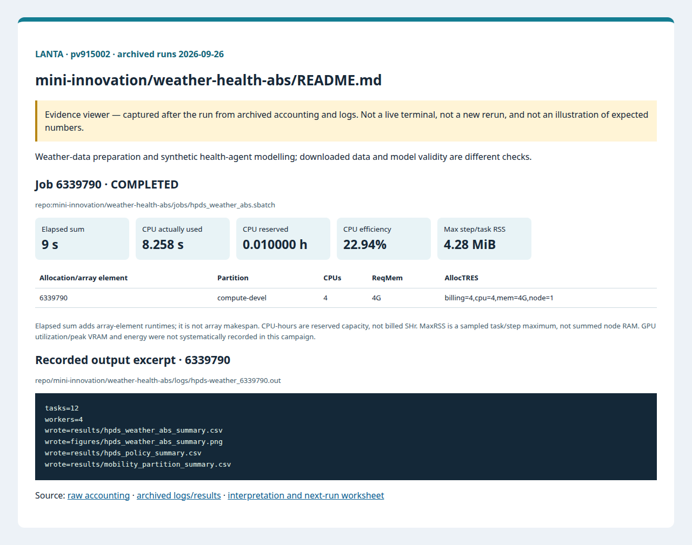
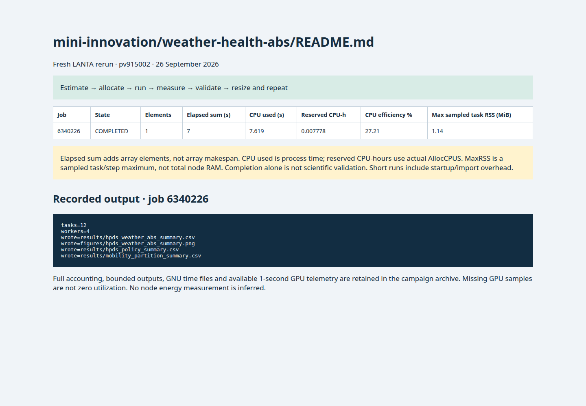

# Weather-Health ABS: วิทยาการข้อมูลสมรรถนะสูงบน LANTA

<!-- resource-learning:start -->
## จากงานเล็กสู่การทดลองที่วัดผลได้ / Resource lab

Booklet flow: pages **33–36** of the [LANTA handbook](../../docs/lanta-hpc-experience-handbook.pdf). [Full learning sequence and worksheet](../../docs/RESOURCE_ESTIMATION_WORKBOOK.md).

<details><summary>ภาพแนวคิดจาก booklet / workflow illustration</summary>


Original booklet illustration, not a run screenshot. [Source and limitations](../../docs/images/booklet/README.md).

</details>

### 1. ขอบเขตและการประมาณก่อนรัน

Weather-data preparation and synthetic health-agent modelling; downloaded data and model validity are different checks.

Budget source archive + extracted data + intermediate tables + outputs. Model cost scales with agents, steps and seeds; preprocessing cost scales with input records and parsing. Record both phases separately.

### 2. ทรัพยากรที่ใช้จริงและตัวอย่าง output

Archived LANTA evidence, **2026-09-26**, account `pv915002`; these are historical measurements, not a new run or a future performance promise.

| Job | State | Elements | Sum elapsed (s) | CPU used (s) | Reserved CPU-h | Max step/task RSS (MiB) |
|---|---|---:|---:|---:|---:|---:|
| 6339790 | COMPLETED | 1 | 9 | 8.258 | 0.010000 | 4.28 |

Elapsed is summed across array elements, not array makespan. CPU used is `TotalCPU`; reserved CPU-hours include idle allocation time. MaxRSS is the largest sampled task/step value, **not total node RAM**. Missing GPU/energy telemetry must not be interpreted as zero.



Browser screenshot of the [archived evidence viewer](../../docs/tutorial-evidence/mini-innovation-weather-health-abs-readme.html); not a live terminal capture. Open the viewer for exact requested/allocated resources and job-specific log excerpts.

**Read the numbers:** job `6339790` used 8.258 CPU-seconds over 9 summed elapsed seconds: about **0.92 busy CPU cores per running element on average**. This describes CPU work across the whole allocation, including setup; it does not measure GPU utilization. For a seconds-long run, startup and coarse memory sampling can dominate. Do not reduce RAM to the displayed RSS or claim scaling without a longer pilot.

<details><summary>ตัวอย่าง output ที่บันทึกจริง / archived stdout excerpt</summary>

Job `6339790` · archive member `repo/mini-innovation/weather-health-abs/logs/hpds-weather_6339790.out`

```text
tasks=12
workers=4
wrote=results/hpds_weather_abs_summary.csv
wrote=figures/hpds_weather_abs_summary.png
wrote=results/hpds_policy_summary.csv
wrote=results/mobility_partition_summary.csv
```

</details>

### 3. ขยายงานทีละแกนและตรวจความถูกต้อง

Pilot one weather file and one seed, then 10 files or seeds with bounded array concurrency. Compare chunk sizes without changing missing-value handling, dates or units. Do not silently replace failed data downloads with synthetic input.

**Correctness gate:** Verify source manifest/checksums, timestamp coverage, units, missing values and population invariants. Successful download is not validated health prediction.

[Public applications and research-backed experiments](../../docs/REAL_APPLICATION_EXPERIMENTS.md#earth-observation) provide the next workload. Proposed resource budgets there are not measured requirements.

Before the next run, write down input size, expected time/RAM, requested CPUs/GPUs, and a stop condition. Afterwards record job ID, actual allocation, elapsed, CPU time, memory, result check and one change for the next run. Use three repeats and report spread; do not claim speedup from one short smoke run.

<!-- resource-learning:end -->

ผลรันซ้ำ LANTA บัญชี `pv915002` วันที่ 2026-09-26: [สถานะ ขอบเขต ผลลัพธ์ และ resource usage](../../docs/lanta-runs/2026-09-26-pv915002/README.md) · [วิธีประเมินและปรับปรุง performance](../../docs/PERFORMANCE_EVALUATION_OPTIMIZATION_TH.md)

โฟลเดอร์นี้เป็นนวัตกรรมย่อยสำหรับสอน High Performance Data Science หรือ HPDS ผ่านกระบวนการข้อมูลอากาศจริง แบบจำลองอาคารเชิงวิทยาศาสตร์ แบบจำลองเชิงตัวแทน และชุดหลักฐานที่รันบน LANTA

ในชุมชน HPC มักใช้คำว่า High Performance Data Analytics หรือ HPDA บทเรียนนี้ใช้คำว่า HPDS เพื่อเน้นทักษะของผู้ทำงานวิทยาการข้อมูลที่ต้องเข้าใจระบบจัดคิว ระบบแฟ้มขนาน การย้ายข้อมูล การแบ่งข้อมูลเป็นก้อน ประวัติที่มาของข้อมูล และหลักฐานด้านสมรรถนะ

## เป้าหมายของบทเรียน

- ดึงข้อมูลจากแหล่ง HTTP เข้าสู่ LANTA ด้วย `curl` และ `wget`
- ฝึก `rsync` ผ่าน SSH สำหรับย้ายข้อมูลจากเครื่องผู้ใช้ไปยัง LANTA
- ใช้ `zip`, `unzip`, `tar`, `gzip`, `pigz` เพื่อจัดแฟ้มรวมและลดปัญหาไฟล์ย่อยจำนวนมาก
- อ่านหลักฐานของระบบแฟ้มขนาน Lustre ด้วย `df`, `lfs getstripe`, `du`, `find`
- สร้างสภาพแวดล้อม Dask เพิ่มเติมบนฐานของโครงการ `hpc-mesa` แล้วติดตั้ง `dask` และ `distributed`
- รัน Dask `LocalCluster` ภายในทรัพยากรหนึ่งโหนดที่ Slurm จัดให้
- สร้างตัวแปรจากข้อมูลอากาศ แล้วส่งต่อให้แบบจำลองอาคารขนาดย่อและ ABS
- สรุปผลเป็น CSV รูปภาพ หลักฐานจาก Slurm และ prompt สำหรับให้ AI ช่วยตรวจหลักฐาน
- เชื่อมแนวคิดการแบ่งกราฟจาก METIS/ParMETIS เข้ากับกราฟการเดินทางและต้นทุนการสื่อสาร

## ลำดับการทำงาน

`แหล่งข้อมูล HTTP/rsync -> manifest/checksum -> แฟ้มรวมและพื้นที่พักข้อมูล -> งานย่อยของ Dask -> แบบจำลองอาคาร -> ABS -> หลักฐานจาก Slurm -> การแสดงผลสรุป -> นั่งร้านการเรียนรู้ด้วย AI`

## ไฟล์สำคัญ

| ไฟล์ | หน้าที่ |
|---|---|
| [TRAINING_SHEET_TH.md](TRAINING_SHEET_TH.md) | หน้าเรียนแบบคัดลอกคำสั่งทีละขั้นสำหรับผู้เรียน |
| [DATA_RESCUE_CADC_TH.md](DATA_RESCUE_CADC_TH.md) | หน้าเรียนกู้ข้อมูลเมื่อปลายทางหมดเวลา ครอบคลุมการดาวน์โหลดต่อจากไฟล์ค้าง checksum, manifest และ `rsync --append-verify` |
| `src/stage_weather_data.py` | แปลง NASA POWER CSV เป็นชุดข้อมูลอากาศหลายพื้นที่พร้อม manifest |
| `src/cadc_resumable_fetch.py` | ตัวช่วยสำหรับตรวจ CADC/ข้อมูลสาธารณะ ดาวน์โหลดต่อจากไฟล์ค้าง สร้าง checksum และ manifest |
| `src/hpds_weather_abs.py` | กระบวนการ Dask ที่รันแบบจำลองอาคารและ ABS หลายสถานการณ์ |
| `src/plot_hpds_summary.py` | สร้างตารางสรุปเชิงนโยบายและรูป PNG |
| `src/partition_mobility_graph.py` | เปรียบเทียบการแบ่งกราฟแบบง่ายเพื่ออธิบาย METIS/ParMETIS |
| `jobs/hpds_weather_abs.sbatch` | ไฟล์ Slurm สำหรับรันกระบวนการ Dask |
| `plots/hpds_dashboard.gp` | แดชบอร์ดของ gnuplot จาก CSV สรุป |

## หลักฐานที่ผู้เรียนควรส่ง

- `data/weather_manifest.csv`
- `logs/lanta_cadc_probe.txt` หรือ `manifest/cadc_manifest.csv` เมื่อใช้ data-rescue sheet
- `notes/filesystem_evidence.txt`
- `notes/environment_<jobid>.txt`
- `notes/time_hpds_weather_abs_<jobid>.txt`
- `notes/sacct_<jobid>.txt`
- `results/hpds_weather_abs_summary.csv`
- `results/hpds_policy_summary.csv`
- `results/mobility_partition_summary.csv`
- `figures/hpds_weather_abs_summary.png`
- `notes/ai_hpds_review_prompt.md`

## เกณฑ์ตัดสินผล

1. การย้ายข้อมูลสำเร็จ มีขนาดไฟล์และ checksum ใน manifest
2. CSV ที่พักข้อมูลไว้ทุกไฟล์มีหัวตาราง จำนวนแถว และค่าอุณหภูมิ/ความชื้นอยู่ในช่วงสมเหตุสมผล
3. งาน Slurm จบด้วย `COMPLETED` และ `ExitCode=0:0`
4. รายงาน Dask ระบุจำนวนงานย่อยและจำนวน worker
5. ตารางสรุปเชิงนโยบายแสดงการแลกเปลี่ยนระหว่างการสัมผัสความร้อน การทำความเย็น และตัวแทนความเสี่ยง
6. ตารางสรุปการแบ่งกราฟชี้ให้เห็นสมดุลภาระงานและน้ำหนักขอบที่ถูกตัดจากกราฟการเดินทาง

<!-- performance-rerun:start -->
## Fresh measured rerun — 26 September 2026

| Job | State | Elements | Sum elapsed (s) | CPU used (s) | Reserved CPU-h | Max step/task RSS (MiB) |
|---|---|---:|---:|---:|---:|---:|
| 6340226 | COMPLETED | 1 | 7 | 7.619 | 0.007778 | 1.14 |

These are new measured jobs, not estimates. One campaign pass does not establish scaling or runtime variance. Allocated CPU-hours are not billed SHr; sampled RSS is not total node memory.

[Accounting, output archive and measurement limitations](../../docs/lanta-runs/2026-09-26-performance/README.md)


<!-- performance-rerun:end -->
